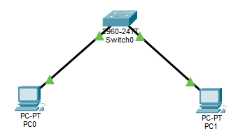
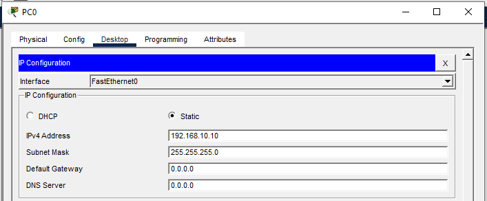
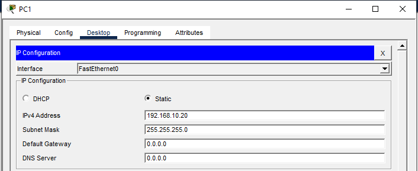
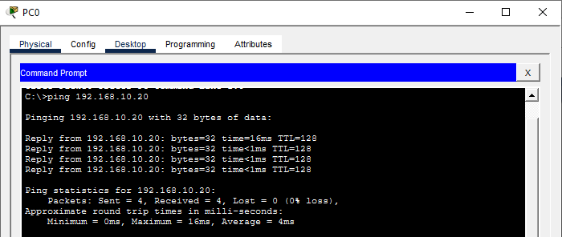
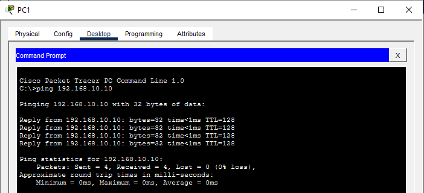
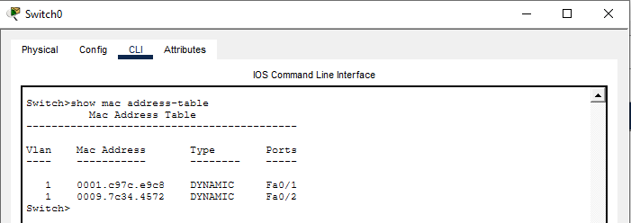
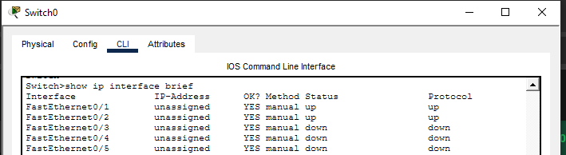

# Lab 01 — Basic PC to Switch Connectivity

## 🎯 Objective
To establish a simple wired network connection between two PCs using a Cisco switch, and verify connectivity using `ping`.

---

## 🧩 Topology
- PC0 connected to Switch using Copper Straight-Through cable
- PC1 connected to Switch using Copper Straight-Through cable

---

## 🛠️ Device List
| Device | Model | Count |
|--------|--------|-------|
| PC     | Generic | 2 |
| Switch | 2960 | 1 |
| Cable  | Copper Straight-Through | 2 |

---

## ⚙️ Configuration Steps

### 1️⃣ Place Devices
- Add **2 PCs** and **1 Switch (2960)** to the workspace

### 2️⃣ Cabling
- Use **Copper Straight-Through** cable to connect:
  - PC0 → Switch (FastEthernet0/1)
  - PC1 → Switch (FastEthernet0/2)

### 3️⃣ Assign IP Addresses
PC0:

IP Address: 192.168.1.10
Subnet Mask: 255.255.255.0

PC1:

IP Address: 192.168.1.20
Subnet Mask: 255.255.255.0

### 4️⃣ Verify Connectivity
- From PC0 → Command Prompt:

ping 192.168.1.20

- From PC1:

ping 192.168.1.10

🟢 Successful ping = **network connectivity established**

---

## 📋 Switch MAC Address Table
Command:

Switch> show mac address-table

Switch learns MAC addresses dynamically as frames are forwarded.

---

## 📋 Switch Interface Status
Command:

Switch> show ip interface brief

Shows connected ports up/up.

---

## 🎯 Outcome
- PCs can communicate through the switch
- MAC learning verified
- Basic LAN setup completed successfully

---

## 📁 Files Included
| File | Description |
|------|-------------|
| lab01.pkt | Packet Tracer project file |
| screenshots/ | Ping results + MAC table |

---

## 🚀 Next Lab (Day 2 Preview)
- Switch security configurations:
  - Port security
  - Disabling unused ports
  - MAC sticky learning
###
3️⃣ Assign IP Addresses
PC0:
