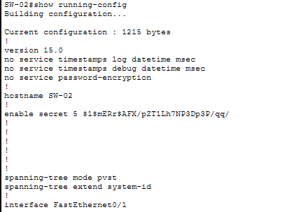
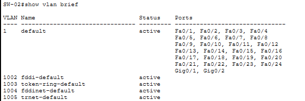
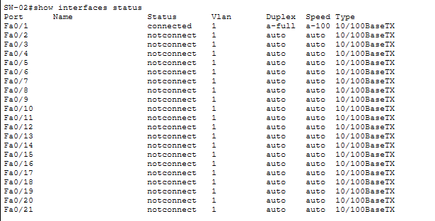
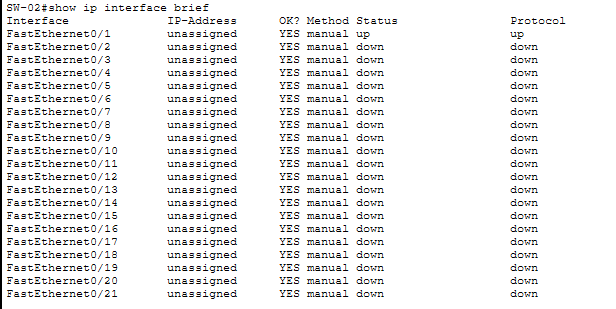
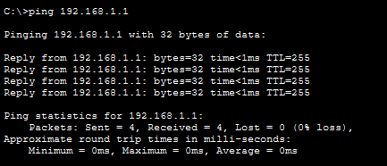

# Lab02 – Basic Switch Configuration (Cisco Packet Tracer)

## Objective
Configure a Cisco switch with basic security hardening and management access.  
This includes hostname, console password, enable secret, banner, and SVI interface.

---

## Topology

[PC] ---- [SW-02]

Single PC connected to FastEthernet0/1 on the switch.

---

## Step-By-Step Configuration

### Configure Hostname

enable
configure terminal
hostname SW-02

---

### Secure Console Access

line console 0
password cisco123
login
exit

---

### Set Enable Secret password

enable secret admin123

---

### Add Security Banner (MOTD)

banner motd #Unauthorized access is prohibited#

---

### Configure Management Interface (VLAN 1)

interface vlan 1
ip address 192.168.1.1 255.255.255.0
no shutdown
exit

---

### Save Configuration

copy running-config startup-config

---

## Verification Commands

### Show running configuration

show running-config

### Check VLANs

show vlan brief

### Check Interface Status

show interfaces status

### Check SVI

show ip interface brief

### Ping Test (PC → Switch)
From the PC:

ping 192.168.1.1

Result: 100% success.

---

## Files Included
- `lab02.pkt`
- `README.md`
- `screenshots/`

---

## Result
Switch successfully configured for:
- Local access security  
- Management IP  
- Operational VLAN interface  
- Verified connectivity  

---

Lab02 **completed successfully**.
