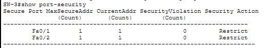
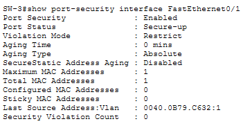
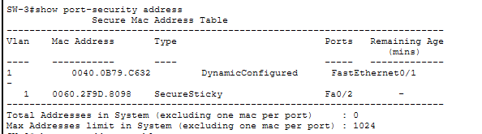
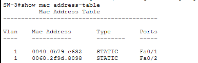
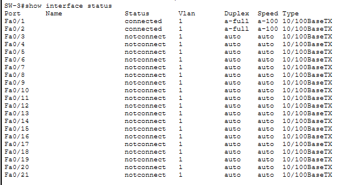

# Lab03 – Switch Port Security (MAC-Based Protection)

## 🎯 Objective
Implement basic port security on a Cisco switch to restrict access based on MAC addresses.  
You will configure:
- Static or sticky MAC learning
- Violation modes
- Switchport access mode
- Testing with PC devices

---

## 🖥️ Topology Used
```
PC0 --- Switch(SW-3) --- PC1
PC2(connected to switch later, used for testing)
```
---

## 🔧 Step 1: Configure PC IP Settings
**PC0**
- IP Address: `192.168.10.10`
- Subnet Mask: `255.255.255.0`
- Default Gateway: `192.168.10.1`

**PC1**
- IP Address: `192.168.10.11`
- Subnet Mask: `255.255.255.0`
- Default Gateway: `192.168.10.1`

**PC2**
- IP Address: `192.168.10.12`
- Subnet Mask: `255.255.255.0`
- Default Gateway: `192.168.10.1`

---

## 🔧 Step 2: Basic Switch Configuration
```
enable
configure terminal
hostname SW-LAB03
enable secret admin123

interface vlan 1
 ip address 192.168.10.1 255.255.255.0
 no shutdown
exit

no ip domain-lookup
service timestamps log datetime msec

end
write memory
```
---

## 🔧 Step 3: Access ports + port security (sticky)
```
configure terminal

! Put ports into access mode and enable portfast
interface range FastEthernet0/1 - 2
 switchport mode access
 switchport access vlan 1
 spanning-tree portfast
 exit

! Configure port-security on Fa0/1
interface FastEthernet0/1
 switchport port-security
 switchport port-security maximum 1
 switchport port-security mac-address sticky
 switchport port-security violation restrict
 exit

! Configure port-security on Fa0/2
interface FastEthernet0/2
 switchport port-security
 switchport port-security maximum 1
 switchport port-security mac-address sticky
 switchport port-security violation restrict
 exit

end
write memory
```
---

## 🔧 Step 4: Verification Commands

Run these after connecting PC0 & PC1 and pinging from PCs:
```
show port-security
show port-security interface FastEthernet0/1
show port-security interface FastEthernet0/2
show mac address-table dynamic
show running-config | include port-security
```
Expected

show port-security shows Port Security: Enabled, Max: 1, Violation: restrict (or your chosen mode), Secure MAC count = 1 for each locked port.

show port-security interface fa0/1 → Security Violation Count: 0 and a learned sticky MAC shown.

show mac address-table dynamic shows learned MACs mapped to Fa0/1 and Fa0/2.

running-config contains switchport port-security mac-address sticky aaaa.bbbb.cccc after learning.

---

## 🔧 Step 5: Violation test (simulate an attacker)

1. Disconnect PC0 from Fa0/1.

2. Connect PC2 to Fa0/1 and attempt to ping 192.168.10.1.

3. On the switch:
```
show port-security interface FastEthernet0/1
show mac address-table dynamic
show logging
```
Expected: Security Violation Count: 1 and newcomer MAC traffic dropped (restrict). If shutdown mode had been used, interface would be err-disabled

---

### ! If interface is err-disabled (shutdown mode), recover:
```
interface FastEthernet0/1
 shutdown
 no shutdown
```
Or rely on errdisable recovery if configured.

### Remove a sticky mac address:
```
configure terminal
interface FastEthernet0/1
 no switchport port-security mac-address sticky
 exit
```
### Clear dynamic mac:
```
clear port-security all

write memory

configure terminal
interface FastEthernet0/1
 shutdown
 no shutdown
 exit
```

---

## Commands to verify:

1. show port security



2. show port security interface FastEthernet0/1



3. show port security address

 

4. show mac address-table

 

5. show interface status



6. show running-config | section interface FastEthernet0/1

 

