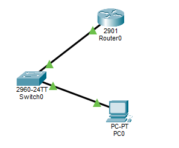
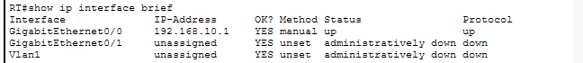
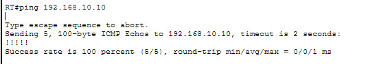
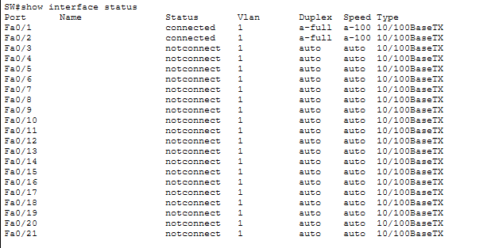
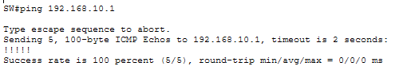
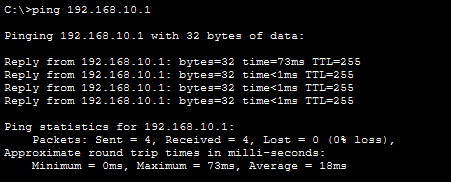
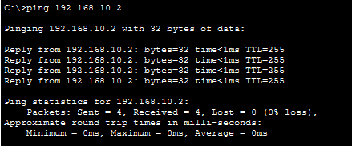

# Lab04 – Basic Router Configuration (Router → Switch → PC)

## Objective
Set up a basic router–switch–PC topology with IP addressing, baseline configs, and verification.  
You will configure:
- Router interface as gateway
- Switch VLAN1 IP + default gateway
- PC IP settings
- Passwords and banner on router
- End-to-end connectivity verification

---

## 🖥️ Topology Used

PC --- Switch ---Router



---

## 🔧 Step 2: Configure the PC
Desktop → IP Configuration:
- IP address: `192.168.10.10`
- Subnet mask: `255.255.255.0`
- Default gateway: `192.168.10.1`

---

## 🔧 Step 3: Configure the Switch
```
enable
configure terminal
hostname SW-01

interface vlan 1
 ip address 192.168.10.2 255.255.255.0
 no shutdown
exit

ip default-gateway 192.168.10.1

interface FastEthernet0/1
 switchport mode access
 spanning-tree portfast

end
write memory
```
---

## 🔧 Step 3: Configure the Router
```
enable
configure terminal
hostname R-01

! Housekeeping
no ip domain-lookup
service timestamps log datetime msec

! Configure interface (use g0/0 or f0/0 depending on router model)
interface g0/0
 ip address 192.168.10.1 255.255.255.0
 no shutdown
exit

! Banner (optional)
banner motd #Unauthorized access prohibited#

! Console password
line console 0
 password cisco123
 login
 exit

! Enable secret
enable secret admin123

end
write memory
```
---

## 🔧 Step 3: Verification

### ROUTER:

```
show ip interface brief
```


Router->PC
```
ping pc: ping 192.168.10.10
```


---

### SWITCH:

```
show interface status
```


Switch->Router:
```
ping router: ping 192.168.10.1
```


---

### PC:

PC->router:
```
ping router: ping 192.168.10.1
```


PC->switch:
```
ping switch: ping 192.168.10.2
```


---

## Files Included
- `lab04.pkt`
- `README.md`
- `screenshots/`

---

## What Was Achieved
- Router baseline configured with hostname, passwords, banner, and gateway IP.  
- Switch baseline configured with VLAN1 IP and default gateway.  
- PC configured with IP, subnet mask, and gateway.  
- End-to-end connectivity verified with pings and interface status.  

---

Lab04 **completed successfully**
