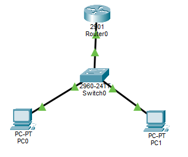
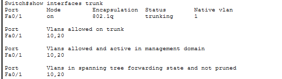
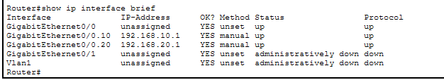
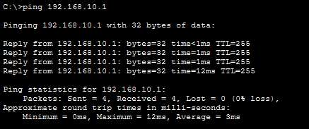
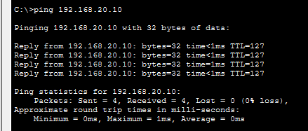
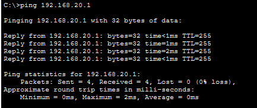
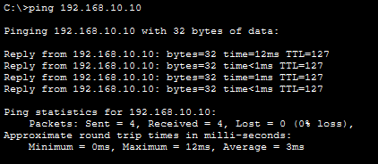

# Lab05 – VLANs + Inter-VLAN Routing (Router-on-a-Stick)

## Objective
Implement VLAN segmentation on a switch and configure inter-VLAN routing using a router-on-a-stick setup.  
You will configure:
- VLAN creation and port assignment
- Trunk link between switch and router
- Router sub-interfaces for VLAN gateways
- PC IP addressing
- End-to-end connectivity verification

---

## Topology Used



---

## Step 1: Create VLANs on Switch
```
enable
configure terminal
vlan 10
 name SALES
exit
vlan 20
 name HR
exit
```
---

## Step 2: Assign Interfaces to VLANs

PC1 → VLAN 10
```
interface FastEthernet0/2
 switchport mode access
 switchport access vlan 10
exit
```

PC2 → VLAN 20
```
interface FastEthernet0/3
 switchport mode access
 switchport access vlan 20
exit
```
---

## Step 3: Configure Trunk on Switch (link to router)
```
interface FastEthernet0/1
 switchport mode trunk
 switchport trunk encapsulation dot1q   ! If not supported, skip
 switchport trunk allowed vlan 10,20
exit

end
write memory
```
---

## Step 4: Configure Router-on-a-Stick (Sub-Interfaces)

Router physical interface = G0/0
```
enable
configure terminal
hostname R-05

! VLAN 10 gateway
interface g0/0.10
 encapsulation dot1Q 10
 ip address 192.168.10.1 255.255.255.0
exit

! VLAN 20 gateway
interface g0/0.20
 encapsulation dot1Q 20
 ip address 192.168.20.1 255.255.255.0
exit

! Enable physical interface
interface g0/0
 no shutdown
exit

end
write memory
```

---

## Step 5: Configure PC IP Settings
PC1 (VLAN 10)
- IP: 192.168.10.10
- Mask: 255.255.255.0
- Gateway: 192.168.10.1

PC2 (VLAN 20)
- IP: 192.168.20.10
- Mask: 255.255.255.0
- Gateway: 192.168.20.1

---

Step 6: Verification Tests
On Switch:
```
show vlan brief
show interfaces trunk
```




On Router:
```
show ip interface brief
```



From PCs
- PC1 → ping 192.168.10.1 (gateway)


 
- PC1 → ping PC2 (192.168.20.10)


  
- PC2 → ping 192.168.20.1 (gateway)



- PC2 → ping PC1 (192.168.10.10)



Result: Inter-VLAN communication works via router-on-a-stick.

---

## Outcome:
- VLANs created and assigned to switch ports.  
- Trunk configured between switch and router.  
- Router sub-interfaces configured with dot1Q encapsulation and IP gateways.  
- PCs assigned to VLANs with correct IPs and gateways.  
- Verified inter-VLAN connectivity via router-on-a-stick.  

---

## Files Included
- `lab05.pkt`
- `README.md`
- `screenshots/`

---

Lab05 **completed successfully**
