# Lab06 – DHCP on Router (Centralized DHCP for VLANs)

## Objective
Configure a Cisco router to act as a centralized DHCP server for multiple VLANs.  
You will learn to:
- Exclude gateway IPs from DHCP assignment
- Create multiple DHCP pools (VLAN10, VLAN20)
- Assign IPs dynamically to PCs
- Verify DHCP bindings and connectivity

---

## Topology Used


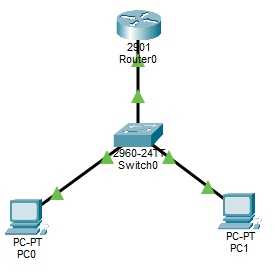

---

## Step 1: Switch Configuration
```
enable
configure terminal
hostname SW

! Create VLANs
vlan 10
 name SALES
exit
vlan 20
 name HR
exit

! Assign ports
interface fa0/2
 switchport mode access
 switchport access vlan 10
exit

interface fa0/3
 switchport mode access
 switchport access vlan 20
exit

! Configure trunk to router
interface fa0/1
 switchport mode trunk
 switchport trunk allowed vlan 10,20
exit

end
write memory
```

---

## Step 2: Router Sub-Interfaces

```
enable
configure terminal
hostname RT

! Physical interface
interface g0/0
 no shutdown
exit

! VLAN 10 gateway
interface g0/0.10
 encapsulation dot1Q 10
 ip address 192.168.10.1 255.255.255.0
exit

! VLAN 20 gateway
interface g0/0.20
 encapsulation dot1Q 20
 ip address 192.168.20.1 255.255.255.0
exit

end
write memory
```

---

## Step 3: Configure DHCP on Router

```
enable
configure terminal

! Exclude gateway IPs
ip dhcp excluded-address 192.168.10.1
ip dhcp excluded-address 192.168.20.1

! DHCP pool for VLAN 10
ip dhcp pool VLAN10-POOL
 network 192.168.10.0 255.255.255.0
 default-router 192.168.10.1
 dns-server 8.8.8.8
exit

! DHCP pool for VLAN 20
ip dhcp pool VLAN20-POOL
 network 192.168.20.0 255.255.255.0
 default-router 192.168.20.1
 dns-server 8.8.8.8
exit

end
write memory
```
---

## Step 4: Configure PCs

- PC0 (VLAN10) → Desktop → IP Config → set to DHCP  
- PC1 (VLAN20) → Desktop → IP Config → set to DHCP

Expected:  
- PC1 gets 192.168.10.x  
- PC2 gets 192.168.20.x  

---

## Step 5: Verification
On Router
```
show run | section dhcp
```

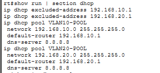

```
show ip dhcp pool
```

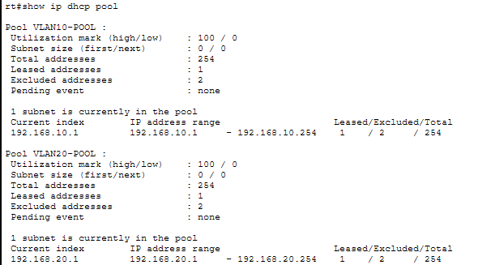

```
show ip dhcp binding
```

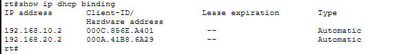

On Switch
```
show vlan brief
```

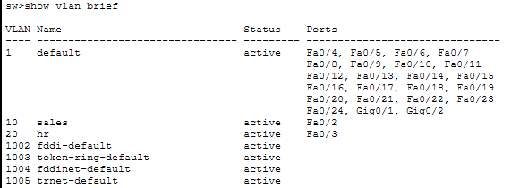

```
show interfaces trunk
```

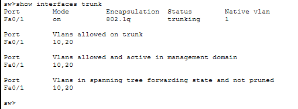


On PCs
- PC0  

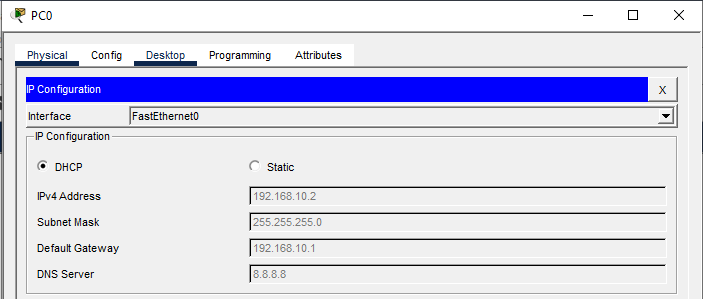

- PC1

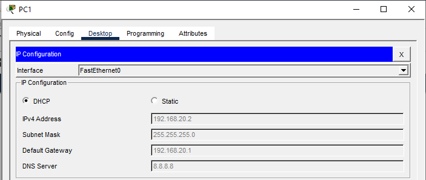

- Ping tests:
  - PC0 → ping 192.168.10.1 (gateway)

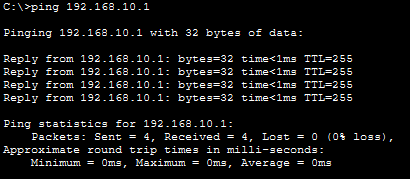

  - PC1 → ping 192.168.20.1 (gateway)

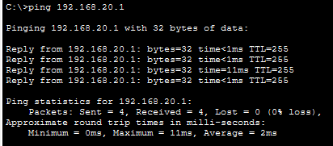

 PC0 ↔ PC1 (inter-VLAN communication)

- PC0 → ping PC1 (192.168.20.10)

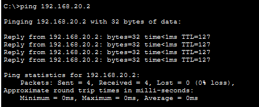

- PC1 → ping PC0 (192.168.10.10)

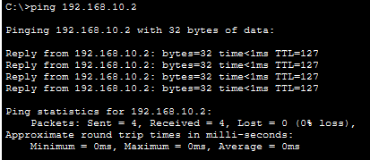

---

## Outcome:
- VLANs created and trunk configured on switch  
- Router sub-interfaces configured for VLAN gateways  
- Router DHCP server configured with excluded addresses and pools  
- PCs successfully obtained IPs via DHCP  
- Verified DHCP bindings and inter-VLAN connectivity  

---

## Files Included
- `lab06.pkt`
- `README.md`
- `screenshots/`

---

Lab06 **completed successfully**

---
