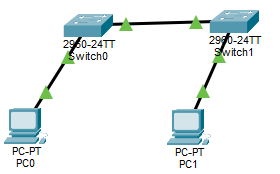
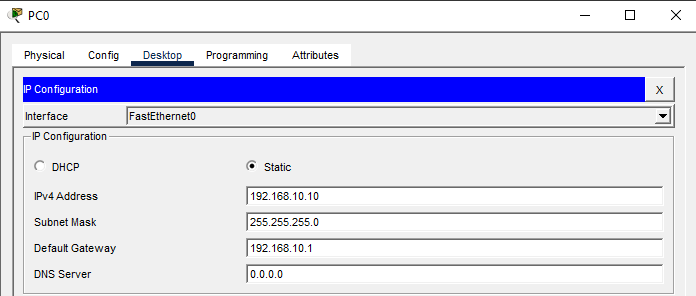
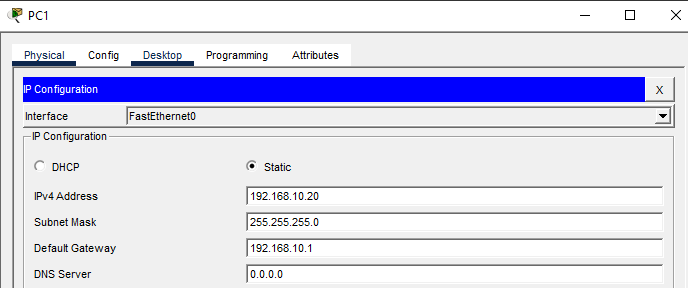
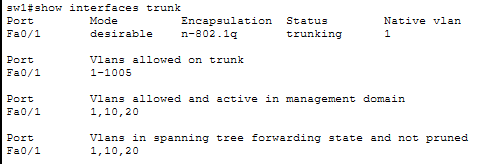
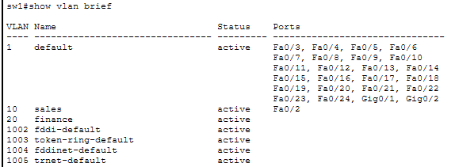
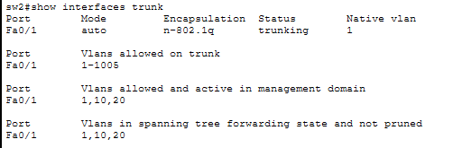
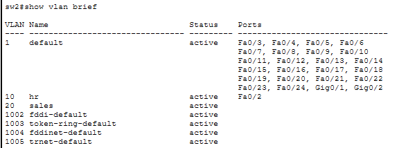
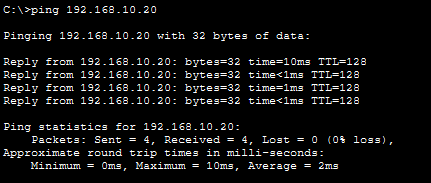
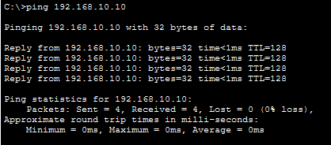

# Lab07 – VLAN Trunking + DTP (Dynamic Trunking Protocol)

## Objective
Configure two Cisco switches to form a trunk link using DTP negotiation.  
You will learn to:
- Create VLANs on multiple switches
- Assign access ports to VLANs
- Configure trunk ports with DTP (dynamic desirable / dynamic auto)
- Verify trunk formation and VLAN traffic flow across switches

---

## Topology Used



- **SW-1:** Cisco 2960  
- **SW-2:** Cisco 2960  
- **PC-0:** Generic PC connected to SW-A Fa0/2  
- **PC-1:** Generic PC connected to SW-B Fa0/2  
- **SW-1 Fa0/1 ↔ SW-2 Fa0/1:** Copper straight-through cable  

---

## Step 1: PC IP Configuration

PC0:



PC1:



---

## Step 2: VLAN Creation (on both switches)
```
enable
configure terminal
vlan 10
 name HR
exit
vlan 20
 name FINANCE
exit
```

---

## Step 3: Assign PC Ports to VLANs
SW-1
```
interface fa0/2
 switchport mode access
 switchport access vlan 10
 spanning-tree portfast
exit
```

SW-2
```
interface fa0/2
 switchport mode access
 switchport access vlan 10
 spanning-tree portfast
exit
```

(Both PCs must be in the same VLAN to test trunking.)

---

## Step 4: Configure DTP Trunk Between Switches

SW-1 (active negotiator)
```
interface fa0/1
 switchport mode dynamic desirable
 switchport trunk allowed vlan 10,20
exit
```

SW-2 (passive)
```
interface fa0/1
 switchport mode dynamic auto
 switchport trunk allowed vlan 10,20
exit
```

Desirable + Auto = trunk successfully negotiated using DTP.

---

## Step 5: Verification Commands
On both switches:
```
show interfaces trunk
show vlan brief
```

SW-1:






SW-2:





Expected:
- Fa0/1 listed as trunking
- Allowed VLANs: 10,20
- VLAN 10 active with Fa0/2 assigned

(Note: show dtp interface may not be supported in Packet Tracer IOS images.)

---

## Step 6: Connectivity Test
On PC-0:
```
ping 192.168.10.20
```



On PC-1:
```
ping 192.168.10.10
```



Trunk is working, pings succeed.

---

## Outcome:
- VLANs created consistently on both switches  
- PCs placed in VLAN 10 on separate switches  
- DTP trunk successfully negotiated between SW-1 and SW-2  
- Verified trunk status and VLAN membership  
- Successful ping between PCs across switches  

---

## Files Included
- `lab07.pkt`
- `README.md`
- `screenshots/`

---

Lab07 **completed successfully**

---
