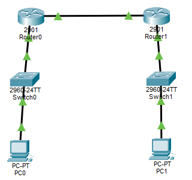
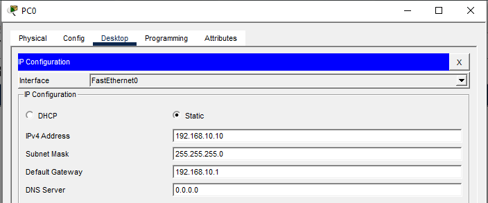
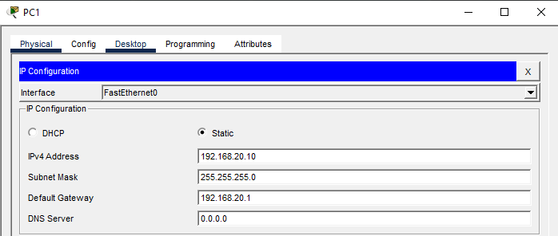
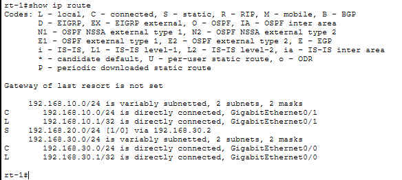
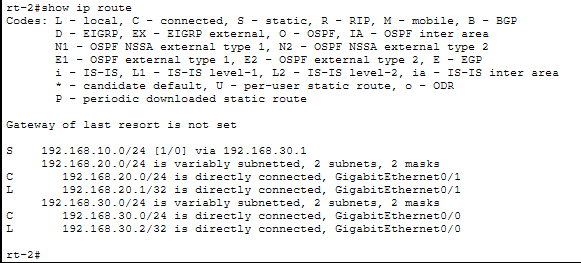
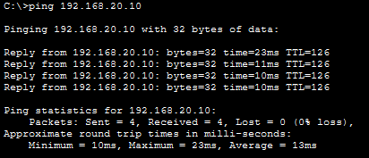
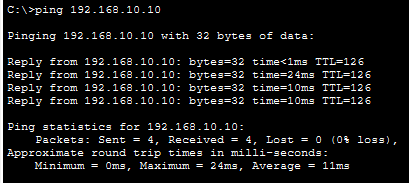

# Lab08 – Static Routing (Router to Router connectivity)

## Objective
Establish connectivity between two separate LANs using static routes across a point-to-point WAN.

---

## Topology



---

## IP Addressing Plan
| Device | Interface | IP Address     | Subnet Mask     | Gateway       |
|--------|-----------|----------------|-----------------|---------------|
| PC1    | NIC       | 192.168.10.10  | 255.255.255.0   | 192.168.10.1  |
| R1     | G0/1 (LAN)| 192.168.10.1   | 255.255.255.0   | —             |
| R1     | G0/0 (WAN)| 192.168.30.1   | 255.255.255.0   | —             |
| R2     | G0/0 (WAN)| 192.168.30.2   | 255.255.255.0   | —             |
| R2     | G0/1 (LAN)| 192.168.20.1   | 255.255.255.0   | —             |
| PC2    | NIC       | 192.168.20.10  | 255.255.255.0   | 192.168.20.1  |

---

## PC Configurations
**PC1**



**PC2**



---

## Switch Configurations
**SW1**
```
enable
configure terminal
hostname SW1
vlan 10
 name LAN_A
exit
interface fa0/1
 switchport mode access
 switchport access vlan 10
 no shutdown
exit
interface fa0/2
 switchport mode access
 switchport access vlan 10
 no shutdown
exit
end
write memory
```

**SW1**
```
enable
configure terminal
hostname SW2
vlan 20
 name LAN_B
exit
interface fa0/1
 switchport mode access
 switchport access vlan 20
 no shutdown
exit
interface fa0/2
 switchport mode access
 switchport access vlan 20
 no shutdown
exit
end
write memory
```

---

## Router Configuration

**R1**
```
enable
configure terminal
hostname R1

interface g0/1
 ip address 192.168.10.1 255.255.255.0
 no shutdown

interface g0/0
 ip address 192.168.30.1 255.255.255.0
 no shutdown

! Static route to LAN B via R2
ip route 192.168.20.0 255.255.255.0 192.168.30.2

end
write memory
```

**R2**
```
enable
configure terminal
hostname R2

interface g0/1
 ip address 192.168.20.1 255.255.255.0
 no shutdown

interface g0/0
 ip address 192.168.30.2 255.255.255.0
 no shutdown

! Static route to LAN A via R1
ip route 192.168.10.0 255.255.255.0 192.168.30.1

end
write memory
```

---

## Verification

On R1:
```
show ip route
```



On R2:
```
show ip route
```



On PCs:
PC1:
```
ping 192.168.20.10
```



PC2:
```
ping 192.168.10.10
```



Successful pings confirm static routing is working.

---

Outcome
- LAN A and LAN B configured with distinct subnets  
- WAN link established between R1 and R2  
- Static routes added so each router knows about the remote LAN  
- End-to-end connectivity verified with successful pings  

---

## Files Included
- `lab08.pkt`
- `README.md`
- `screenshots/`

---

Lab08 **completed successfully**

---
