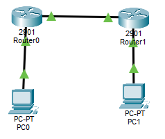
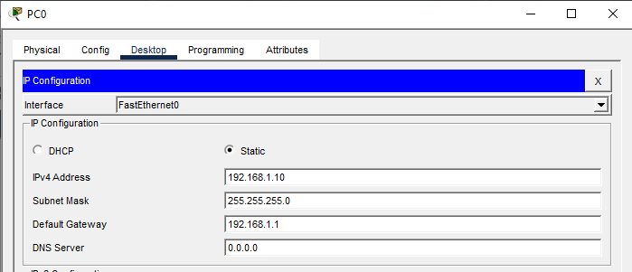
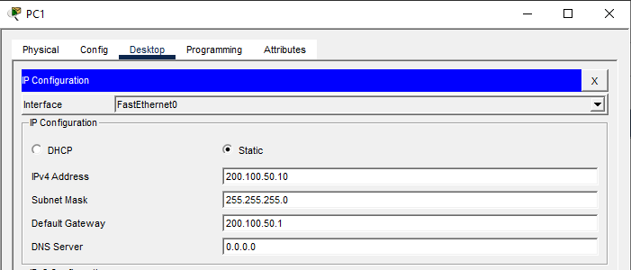
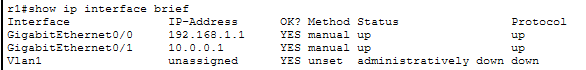
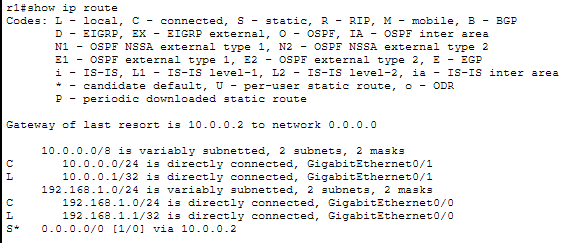
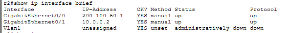
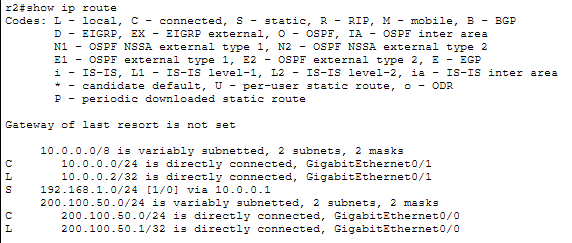
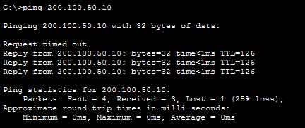

# LAB 09 — Default Route & Gateway of Last Resort

## Objective
- Configure a default route on a router so all traffic destined for unknown networks forwards to the correct next hop
- Verify the Gateway of Last Resort using show commands
- Understand how routers handle traffic to networks not in their routing table

---

## Topology

```
PC1 --- R1 --- R2 --- PC2
       (LAN)  (WAN)  ("Internet")
```



---

## IP Addressing Plan

| Device | Interface | IP Address      | Subnet Mask     | Purpose           |
|--------|-----------|-----------------|-----------------|-------------------|
| PC1    | NIC       | 192.168.1.10    | 255.255.255.0   | LAN host          |
| R1     | G0/0      | 192.168.1.1     | 255.255.255.0   | LAN gateway       |
| R1     | G0/1      | 10.0.0.1        | 255.255.255.0   | Link to R2        |
| R2     | G0/1      | 10.0.0.2        | 255.255.255.0   | Link to R1        |
| R2     | G0/0      | 200.100.50.1    | 255.255.255.0   | "Internet" side   |
| PC2    | NIC       | 200.100.50.10   | 255.255.255.0   | Simulates Internet|

---

## PC Configuration

### PC1



### PC2



---

## Router R1 Configuration

### Step 1: Basic Configuration
```
enable
configure terminal
hostname R1
no ip domain-lookup
```

### Step 2: Configure Interfaces
```
interface gigabitEthernet0/0
ip address 192.168.1.1 255.255.255.0
no shutdown
exit

interface gigabitEthernet0/1
ip address 10.0.0.1 255.255.255.0
no shutdown
exit
```

### Step 3: Configure Default Route
Send all unknown traffic to R2 (10.0.0.2)
```
ip route 0.0.0.0 0.0.0.0 10.0.0.2
```

---

## Router R2 Configuration

### Step 1: Basic Configuration
```
enable
configure terminal
hostname R2
no ip domain-lookup
```

### Step 2: Configure Interfaces
```
interface gigabitEthernet0/1
ip address 10.0.0.2 255.255.255.0
no shutdown
exit

interface gigabitEthernet0/0
ip address 200.100.50.1 255.255.255.0
no shutdown
exit
```

### Step 3: Configure Return Route
So R2 knows where the 192.168.1.0/24 network is:
```
ip route 192.168.1.0 255.255.255.0 10.0.0.1
```

---

## Verification Commands

### On R1
```
show ip interface brief
```



```
show ip route
```



**Expected output - Gateway of Last Resort:**
```
Gateway of last resort is 10.0.0.2 to network 0.0.0.0

S*   0.0.0.0/0 [1/0] via 10.0.0.2
C    10.0.0.0/24 is directly connected, GigabitEthernet0/1
C    192.168.1.0/24 is directly connected, GigabitEthernet0/0
```

### On R2
```
show ip interface brief
```



```
show ip route
```



### Ping Tests

**From PC1 to PC2:**
```
ping 200.100.50.10
```



**From PC1 to R2(Internet side):**
```
ping 200.100.50.1
```


---

## Key Concepts

**Default Route (0.0.0.0/0):**
- Matches ALL IP addresses
- Used when no specific route exists in the routing table
- Also called "Gateway of Last Resort" or "Quad Zero Route"

**Important:**
- In real networks, routers can't have routes to every single network on the Internet
- Default route points to the ISP or upstream router
- Reduces routing table size dramatically

**Static Route vs Default Route:**
- Static route: Points to a specific network (e.g., 192.168.1.0/24)
- Default route: Points to ALL unknown networks (0.0.0.0/0)

---

## Outcome

- Configured a default route on R1
- Configured a static return route on R2
- Verified Gateway of Last Resort
- Established end-to-end connectivity between two different networks

---

## Files Included
- `lab09.pkt`
- `README.md`
- `screenshots/`

---

Lab09 **completed successfully**

---
