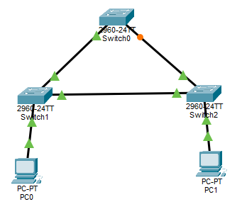
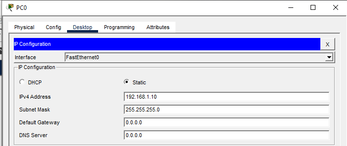
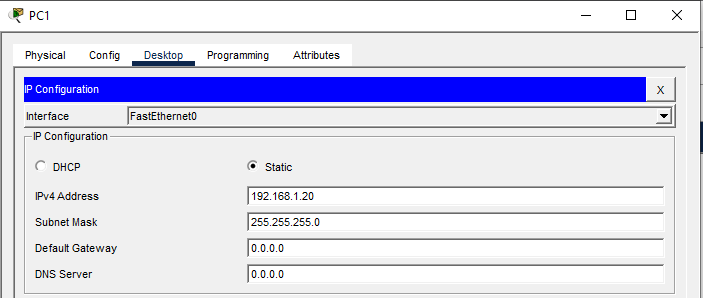
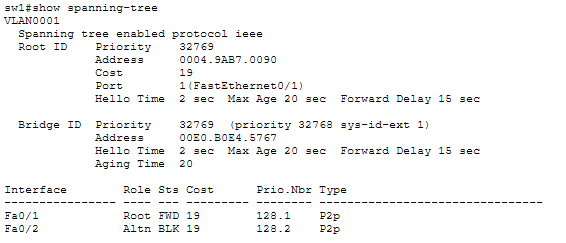
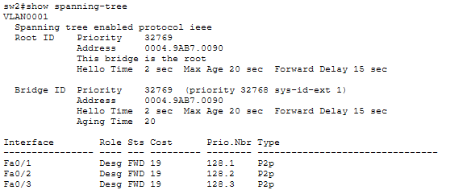
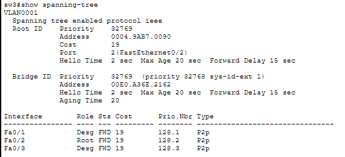
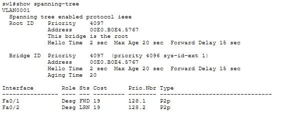

# LAB 10 — Spanning Tree Protocol (STP)

## Objective
- Understand how STP prevents Layer 2 loops in redundant switch topologies
- Configure and verify STP root bridge election
- Observe port states (blocking, forwarding)
- Manually configure root bridge priority

---

## Topology



**Redundant links between switches create a loop - STP will block one link**

---

## IP Addressing Plan

| Device | Interface | IP Address      | Subnet Mask     | Purpose           |
|--------|-----------|-----------------|-----------------|-------------------|
| PC1    | NIC       | 192.168.1.10    | 255.255.255.0   | Test host         |
| PC2    | NIC       | 192.168.1.20    | 255.255.255.0   | Test host         |

---

## Physical Connections

**Connect switches in a triangle topology:**
- SW1 F0/1 → SW2 F0/1
- SW1 F0/2 → SW3 F0/1
- SW2 F0/2 → SW3 F0/2

**Connect PCs:**
- PC1 → SW2 F0/3
- PC2 → SW3 F0/3

---

## PC Configuration

### PC1



### PC2



---

## Switch Configuration

### SW1 Configuration
```
enable
configure terminal
hostname SW1
exit
```

### SW2 Configuration
```
enable
configure terminal
hostname SW2
exit
```

### SW3 Configuration
```
enable
configure terminal
hostname SW3
exit
```

**No additional configuration needed - STP runs by default on Cisco switches**

---

## Verification Commands

### Step 1: Check STP Status on All Switches

**On SW1:**
```
show spanning-tree
```



**On SW2:**
```
show spanning-tree
```



**On SW3:**
```
SW3#show spanning-tree
```



### Step 2: Identify Root Bridge

Look for this line in the output:
```
This bridge is the root
```
OR
```
Root ID Priority: 32769
        Address: [MAC address]
        This bridge is the root
```

### Above we have SW2 as the root bridge.

**The switch with the lowest MAC address becomes root bridge by default**

### Step 4: Verify Connectivity

**From PC1:**
```
ping 192.168.1.20
```


---

## Manually Configure Root Bridge

### Make SW1 the Root Bridge

Lower priority value = higher priority for root bridge election

**On SW1:**
```
spanning-tree vlan 1 priority 4096
```

**Verify SW1 is now root:**
```
show spanning-tree
```



---

## Key Concepts

**What is STP?**
- IEEE 802.1D protocol
- Prevents Layer 2 broadcast storms and loops
- Blocks redundant paths automatically
- Maintains loop-free topology

**Root Bridge Election:**
1. Lowest priority value wins (default: 32768)
2. If priorities are equal, lowest MAC address wins
3. Root bridge is the reference point for the entire STP topology

**Port States:**
- **Blocking** - Doesn't forward frames, prevents loops
- **Listening** - Preparing to forward, building topology
- **Learning** - Learning MAC addresses, not forwarding yet
- **Forwarding** - Fully operational, forwarding traffic
- **Disabled** - Administratively shut down

**Why STP is Important:**
- Without STP, redundant links cause broadcast storms
- Network would crash within seconds due to infinite loops
- STP provides both redundancy AND loop prevention

---

## Outcome

You have successfully:
- Built a redundant switch topology with potential loops
- Observed STP automatically preventing loops by blocking ports
- Identified the root bridge
- Manually configured root bridge priority
- Verified loop-free connectivity between PCs

---

## Files Included
- `lab10.pkt`
- `README.md`
- `screenshots/`

---

Lab10 **completed successfully**

---
