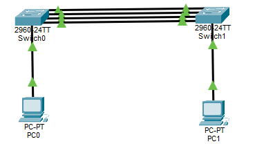
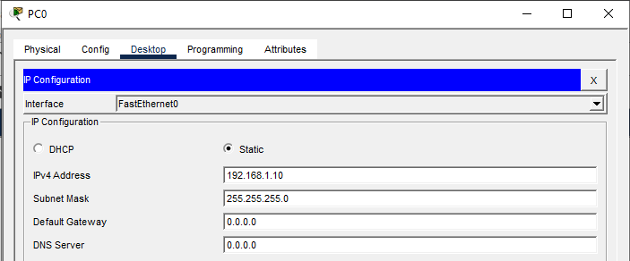
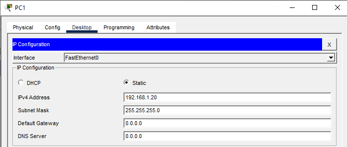
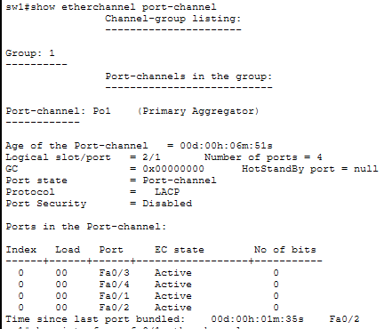
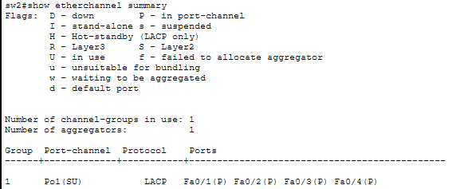
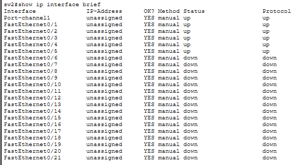
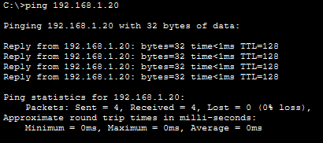

# LAB 11 — EtherChannel (Link Aggregation)

## Objective
- Configure EtherChannel to bundle multiple physical links into one logical link
- Understand the difference between LACP, PAgP, and Static EtherChannel
- Increase bandwidth and provide redundancy between switches
- Verify EtherChannel load balancing

---

## Topology



**4 physical links between SW1 and SW2 act as 1 logical link**

---

## IP Addressing Plan

| Device | Interface | IP Address      | Subnet Mask     | Purpose           |
|--------|-----------|-----------------|-----------------|-------------------|
| PC1    | NIC       | 192.168.1.10    | 255.255.255.0   | Test host         |
| PC2    | NIC       | 192.168.1.20    | 255.255.255.0   | Test host         |

---

## Physical Connections

**Between SW1 and SW2 (4 links):**
- SW1 F0/1 → SW2 F0/1
- SW1 F0/2 → SW2 F0/2
- SW1 F0/3 → SW2 F0/3
- SW1 F0/4 → SW2 F0/4

**Connect PCs:**
- PC1 → SW1 F0/5
- PC2 → SW2 F0/5

---

## PC Configuration

### PC1



### PC2



---

## Switch SW1 Configuration

### Step 1: Basic Configuration
```
enable
configure terminal
hostname SW1
```

### Step 2: Create Port-Channel Interface
```
interface port-channel 1
exit
```

### Step 3: Configure Physical Interfaces
```
interface range fastEthernet 0/1-4
switchport mode trunk
channel-group 1 mode active
exit
```

**Note:** `mode active` uses LACP (industry standard, works with non-Cisco switches)

---

## Switch SW2 Configuration

### Step 1: Basic Configuration
```
enable
configure terminal
hostname SW2
```

### Step 2: Create Port-Channel Interface
```
interface port-channel 1
exit
```

### Step 3: Configure Physical Interfaces
```
interface range fastEthernet 0/1-4
switchport mode trunk
channel-group 1 mode active
exit
```

---

## Verification Commands

### On SW1

**Check EtherChannel Summary:**
```
show etherchannel summary
```


**Expected output:**

- **(SU)** = Layer 2, Up
- **(P)** = Port is bundled in the channel

**Check Detailed EtherChannel Info:**
```
show etherchannel port-channel
```


### On SW2

**Check EtherChannel Summary:**
```
show etherchannel summary
```



**Verify Interface Status:**
```
show ip interface brief
```



### Connectivity Test

**From PC1:**
```
ping 192.168.1.20
```



---

## EtherChannel Modes Explained

### LACP (Link Aggregation Control Protocol)
```
channel-group 1 mode active
```
- **IEEE 802.3ad standard** (works with all vendors)
- **Recommended for production**
- Both sides must be `active` or one `active` + one `passive`

### PAgP (Port Aggregation Protocol)
```
channel-group 1 mode desirable
```
- **Cisco proprietary** (only works between Cisco switches)
- Use `desirable` on both sides or `desirable` + `auto`

### Static/On Mode
```
channel-group 1 mode on
```
- **No negotiation protocol**
- Both sides must be `on`
- Not recommended (no error detection)

---

## Key Concepts

**What is EtherChannel?**
- Bundles multiple physical links into one logical link
- Increases bandwidth (4 × 100Mbps = 400Mbps total)
- Provides redundancy (if one link fails, others continue)
- STP sees it as a single link (no blocking)

**Benefits:**
- **Increased bandwidth** without upgrading hardware
- **Load balancing** across multiple links
- **Redundancy** - automatic failover if a link goes down
- **No STP blocking** - all links are active

**Common Issues:**
- **Mismatched modes** - LACP active on one side, PAgP on other (won't work)
- **Speed/duplex mismatch** - all links must have same speed
- **VLAN mismatch** - all ports must have same VLAN configuration
- **Different switch port modes** - all must be access or all trunk

---

## Outcome

You have successfully:
- Configured EtherChannel using LACP protocol
- Bundled 4 physical links into 1 logical link
- Increased bandwidth between switches
- Verified EtherChannel formation and status
- Tested connectivity across the EtherChannel

**EtherChannel is widely used in enterprise networks to maximize link utilization and provide redundancy without STP blocking ports.**

---

## Files Included
- `lab11.pkt`
- `README.md`
- `screenshots/`

---

Lab11 **Completed Successful**

---
