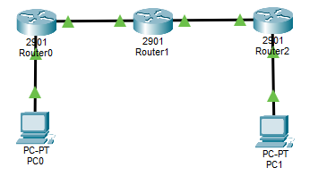
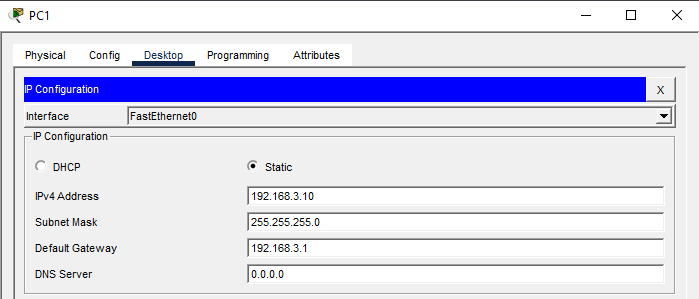
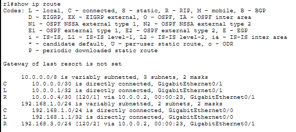
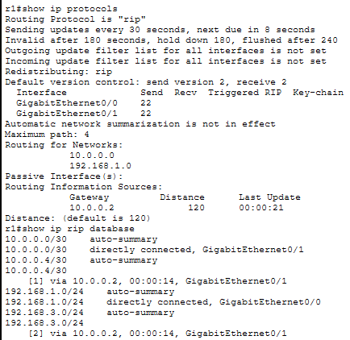
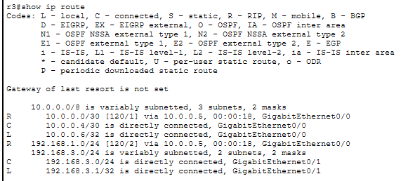
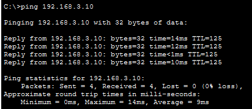
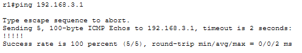
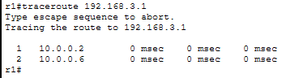

# LAB 12 — RIPv2 Configuration (Dynamic Routing)

## Objective
- Configure RIPv2 (Routing Information Protocol version 2) on multiple routers
- Understand how dynamic routing protocols automatically share route information
- Compare RIPv2 with static routing
- Verify dynamic route propagation and convergence

---

## Topology

```
PC1 --- R1 --- R2 --- R3 --- PC2
      (LAN1)       (LAN2)      (LAN3)
```

**3 routers will automatically share routing information using RIPv2**



---

## IP Addressing Plan

| Device | Interface | IP Address      | Subnet Mask     | Network          |
|--------|-----------|-----------------|-----------------|------------------|
| PC1    | NIC       | 192.168.1.10    | 255.255.255.0   | 192.168.1.0/24   |
| R1     | G0/0      | 192.168.1.1     | 255.255.255.0   | 192.168.1.0/24   |
| R1     | G0/1      | 10.0.0.1        | 255.255.255.252 | 10.0.0.0/30      |
| R2     | G0/0      | 10.0.0.2        | 255.255.255.252 | 10.0.0.0/30      |
| R2     | G0/1      | 10.0.0.5        | 255.255.255.252 | 10.0.0.4/30      |
| R3     | G0/0      | 10.0.0.6        | 255.255.255.252 | 10.0.0.4/30      |
| R3     | G0/1      | 192.168.3.1     | 255.255.255.0   | 192.168.3.0/24   |
| PC2    | NIC       | 192.168.3.10    | 255.255.255.0   | 192.168.3.0/24   |

---

## Physical Connections

- PC1 → R1 G0/0
- R1 G0/1 → R2 G0/0
- R2 G0/1 → R3 G0/0
- R3 G0/1 → PC2

---

## PC Configuration

### PC1


### PC2



---

## Router R1 Configuration

### Step 1: Basic Configuration
```
Router>enable
Router#configure terminal
Router(config)#hostname R1
Router(config)#no ip domain-lookup
```

### Step 2: Configure Interfaces
```
R1(config)#interface gigabitEthernet 0/0
R1(config-if)#ip address 192.168.1.1 255.255.255.0
R1(config-if)#no shutdown
R1(config-if)#exit

R1(config)#interface gigabitEthernet 0/1
R1(config-if)#ip address 10.0.0.1 255.255.255.252
R1(config-if)#no shutdown
R1(config-if)#exit
```

### Step 3: Configure RIPv2
```
R1(config)#router rip
R1(config-router)#version 2
R1(config-router)#network 192.168.1.0
R1(config-router)#network 10.0.0.0
R1(config-router)#no auto-summary
R1(config-router)#exit
```

---

## Router R2 Configuration

### Step 1: Basic Configuration
```
Router>enable
Router#configure terminal
Router(config)#hostname R2
Router(config)#no ip domain-lookup
```

### Step 2: Configure Interfaces
```
R2(config)#interface gigabitEthernet 0/0
R2(config-if)#ip address 10.0.0.2 255.255.255.252
R2(config-if)#no shutdown
R2(config-if)#exit

R2(config)#interface gigabitEthernet 0/1
R2(config-if)#ip address 10.0.0.5 255.255.255.252
R2(config-if)#no shutdown
R2(config-if)#exit
```

### Step 3: Configure RIPv2
```
R2(config)#router rip
R2(config-router)#version 2
R2(config-router)#network 10.0.0.0
R2(config-router)#no auto-summary
R2(config-router)#exit
```

---

## Router R3 Configuration

### Step 1: Basic Configuration
```
Router>enable
Router#configure terminal
Router(config)#hostname R3
Router(config)#no ip domain-lookup
```

### Step 2: Configure Interfaces
```
R3(config)#interface gigabitEthernet 0/0
R3(config-if)#ip address 10.0.0.6 255.255.255.252
R3(config-if)#no shutdown
R3(config-if)#exit

R3(config)#interface gigabitEthernet 0/1
R3(config-if)#ip address 192.168.3.1 255.255.255.0
R3(config-if)#no shutdown
R3(config-if)#exit
```

### Step 3: Configure RIPv2
```
R3(config)#router rip
R3(config-router)#version 2
R3(config-router)#network 10.0.0.0
R3(config-router)#network 192.168.3.0
R3(config-router)#no auto-summary
R3(config-router)#exit
```

---

## Verification Commands

### On R1

**Check routing table:**
```
R1#show ip route
```



**output - see RIP routes marked with 'R':**
```
R    192.168.3.0/24 [120/2] via 10.0.0.2, 00:00:15, GigabitEthernet0/1
```

**Check RIP protocol status:**
```
R1#show ip protocols
```



**Check RIP database:**

```
R1#show ip rip database
```

### On R2

**Check routing table:**
```
R2#show ip route
```


**Check RIP neighbors:**
```
R2#show ip protocols
```


### On R3

**Check routing table:**

```
R3#show ip route
```



### Connectivity Tests

**From PC1:**
```
ping 192.168.3.10
```



**From R1:**

```
R1#ping 192.168.3.1
```



```
R1#traceroute 192.168.3.1
```



**Traceroute should show the path: R1 → R2 → R3**

---

## Key Concepts

**What is RIP?**
- **Distance Vector** routing protocol
- Uses **hop count** as metric (max 15 hops, 16 = unreachable)
- Sends full routing table updates every 30 seconds
- Simple to configure, but inefficient for large networks

**Important RIP Commands:**
- `version 2` - Use RIPv2 (supports VLSM and CIDR)
- `network [network-address]` - Advertise networks (classful boundary)
- `no auto-summary` - Disable automatic summarization (critical for RIPv2)

**How RIP Works:**
1. Routers send their entire routing table to neighbors every 30 seconds
2. Each router adds 1 to the hop count for received routes
3. Best path = lowest hop count
4. Maximum hop count = 15 (16 = unreachable)

**Advantages:**
- Simple to configure
- Works in small networks
- Automatic route discovery

**Disadvantages:**
- Slow convergence (can take minutes)
- Inefficient (sends updates every 30 seconds)
- Limited to 15 hops
- Uses bandwidth unnecessarily
- Not suitable for large networks

---

## Comparison: Static vs Dynamic Routing

| Aspect              | Static Routing          | RIPv2 (Dynamic)        |
|---------------------|-------------------------|------------------------|
| Configuration       | Manual on each router   | Automatic sharing      |
| Scalability         | Poor (many manual routes)| Better (auto-discovery)|
| Convergence         | Instant (no updates)    | Slow (30-60 seconds)   |
| Bandwidth usage     | None                    | Regular updates        |
| Fault tolerance     | Manual reconfiguration  | Automatic rerouting    |
| Best for            | Small, stable networks  | Small to medium networks|

---

## LAB COMPLETE

- Configured RIPv2 on three routers
- Enabled automatic route advertisement and discovery
- Verified dynamic routing table population
- Tested end-to-end connectivity using dynamic routes
- Compared static and dynamic routing behavior

---

## Files Included
- `lab12.pkt`
- `README.md`
- `screenshots/`

---

Lab12 **completed successfully**

---
