# LAB 13 — OSPF Single Area

## Objective
- Configure OSPF (Open Shortest Path First) in a single area (Area 0)
- Understand OSPF neighbor relationships and link-state routing
- Compare OSPF with RIP
- Verify OSPF routing table and adjacencies

---

## Topology

```
PC1 --- R1 --- R2 --- R3 --- PC2
      (LAN1)       (LAN2)      (LAN3)
```

**All routers in OSPF Area 0 (backbone area)**


---

## IP Addressing Plan

| Device | Interface | IP Address      | Subnet Mask     | Network          |
|--------|-----------|-----------------|-----------------|------------------|
| PC1    | NIC       | 192.168.1.10    | 255.255.255.0   | 192.168.1.0/24   |
| R1     | G0/0      | 192.168.1.1     | 255.255.255.0   | 192.168.1.0/24   |
| R1     | G0/1      | 10.0.0.1        | 255.255.255.252 | 10.0.0.0/30      |
| R2     | G0/0      | 10.0.0.2        | 255.255.255.252 | 10.0.0.0/30      |
| R2     | G0/1      | 10.0.0.5        | 255.255.255.252 | 10.0.0.4/30      |
| R3     | G0/0      | 10.0.0.6        | 255.255.255.252 | 10.0.0.4/30      |
| R3     | G0/1      | 192.168.3.1     | 255.255.255.0   | 192.168.3.0/24   |
| PC2    | NIC       | 192.168.3.10    | 255.255.255.0   | 192.168.3.0/24   |

---

## Physical Connections

- PC1 → R1 G0/0
- R1 G0/1 → R2 G0/0
- R2 G0/1 → R3 G0/0
- R3 G0/1 → PC2

---

## PC Configuration

### PC1

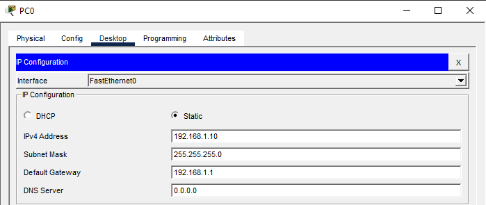

### PC2


---

## Router R1 Configuration

### Step 1: Basic Configuration
```
Router>enable
Router#configure terminal
Router(config)#hostname R1
Router(config)#no ip domain-lookup
```

### Step 2: Configure Interfaces
```
R1(config)#interface gigabitEthernet 0/0
R1(config-if)#ip address 192.168.1.1 255.255.255.0
R1(config-if)#no shutdown
R1(config-if)#exit

R1(config)#interface gigabitEthernet 0/1
R1(config-if)#ip address 10.0.0.1 255.255.255.252
R1(config-if)#no shutdown
R1(config-if)#exit
```

### Step 3: Configure OSPF
```
R1(config)#router ospf 1
R1(config-router)#network 192.168.1.0 0.0.0.255 area 0
R1(config-router)#network 10.0.0.0 0.0.0.3 area 0
R1(config-router)#exit
```

**Note:** OSPF uses **wildcard masks** (inverse of subnet mask)

---

## Router R2 Configuration

### Step 1: Basic Configuration
```
Router>enable
Router#configure terminal
Router(config)#hostname R2
Router(config)#no ip domain-lookup
```

### Step 2: Configure Interfaces
```
R2(config)#interface gigabitEthernet 0/0
R2(config-if)#ip address 10.0.0.2 255.255.255.252
R2(config-if)#no shutdown
R2(config-if)#exit

R2(config)#interface gigabitEthernet 0/1
R2(config-if)#ip address 10.0.0.5 255.255.255.252
R2(config-if)#no shutdown
R2(config-if)#exit
```

### Step 3: Configure OSPF
```
R2(config)#router ospf 1
R2(config-router)#network 10.0.0.0 0.0.0.3 area 0
R2(config-router)#network 10.0.0.4 0.0.0.3 area 0
R2(config-router)#exit
```

---

## Router R3 Configuration

### Step 1: Basic Configuration
```
Router>enable
Router#configure terminal
Router(config)#hostname R3
Router(config)#no ip domain-lookup
```

### Step 2: Configure Interfaces
```
R3(config)#interface gigabitEthernet 0/0
R3(config-if)#ip address 10.0.0.6 255.255.255.252
R3(config-if)#no shutdown
R3(config-if)#exit

R3(config)#interface gigabitEthernet 0/1
R3(config-if)#ip address 192.168.3.1 255.255.255.0
R3(config-if)#no shutdown
R3(config-if)#exit
```

### Step 3: Configure OSPF
```
R3(config)#router ospf 1
R3(config-router)#network 10.0.0.4 0.0.0.3 area 0
R3(config-router)#network 192.168.3.0 0.0.0.255 area 0
R3(config-router)#exit
```

---

## Verification Commands

### On R1

**Check routing table:**
```
R1#show ip route
```

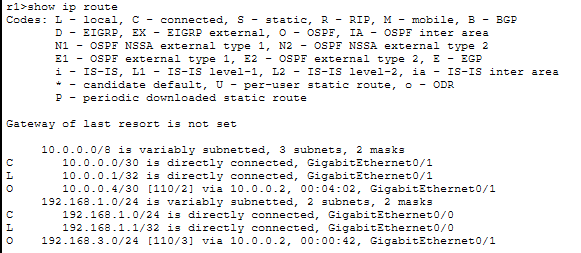

**Expected - OSPF routes marked with 'O':**
```
O    192.168.3.0/24 [110/3] via 10.0.0.2, 00:00:15, GigabitEthernet0/1
```

**Check OSPF neighbors:**
```
R1#show ip ospf neighbor
```

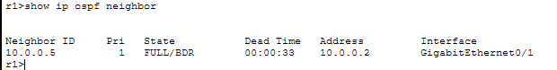


**Check OSPF interfaces:**
```
R1#show ip ospf interface brief
```

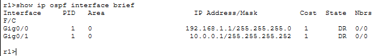

**Check OSPF database:**
```
R1#show ip ospf database
```

**Check OSPF protocol details:**
```
R1#show ip protocols
```

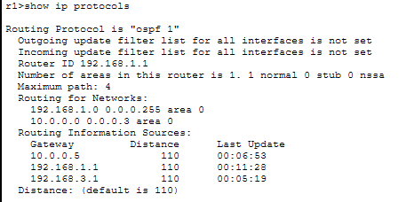

### On R2

**Check OSPF neighbors (should see both R1 and R3):**
```
R2#show ip ospf neighbor
```

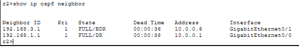

**Check routing table:**
```
R2#show ip route ospf
```


### On R3

**Check routing table:**
```
R3#show ip route
```

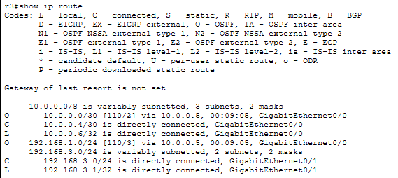

**Check OSPF neighbors:**
```
R3#show ip ospf neighbor
```

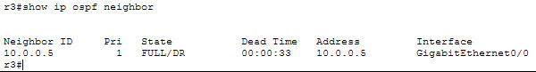

### Connectivity Tests

**From PC1:**
```
ping 192.168.3.10
```

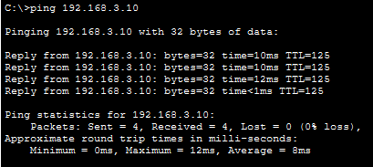

**From R1:**
```
R1#ping 192.168.3.1
```

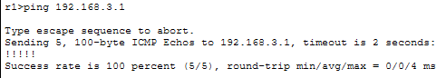

```
R1#traceroute 192.168.3.1
```

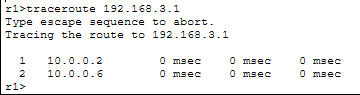

---

## Understanding Wildcard Masks

**Subnet Mask vs Wildcard Mask:**

| Subnet Mask     | Wildcard Mask   | Network Size |
|-----------------|-----------------|--------------|
| 255.255.255.0   | 0.0.0.255       | /24          |
| 255.255.255.252 | 0.0.0.3         | /30          |
| 255.255.255.128 | 0.0.0.127       | /25          |

**Quick calculation:** Wildcard = 255.255.255.255 - Subnet Mask

Example:
- Subnet: 255.255.255.252
- Wildcard: 0.0.0.3 (255-255=0, 255-255=0, 255-255=0, 255-252=3)

---

## Key Concepts

**What is OSPF?**
- **Link-State** routing protocol (not distance-vector like RIP)
- Uses **Dijkstra's algorithm** (SPF - Shortest Path First)
- Metric = **Cost** (based on bandwidth, not hop count)
- Fast convergence (sub-second)
- No hop count limit
- Industry standard (RFC 2328)

**OSPF Process:**
1. **Discover neighbors** via Hello packets (every 10 seconds)
2. **Exchange link-state information** (LSAs)
3. **Build topology database** (LSDB - Link State Database)
4. **Calculate best paths** using SPF algorithm
5. **Populate routing table**

**OSPF Neighbor States:**
- **Down** - No Hello packets received
- **Init** - Hello received, but not bidirectional yet
- **2-Way** - Bidirectional communication established
- **Exstart** - Negotiating master/slave for database exchange
- **Exchange** - Exchanging database descriptions
- **Loading** - Requesting and receiving full LSAs
- **Full** - Fully adjacent, databases synchronized

**OSPF Cost Calculation:**
- Cost = Reference Bandwidth / Interface Bandwidth
- Default reference bandwidth = 100 Mbps
- FastEthernet (100 Mbps) = Cost 1
- GigabitEthernet (1000 Mbps) = Cost 1 (by default, needs adjustment)

**Important OSPF Terms:**
- **Area** - Logical grouping of routers
- **Area 0** - Backbone area (all other areas must connect to it)
- **Router ID** - Unique identifier for each OSPF router (highest IP or loopback)
- **DR/BDR** - Designated Router/Backup (on multi-access networks)
- **LSA** - Link State Advertisement (routing information packets)

---

## OSPF vs RIP Comparison

| Feature           | RIP                  | OSPF                    |
|-------------------|----------------------|-------------------------|
| Type              | Distance Vector      | Link State              |
| Metric            | Hop Count            | Cost (Bandwidth)        |
| Max Hops          | 15                   | Unlimited               |
| Convergence       | Slow (30-60 sec)     | Fast (<1 second)        |
| Updates           | Every 30 seconds     | Triggered updates only  |
| Scalability       | Small networks       | Large networks          |
| Algorithm         | Bellman-Ford         | Dijkstra (SPF)          |
| Bandwidth usage   | High (periodic)      | Low (event-driven)      |
| Subnet support    | RIPv2: Yes           | Yes (always)            |

---

## Outcome

You have successfully:
- Configured OSPF single area (Area 0) on three routers
- Established OSPF neighbor adjacencies
- Verified OSPF routing table with link-state routes
- Understood wildcard masks in OSPF configuration
- Tested end-to-end connectivity using OSPF

**OSPF is the most widely-used interior gateway protocol (IGP) in enterprise networks. Understanding single-area OSPF is critical before moving to multi-area designs.**

---

## Files Included
- `lab13.pkt`
- `README.md`
- `screenshots/`

---

Lab13 **completed successfully**

---
