# LAB 14 — OSPF Multi-Area

## Objective
- Configure OSPF with multiple areas (Area 0, Area 1, Area 2)
- Understand the OSPF hierarchical design and Area Border Routers (ABRs)
- Learn route summarization between areas
- Verify inter-area routing and OSPF LSA types

---

## Topology

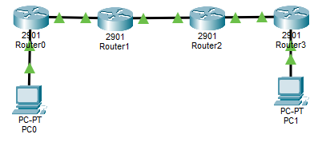

---

## IP Addressing Plan

| Device | Interface | IP Address      | Subnet Mask     | Network          | Area   |
|--------|-----------|-----------------|-----------------|------------------|--------|
| PC1    | NIC       | 192.168.1.10    | 255.255.255.0   | 192.168.1.0/24   | Area 1 |
| R1     | G0/0      | 192.168.1.1     | 255.255.255.0   | 192.168.1.0/24   | Area 1 |
| R1     | G0/1      | 10.1.0.1        | 255.255.255.252 | 10.1.0.0/30      | Area 1 |
| R2     | G0/0      | 10.1.0.2        | 255.255.255.252 | 10.1.0.0/30      | Area 1 |
| R2     | G0/1      | 10.0.0.1        | 255.255.255.252 | 10.0.0.0/30      | Area 0 |
| R3     | G0/0      | 10.0.0.2        | 255.255.255.252 | 10.0.0.0/30      | Area 0 |
| R3     | G0/1      | 10.2.0.1        | 255.255.255.252 | 10.2.0.0/30      | Area 2 |
| R4     | G0/0      | 10.2.0.2        | 255.255.255.252 | 10.2.0.0/30      | Area 2 |
| R4     | G0/1      | 192.168.2.1     | 255.255.255.0   | 192.168.2.0/24   | Area 2 |
| PC2    | NIC       | 192.168.2.10    | 255.255.255.0   | 192.168.2.0/24   | Area 2 |

---

## Physical Connections

- PC1 → R1 G0/0
- R1 G0/1 → R2 G0/0
- R2 G0/1 → R3 G0/0
- R3 G0/1 → R4 G0/0
- R4 G0/1 → PC2

---

## PC Configuration

### PC1

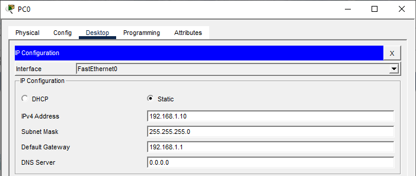

### PC2

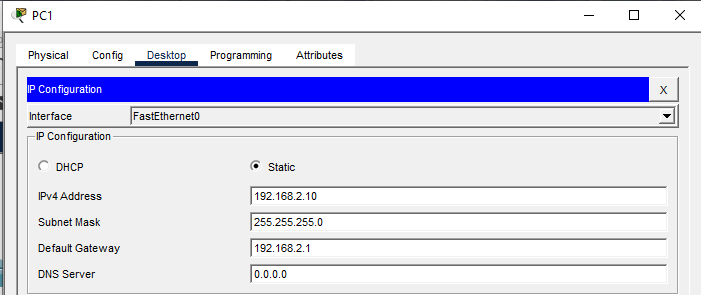

---

## Router R1 Configuration (Area 1 Internal Router)

### Step 1: Basic Configuration
```
Router>enable
Router#configure terminal
Router(config)#hostname R1
Router(config)#no ip domain-lookup
```

### Step 2: Configure Interfaces
```
R1(config)#interface gigabitEthernet 0/0
R1(config-if)#ip address 192.168.1.1 255.255.255.0
R1(config-if)#no shutdown
R1(config-if)#exit

R1(config)#interface gigabitEthernet 0/1
R1(config-if)#ip address 10.1.0.1 255.255.255.252
R1(config-if)#no shutdown
R1(config-if)#exit
```

### Step 3: Configure OSPF (All interfaces in Area 1)
```
R1(config)#router ospf 1
R1(config-router)#network 192.168.1.0 0.0.0.255 area 1
R1(config-router)#network 10.1.0.0 0.0.0.3 area 1
R1(config-router)#exit
```

---

## Router R2 Configuration (ABR - Area Border Router)

### Step 1: Basic Configuration
```
Router>enable
Router#configure terminal
Router(config)#hostname R2
Router(config)#no ip domain-lookup
```

### Step 2: Configure Interfaces
```
R2(config)#interface gigabitEthernet 0/0
R2(config-if)#ip address 10.1.0.2 255.255.255.252
R2(config-if)#no shutdown
R2(config-if)#exit

R2(config)#interface gigabitEthernet 0/1
R2(config-if)#ip address 10.0.0.1 255.255.255.252
R2(config-if)#no shutdown
R2(config-if)#exit
```

### Step 3: Configure OSPF (Connects Area 1 to Area 0)
```
R2(config)#router ospf 1
R2(config-router)#network 10.1.0.0 0.0.0.3 area 1
R2(config-router)#network 10.0.0.0 0.0.0.3 area 0
R2(config-router)#exit
```

**R2 is an ABR because it has interfaces in both Area 1 and Area 0**

---

## Router R3 Configuration (ABR - Area Border Router)

### Step 1: Basic Configuration
```
Router>enable
Router#configure terminal
Router(config)#hostname R3
Router(config)#no ip domain-lookup
```

### Step 2: Configure Interfaces
```
R3(config)#interface gigabitEthernet 0/0
R3(config-if)#ip address 10.0.0.2 255.255.255.252
R3(config-if)#no shutdown
R3(config-if)#exit

R3(config)#interface gigabitEthernet 0/1
R3(config-if)#ip address 10.2.0.1 255.255.255.252
R3(config-if)#no shutdown
R3(config-if)#exit
```

### Step 3: Configure OSPF (Connects Area 0 to Area 2)
```
R3(config)#router ospf 1
R3(config-router)#network 10.0.0.0 0.0.0.3 area 0
R3(config-router)#network 10.2.0.0 0.0.0.3 area 2
R3(config-router)#exit
```

**R3 is an ABR because it has interfaces in both Area 0 and Area 2**

---

## Router R4 Configuration (Area 2 Internal Router)

### Step 1: Basic Configuration
```
Router>enable
Router#configure terminal
Router(config)#hostname R4
Router(config)#no ip domain-lookup
```

### Step 2: Configure Interfaces
```
R4(config)#interface gigabitEthernet 0/0
R4(config-if)#ip address 10.2.0.2 255.255.255.252
R4(config-if)#no shutdown
R4(config-if)#exit

R4(config)#interface gigabitEthernet 0/1
R4(config-if)#ip address 192.168.2.1 255.255.255.0
R4(config-if)#no shutdown
R4(config-if)#exit
```

### Step 3: Configure OSPF (All interfaces in Area 2)
```
R4(config)#router ospf 1
R4(config-router)#network 10.2.0.0 0.0.0.3 area 2
R4(config-router)#network 192.168.2.0 0.0.0.255 area 2
R4(config-router)#exit
```

---

## Verification Commands

### On R1 (Area 1 Internal Router)

**Check routing table:**
```
R1#show ip route
```

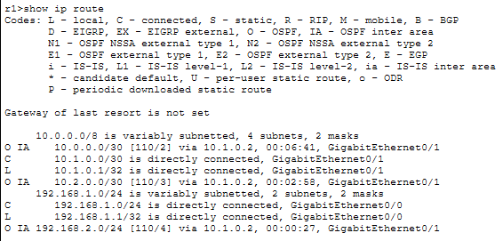

**Look for inter-area routes (marked as 'O IA'):**
```
O IA 192.168.2.0/24 [110/4] via 10.1.0.2, 00:00:15, GigabitEthernet0/1
O IA 10.0.0.0/30 [110/2] via 10.1.0.2, 00:00:15, GigabitEthernet0/1
```

**Check OSPF neighbors:**
```
R1#show ip ospf neighbor
```

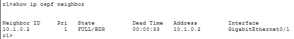

### On R2 (ABR)

**Check that R2 is an ABR:**
```
R2#show ip ospf
```

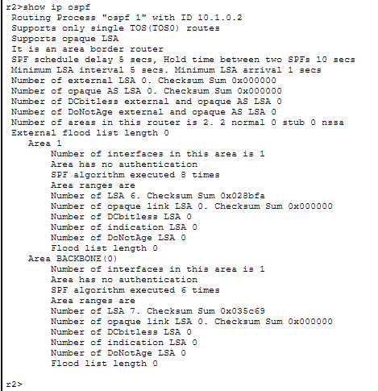

**Look for:** `Area Border Router (ABR)`

**Check OSPF neighbors (should see R1 and R3):**
```
R2#show ip ospf neighbor
```

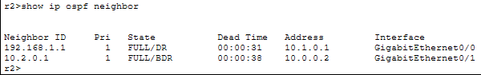

**Check OSPF database:**
```
R2#show ip ospf database
```

**Check routing table:**
```
R2#show ip route ospf
```

### On R3 (ABR)

**Verify ABR status:**
```
R3#show ip ospf
```

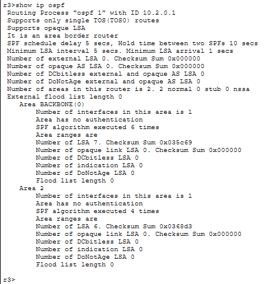

**Check OSPF neighbors:**
```
R3#show ip ospf neighbor
```

**Check routing table:**
```
R3#show ip route
```

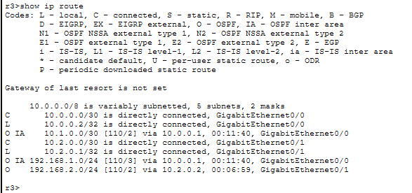

### On R4 (Area 2 Internal Router)

**Check routing table:**
```
R4#show ip route
```

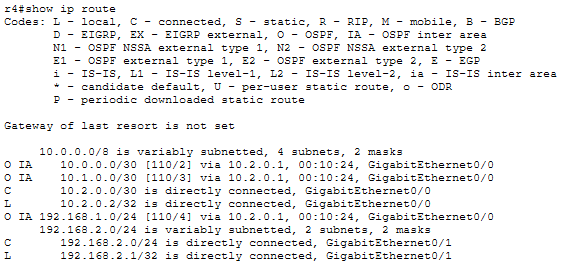

**Check inter-area routes:**
```
R4#show ip route ospf
```

### Connectivity Tests

**From PC1:**
```
ping 192.168.2.10
```

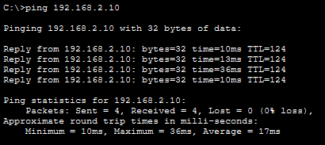

**From R1:**
```
R1#traceroute 192.168.2.1
```

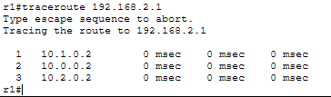

**Path: R1 → R2 → R3 → R4**

---

## Key Concepts

**Why Multi-Area OSPF?**
- **Scalability** - Reduces routing table size
- **Reduces SPF calculations** - Changes in one area don't affect others
- **Reduces LSA flooding** - LSAs are contained within areas
- **Faster convergence** - Smaller LSDB per area
- **Better network design** - Logical hierarchy

**OSPF Area Types:**
- **Area 0 (Backbone)** - All other areas MUST connect to Area 0
- **Standard Area** - Default area (Area 1, Area 2, etc.)
- **Stub Area** - Blocks external routes (not in this lab)
- **Totally Stubby Area** - Blocks external and inter-area routes (Cisco proprietary)
- **NSSA** - Not-So-Stubby Area (allows some external routes)

**Router Types in Multi-Area OSPF:**
- **Internal Router** - All interfaces in same area (R1, R4)
- **Area Border Router (ABR)** - Connects two or more areas (R2, R3)
- **Backbone Router** - Has at least one interface in Area 0 (R2, R3)
- **Autonomous System Boundary Router (ASBR)** - Connects to other routing protocols (not in this lab)

**OSPF LSA Types:**
- **Type 1 (Router LSA)** - Generated by all routers, stays within area
- **Type 2 (Network LSA)** - Generated by DR, stays within area
- **Type 3 (Summary LSA)** - Generated by ABRs, advertises inter-area routes
- **Type 4 (ASBR Summary LSA)** - Points to ASBR
- **Type 5 (External LSA)** - External routes from other protocols
- **Type 7 (NSSA External LSA)** - For NSSA areas

**Route Types in OSPF:**
- **O** - Intra-area routes (within same area)
- **O IA** - Inter-area routes (from different areas via ABR)
- **O E1** - External Type 1 (metric increases with distance)
- **O E2** - External Type 2 (metric doesn't change, default)

**Multi-Area Design Rules:**
- All areas MUST connect to Area 0
- Area 0 cannot be partitioned (split)
- ABRs must have at least one interface in Area 0
- Use contiguous area numbers for easier management

---

## Additional Verification Commands

**Check which areas a router belongs to:**
```
R2#show ip ospf border-routers
```

**View LSA database by type:**
```
R2#show ip ospf database summary
```

**Check specific area information:**
```
R2#show ip ospf interface
```

---

## Single-Area vs Multi-Area OSPF

| Aspect              | Single-Area OSPF     | Multi-Area OSPF          |
|---------------------|----------------------|--------------------------|
| Design              | Flat topology        | Hierarchical             |
| Scalability         | Limited (< 50 routers)| High (hundreds of routers)|
| LSDB size           | Large (all routers)  | Smaller per area         |
| SPF calculations    | Affects all routers  | Contained per area       |
| LSA flooding        | Entire network       | Limited to areas         |
| Configuration       | Simpler              | More complex             |
| Convergence         | Slower (large LSDB)  | Faster (smaller LSDB)    |
| Best for            | Small networks       | Enterprise networks      |

---

## LAB COMPLETE

- Configured OSPF with multiple areas (Area 0, Area 1, Area 2)
- Set up Area Border Routers (ABRs) connecting different areas
- Verified inter-area routing (O IA routes)
- Understood OSPF hierarchical design and LSA types
- Tested end-to-end connectivity across multiple OSPF areas

---

## Files Included
- `lab14.pkt`
- `README.md`
- `screenshots/`

---

Lab14 **completed successfully**

---
