# LAB 15 — EIGRP Configuration

## Objective
- Configure EIGRP (Enhanced Interior Gateway Routing Protocol) on multiple routers
- Understand EIGRP's hybrid routing characteristics
- Learn EIGRP metric calculation and neighbor relationships
- Compare EIGRP with OSPF and RIP

---

## Topology

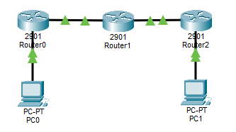

**All routers running EIGRP AS 100**

---

## IP Addressing Plan

| Device | Interface | IP Address      | Subnet Mask     | Network          |
|--------|-----------|-----------------|-----------------|------------------|
| PC1    | NIC       | 192.168.1.10    | 255.255.255.0   | 192.168.1.0/24   |
| R1     | G0/0      | 192.168.1.1     | 255.255.255.0   | 192.168.1.0/24   |
| R1     | G0/1      | 10.0.0.1        | 255.255.255.252 | 10.0.0.0/30      |
| R2     | G0/0      | 10.0.0.2        | 255.255.255.252 | 10.0.0.0/30      |
| R2     | G0/1      | 10.0.0.5        | 255.255.255.252 | 10.0.0.4/30      |
| R3     | G0/0      | 10.0.0.6        | 255.255.255.252 | 10.0.0.4/30      |
| R3     | G0/1      | 192.168.3.1     | 255.255.255.0   | 192.168.3.0/24   |
| PC2    | NIC       | 192.168.3.10    | 255.255.255.0   | 192.168.3.0/24   |

---

## Physical Connections

- PC1 → R1 G0/0
- R1 G0/1 → R2 G0/0
- R2 G0/1 → R3 G0/0
- R3 G0/1 → PC2

---

## PC Configuration

### PC1

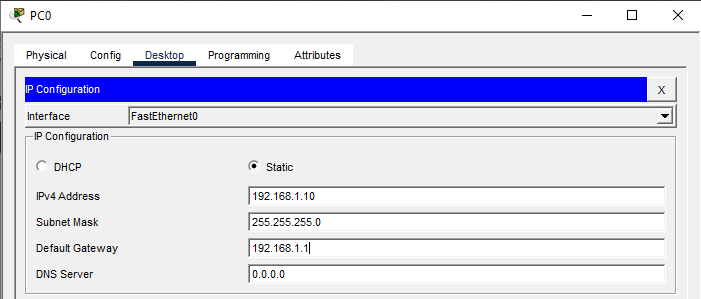

### PC2

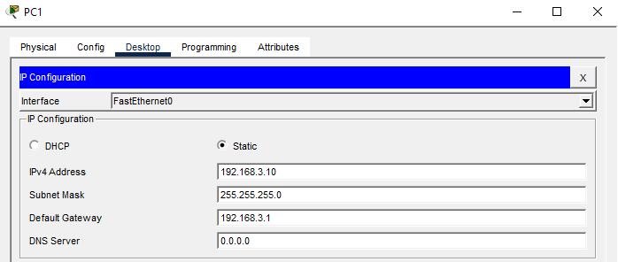

---

## Router R1 Configuration

### Step 1: Basic Configuration
```
Router>enable
Router#configure terminal
Router(config)#hostname R1
Router(config)#no ip domain-lookup
```

### Step 2: Configure Interfaces
```
R1(config)#interface gigabitEthernet 0/0
R1(config-if)#ip address 192.168.1.1 255.255.255.0
R1(config-if)#no shutdown
R1(config-if)#exit

R1(config)#interface gigabitEthernet 0/1
R1(config-if)#ip address 10.0.0.1 255.255.255.252
R1(config-if)#no shutdown
R1(config-if)#exit
```

### Step 3: Configure EIGRP
```
R1(config)#router eigrp 100
R1(config-router)#network 192.168.1.0 0.0.0.255
R1(config-router)#network 10.0.0.0 0.0.0.3
R1(config-router)#no auto-summary
R1(config-router)#exit
```

**Note:** 
- `100` is the Autonomous System (AS) number - must match on all routers
- EIGRP uses wildcard masks like OSPF
- `no auto-summary` prevents automatic route summarization

---

## Router R2 Configuration

### Step 1: Basic Configuration
```
Router>enable
Router#configure terminal
Router(config)#hostname R2
Router(config)#no ip domain-lookup
```

### Step 2: Configure Interfaces
```
R2(config)#interface gigabitEthernet 0/0
R2(config-if)#ip address 10.0.0.2 255.255.255.252
R2(config-if)#no shutdown
R2(config-if)#exit

R2(config)#interface gigabitEthernet 0/1
R2(config-if)#ip address 10.0.0.5 255.255.255.252
R2(config-if)#no shutdown
R2(config-if)#exit
```

### Step 3: Configure EIGRP
```
R2(config)#router eigrp 100
R2(config-router)#network 10.0.0.0 0.0.0.3
R2(config-router)#network 10.0.0.4 0.0.0.3
R2(config-router)#no auto-summary
R2(config-router)#exit
```

---

## Router R3 Configuration

### Step 1: Basic Configuration
```
Router>enable
Router#configure terminal
Router(config)#hostname R3
Router(config)#no ip domain-lookup
```

### Step 2: Configure Interfaces
```
R3(config)#interface gigabitEthernet 0/0
R3(config-if)#ip address 10.0.0.6 255.255.255.252
R3(config-if)#no shutdown
R3(config-if)#exit

R3(config)#interface gigabitEthernet 0/1
R3(config-if)#ip address 192.168.3.1 255.255.255.0
R3(config-if)#no shutdown
R3(config-if)#exit
```

### Step 3: Configure EIGRP
```
R3(config)#router eigrp 100
R3(config-router)#network 10.0.0.4 0.0.0.3
R3(config-router)#network 192.168.3.0 0.0.0.255
R3(config-router)#no auto-summary
R3(config-router)#exit
```

---

## Verification Commands

### On R1

**Check routing table:**
```
R1#show ip route
```
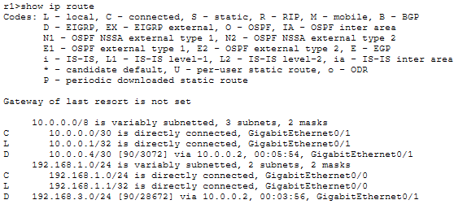

**Expected - EIGRP routes marked with 'D':**
```
D    192.168.3.0/24 [90/3072] via 10.0.0.2, 00:00:15, GigabitEthernet0/1
```
- **D** = EIGRP route
- **90** = Administrative Distance
- **3072** = EIGRP metric (composite metric)

**Check EIGRP neighbors:**
```
R1#show ip eigrp neighbors
```
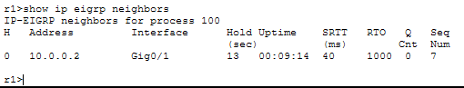

**Check EIGRP topology table:**
```
R1#show ip eigrp topology
```

**Check EIGRP interfaces:**
```
R1#show ip eigrp interfaces
```

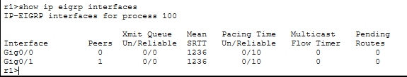

**Check EIGRP protocol details:**
```
R1#show ip protocols
```
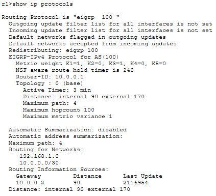

### On R2

**Check EIGRP neighbors (should see both R1 and R3):**
```
R2#show ip eigrp neighbors
```
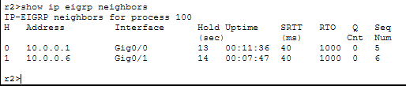

**Check routing table:**
```
R2#show ip route eigrp
```

**Check EIGRP topology:**
```
R2#show ip eigrp topology all-links
```

### On R3

**Check routing table:**
```
R3#show ip route
```
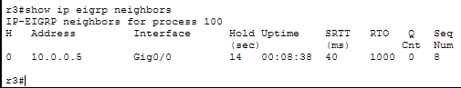

**Check EIGRP neighbors:**
```
R3#show ip eigrp neighbors
```

### Connectivity Tests

**From PC1:**
```
ping 192.168.3.10
```
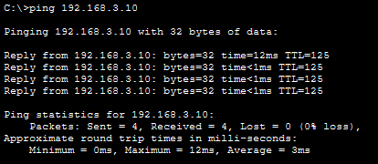

**From R1:**
```
R1#ping 192.168.3.1
```
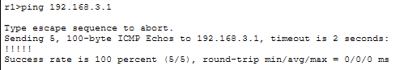

```
R1#traceroute 192.168.3.1
```
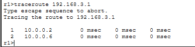

---

## Key Concepts

**What is EIGRP?**
- **Advanced Distance Vector** (sometimes called "Hybrid")
- **Cisco proprietary** (but open standard since 2013 - RFC 7868)
- Uses **DUAL algorithm** (Diffusing Update Algorithm)
- Fast convergence (sub-second)
- Sends **partial updates** only (not full routing table)
- Supports unequal-cost load balancing
- Uses multicast (224.0.0.10) for updates

**EIGRP Metric Calculation:**
```
Metric = 256 × [(K1 × Bandwidth) + (K2 × Bandwidth)/(256 - Load) + (K3 × Delay)]
```

**Default (simplified):**
```
Metric = 256 × (Bandwidth + Delay)
```

Where:
- **Bandwidth** = Slowest link in path (in Kbps)
- **Delay** = Cumulative delay (in microseconds)
- **K-values** = K1=1, K2=0, K3=1, K4=0, K5=0 (by default)

**EIGRP Terminology:**
- **AS Number** - Autonomous System number (must match for neighbors)
- **Successor** - Best route to destination (goes into routing table)
- **Feasible Successor** - Backup route (loop-free, pre-calculated)
- **Feasible Distance (FD)** - Best metric to reach destination
- **Reported Distance (RD)** - Neighbor's metric to destination
- **DUAL** - Algorithm that ensures loop-free paths

**EIGRP Packet Types:**
1. **Hello** - Neighbor discovery and keepalive (every 5 seconds on LAN)
2. **Update** - Route information (sent only when needed)
3. **Query** - Ask neighbors about routes (when route is lost)
4. **Reply** - Response to query
5. **ACK** - Acknowledgment of reliable packets

**EIGRP Neighbor Requirements:**
- Same AS number
- Same K-values
- Authentication match (if configured)
- Must be on same subnet

**Administrative Distance:**
- **Internal EIGRP routes** = 90
- **External EIGRP routes** = 170
- (Lower is better - EIGRP preferred over OSPF which is 110)

---

## EIGRP Features

**Advantages:**
- **Fast convergence** - Sub-second using pre-calculated backup routes
- **Efficient updates** - Partial, triggered updates only
- **Low bandwidth usage** - Only changes are sent
- **Unequal-cost load balancing** - Can use multiple paths with different metrics
- **Easy configuration** - Simpler than OSPF
- **Supports large networks** - No hop limit like RIP

**Disadvantages:**
- **Cisco proprietary** (though RFC exists, rarely implemented by others)
- **Less flexible** than OSPF for complex designs
- **No hierarchical design** like OSPF areas

---

## Comparison: RIP vs OSPF vs EIGRP

| Feature           | RIP              | OSPF                | EIGRP              |
|-------------------|------------------|---------------------|--------------------|
| Type              | Distance Vector  | Link State          | Advanced Distance Vector |
| Algorithm         | Bellman-Ford     | Dijkstra (SPF)      | DUAL               |
| Metric            | Hop Count        | Cost (Bandwidth)    | Bandwidth + Delay  |
| Convergence       | Slow (30-60s)    | Fast (<1s)          | Very Fast (<1s)    |
| Updates           | Periodic (30s)   | Triggered only      | Triggered only     |
| Bandwidth usage   | High             | Medium              | Low                |
| Protocol support  | Standard (RFC)   | Standard (RFC)      | Cisco (RFC exists) |
| Admin Distance    | 120              | 110                 | 90 (internal)      |
| Max hops          | 15               | Unlimited           | 255 (default)      |
| Load balancing    | Equal-cost only  | Equal-cost only     | Unequal-cost supported |
| Scalability       | Small networks   | Large networks      | Large networks     |

---

## Additional Commands

**View EIGRP traffic statistics:**
```
R1#show ip eigrp traffic
```

**Check specific neighbor details:**
```
R1#show ip eigrp neighbors detail
```

**View all EIGRP routes (including feasible successors):**
```
R1#show ip eigrp topology all-links
```

**Debug EIGRP packets:**
```
R1#debug eigrp packets
```

**Stop debugging:**
```
R1#undebug all
```

**Clear EIGRP neighbors (force reconvergence):**
```
R1#clear ip eigrp neighbors
```

---

## LAB COMPLETE

- Configured EIGRP on three routers using AS 100
- Established EIGRP neighbor relationships
- Verified EIGRP routing table with dynamic routes
- Understood EIGRP metric calculation and DUAL algorithm
- Compared EIGRP with RIP and OSPF
- Tested end-to-end connectivity using EIGRP

---

## Files Included
- `lab15.pkt`
- `README.md`
- `screenshots/`

---

Lab15 **completed successfully**

---
