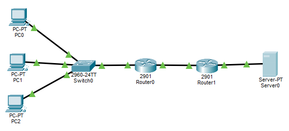
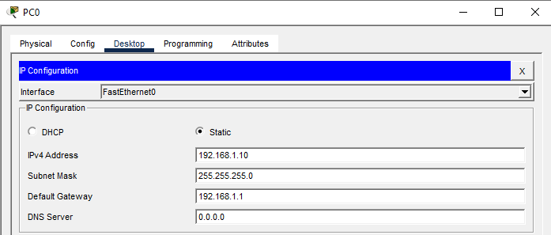
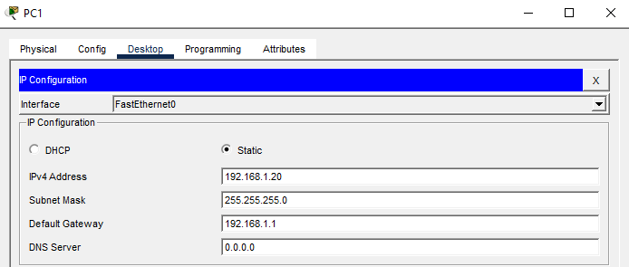
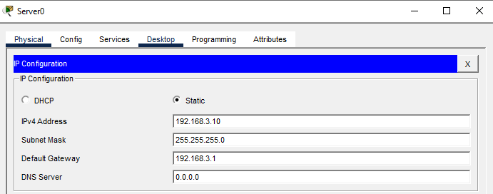
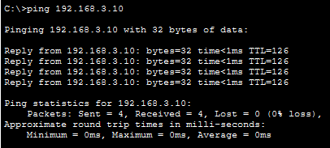
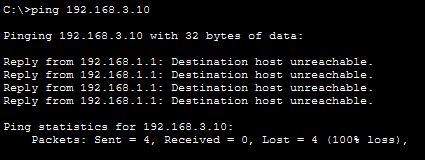
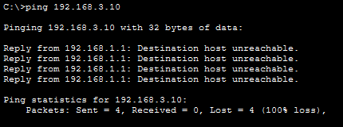
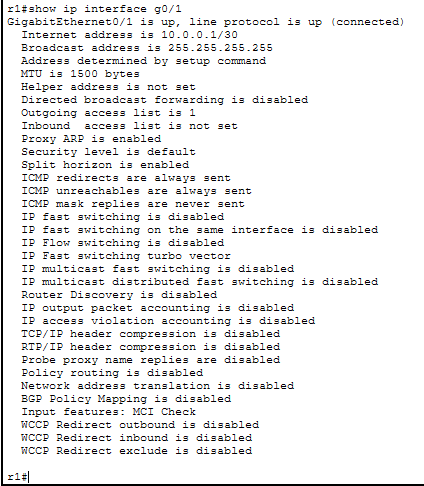

# LAB 16 — Standard ACL (Access Control List)

## Objective
- Configure Standard Access Control Lists (ACLs) to filter traffic based on source IP address
- Understand ACL logic and packet filtering
- Apply ACLs to router interfaces
- Learn the difference between inbound and outbound ACLs

---

## Topology

```
PC1 (192.168.1.10) ---\
                       \
PC2 (192.168.1.20) --- R1 --- R2 --- Server (192.168.3.10)
                       /
PC3 (192.168.1.30) ---/
    (LAN)                      (Server Network)
```



**Goal:** Allow only PC1 to access the Server, block PC2 and PC3

---

## IP Addressing Plan

| Device | Interface | IP Address      | Subnet Mask     | Network          |
|--------|-----------|-----------------|-----------------|------------------|
| PC1    | NIC       | 192.168.1.10    | 255.255.255.0   | 192.168.1.0/24   |
| PC2    | NIC       | 192.168.1.20    | 255.255.255.0   | 192.168.1.0/24   |
| PC3    | NIC       | 192.168.1.30    | 255.255.255.0   | 192.168.1.0/24   |
| R1     | G0/0      | 192.168.1.1     | 255.255.255.0   | 192.168.1.0/24   |
| R1     | G0/1      | 10.0.0.1        | 255.255.255.252 | 10.0.0.0/30      |
| R2     | G0/0      | 10.0.0.2        | 255.255.255.252 | 10.0.0.0/30      |
| R2     | G0/1      | 192.168.3.1     | 255.255.255.0   | 192.168.3.0/24   |
| Server | NIC       | 192.168.3.10    | 255.255.255.0   | 192.168.3.0/24   |

---

## Physical Connections

- PC1 → Switch F0/1
- PC2 → Switch F0/2
- PC3 → Switch F0/3
- Switch F0/24 → R1 G0/0
- R1 G0/1 → R2 G0/0
- R2 G0/1 → Server

---

## PC Configuration

### PC1


### PC2


### PC3


### Server


---

## Switch Configuration

### Basic Switch Setup
```
Switch>enable
Switch#configure terminal
Switch(config)#hostname SW1
Switch(config)#exit
```

**No VLAN configuration needed - all ports in default VLAN 1**

---

## Router R1 Configuration

### Step 1: Basic Configuration
```
Router>enable
Router#configure terminal
Router(config)#hostname R1
Router(config)#no ip domain-lookup
```

### Step 2: Configure Interfaces
```
R1(config)#interface gigabitEthernet 0/0
R1(config-if)#ip address 192.168.1.1 255.255.255.0
R1(config-if)#no shutdown
R1(config-if)#exit

R1(config)#interface gigabitEthernet 0/1
R1(config-if)#ip address 10.0.0.1 255.255.255.252
R1(config-if)#no shutdown
R1(config-if)#exit
```

### Step 3: Configure Static Routing
```
R1(config)#ip route 192.168.3.0 255.255.255.0 10.0.0.2
```

### Step 4: Configure Standard ACL
```
R1(config)#access-list 1 permit 192.168.1.10 0.0.0.0
R1(config)#access-list 1 deny any
```

**Explanation:**
- **access-list 1** - Standard ACL number (1-99 or 1300-1999)
- **permit 192.168.1.10 0.0.0.0** - Allow only PC1 (wildcard mask 0.0.0.0 = exact match)
- **deny any** - Block all other traffic (implicit, but written for clarity)

### Step 5: Apply ACL to Interface
```
R1(config)#interface gigabitEthernet 0/1
R1(config-if)#ip access-group 1 out
R1(config-if)#exit
```

**Note:** Applied **outbound** on G0/1 (towards R2/Server)

---

## Router R2 Configuration

### Step 1: Basic Configuration
```
Router>enable
Router#configure terminal
Router(config)#hostname R2
Router(config)#no ip domain-lookup
```

### Step 2: Configure Interfaces
```
R2(config)#interface gigabitEthernet 0/0
R2(config-if)#ip address 10.0.0.2 255.255.255.252
R2(config-if)#no shutdown
R2(config-if)#exit

R2(config)#interface gigabitEthernet 0/1
R2(config-if)#ip address 192.168.3.1 255.255.255.0
R2(config-if)#no shutdown
R2(config-if)#exit
```

### Step 3: Configure Static Routing
```
R2(config)#ip route 192.168.1.0 255.255.255.0 10.0.0.1
```

---

## Verification Commands

### Before Applying ACL

**From PC1, PC2, PC3 - test connectivity:**
```
ping 192.168.3.10
```

**All PCs should be able to ping the Server**

### After Applying ACL

**From PC1:**
```
ping 192.168.3.10
```


**It works**

**From PC2:**
```
ping 192.168.3.10
```


**Fails (Request timed out or Destination host unreachable)**

**From PC3:**
```
ping 192.168.3.10
```


**Fails**

---

## ACL Verification on R1

**View configured ACLs:**
```
R1#show access-lists
```


**Expected output:**
```
Standard IP access list 1
    10 permit 192.168.1.10
    20 deny any (implicit)
```

**View ACL statistics (hit counts):**
```
R1#show access-lists
```

You'll see match counters next to each ACL entry showing how many packets matched.

**View ACL applied to interface:**
```
R1#show ip interface gigabitEthernet 0/1
```


**Look for:**
```
Outgoing access list is 1
```

**View running config to see ACL:**
```
R1#show running-config | section access-list
```

---

## Key Concepts

**What is an ACL?**
- **Access Control List** - Packet filter that controls traffic flow
- Configured on routers (not switches, usually)
- Reads packets sequentially from top to bottom
- Stops at first match (important!)
- Has an **implicit deny any** at the end

**Standard ACL:**
- Filters based on **source IP address ONLY**
- Cannot filter by destination, port, or protocol
- ACL numbers: **1-99** or **1300-1999**
- Should be placed **close to destination**

**ACL Logic Flow:**
1. Packet arrives at router
2. Router checks ACL from top to bottom
3. First match = action taken (permit or deny)
4. If no match = implicit deny (packet dropped)

**Wildcard Masks:**
- **Inverse of subnet mask**
- 0 = must match exactly
- 255 = don't care (any value)

Examples:
| Purpose              | Wildcard Mask | Meaning                    |
|----------------------|---------------|----------------------------|
| Single host          | 0.0.0.0       | Exact match                |
| /24 network          | 0.0.0.255     | Match first 3 octets       |
| /16 network          | 0.0.255.255   | Match first 2 octets       |
| Any address          | 255.255.255.255| Match anything            |

**Inbound vs Outbound:**
- **Inbound (in)** - Applied to traffic **entering** the interface
- **Outbound (out)** - Applied to traffic **leaving** the interface

**Best Practices:**
- Place Standard ACLs **close to destination**
- Most specific rules first, general rules last
- Use `permit any` explicitly if needed (better than relying on implicit deny)
- Document your ACLs with `remark` statements

---

## Additional ACL Examples

**Permit a specific host:**
```
access-list 1 permit 192.168.1.10 0.0.0.0
```
Or use shorthand:
```
access-list 1 permit host 192.168.1.10
```

**Permit an entire network:**
```
access-list 1 permit 192.168.1.0 0.0.0.255
```

**Permit any address:**
```
access-list 1 permit any
```

**Deny a specific host, permit everyone else:**
```
access-list 2 deny 192.168.1.20 0.0.0.0
access-list 2 permit any
```

---

## Modifying ACLs

**Problem:** You can't edit Standard ACLs line-by-line in numbered format!

**To modify:**

**Option 1: Remove and recreate**
```
R1(config)#no access-list 1
R1(config)#access-list 1 permit 192.168.1.10 0.0.0.0
R1(config)#access-list 1 permit 192.168.1.30 0.0.0.0
R1(config)#access-list 1 deny any
```

**Option 2: Use Named ACL (more flexible)**
```
R1(config)#ip access-list standard ALLOW_PC1
R1(config-std-nacl)#permit host 192.168.1.10
R1(config-std-nacl)#deny any
R1(config-std-nacl)#exit

R1(config)#interface g0/1
R1(config-if)#ip access-group ALLOW_PC1 out
```

---

## Common ACL Mistakes

**Wrong order:**
```
access-list 1 permit any
access-list 1 deny 192.168.1.20
```
Problem: `permit any` matches first, so the deny never executes!

**Wrong placement:**
Standard ACL applied near source blocks ALL traffic, not just to specific destination.

**Forgetting implicit deny:**
If you only have `permit` statements, everything else is denied.

**Wrong wildcard mask:**
```
access-list 1 permit 192.168.1.0 255.255.255.0  ← WRONG (subnet mask, not wildcard)
access-list 1 permit 192.168.1.0 0.0.0.255      ← CORRECT (wildcard mask)
```

---

## Removing ACLs

**Remove ACL from interface:**
```
R1(config)#interface g0/1
R1(config-if)#no ip access-group 1 out
```

**Delete entire ACL:**
```
R1(config)#no access-list 1
```

---

## Outcome
- Configured a Standard ACL to filter traffic based on source IP
- Applied ACL to a router interface (outbound)
- Verified selective traffic filtering (PC1 allowed, PC2 and PC3 blocked)
- Understood ACL logic, wildcard masks, and placement rules
- Learned the difference between numbered and named ACLs

---

## Files Included
- `lab16.pkt`
- `README.md`
- `screenshots/`

---

Lab16 **completed successfully**

---
