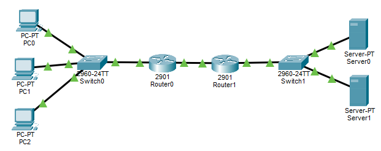
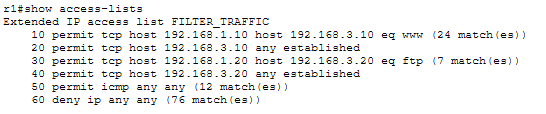
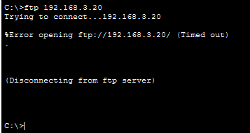
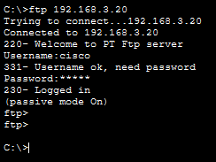
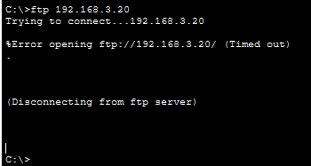
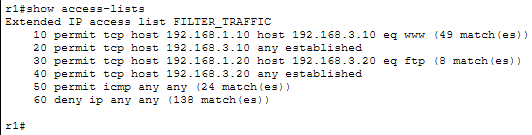
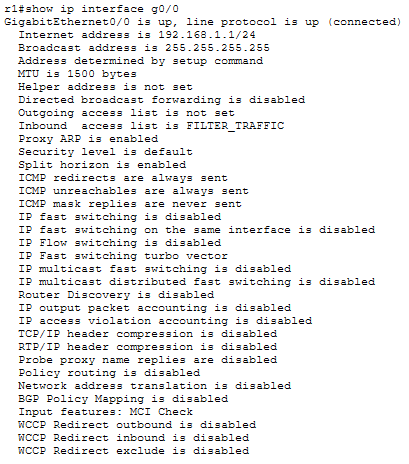

# LAB 17 — Extended ACL (Access Control List)

## Objective
- Configure Extended Access Control Lists to filter traffic based on source IP, destination IP, protocol, and port numbers
- Understand the difference between Standard and Extended ACLs
- Apply Extended ACLs for granular traffic control
- Learn proper ACL placement strategies

---

## Topology

```
PC1 (192.168.1.10) ---\
                       \
PC2 (192.168.1.20) --- SW1 --- R1 --- R2 --- SW2 --- Web Server (192.168.3.10)
                       /                              FTP Server (192.168.3.20)
PC3 (192.168.1.30) ---/
    (LAN)                                            (Server Network)
```



**Goals:**
- Allow PC1 to access Web Server (HTTP) only
- Allow PC2 to access FTP Server only
- Block PC3 from accessing both servers (except ping)
- Allow all ICMP (ping) traffic

---

## IP Addressing Plan

| Device      | Interface | IP Address      | Subnet Mask     | Default Gateway  |
|-------------|-----------|-----------------|-----------------|------------------|
| PC1         | NIC       | 192.168.1.10    | 255.255.255.0   | 192.168.1.1      |
| PC2         | NIC       | 192.168.1.20    | 255.255.255.0   | 192.168.1.1      |
| PC3         | NIC       | 192.168.1.30    | 255.255.255.0   | 192.168.1.1      |
| R1          | G0/0      | 192.168.1.1     | 255.255.255.0   | N/A              |
| R1          | G0/1      | 10.0.0.1        | 255.255.255.252 | N/A              |
| R2          | G0/0      | 10.0.0.2        | 255.255.255.252 | N/A              |
| R2          | G0/1      | 192.168.3.1     | 255.255.255.0   | N/A              |
| Web Server  | NIC       | 192.168.3.10    | 255.255.255.0   | 192.168.3.1      |
| FTP Server  | NIC       | 192.168.3.20    | 255.255.255.0   | 192.168.3.1      |

---

## Physical Connections

- PC1 → SW1 F0/1
- PC2 → SW1 F0/2
- PC3 → SW1 F0/3
- SW1 F0/24 → R1 G0/0
- R1 G0/1 → R2 G0/0
- Web Server → SW2 F0/1
- FTP Server → SW2 F0/2
- SW2 F0/24 → R2 G0/1

---

## PC Configuration

### PC1
```
IP Address: 192.168.1.10
Subnet Mask: 255.255.255.0
Default Gateway: 192.168.1.1
```

### PC2
```
IP Address: 192.168.1.20
Subnet Mask: 255.255.255.0
Default Gateway: 192.168.1.1
```

### PC3
```
IP Address: 192.168.1.30
Subnet Mask: 255.255.255.0
Default Gateway: 192.168.1.1
```

---

## Server Configuration

### Web Server
```
IP Address: 192.168.3.10
Subnet Mask: 255.255.255.0
Default Gateway: 192.168.3.1
```

**Enable HTTP Service:**
1. Click Web Server → Services tab
2. Click HTTP
3. Ensure service is **ON**
4. Verify `index.html` exists in file list

### FTP Server
```
IP Address: 192.168.3.20
Subnet Mask: 255.255.255.0
Default Gateway: 192.168.3.1
```

**Enable FTP Service:**
1. Click FTP Server → Services tab
2. Click FTP
3. Ensure service is **ON**
4. Default username: `cisco` / password: `cisco` (or set your own)

---

## Switch Configuration

### Switch 1 (LAN side)
```
Switch>enable
Switch#configure terminal
Switch(config)#hostname SW1
Switch(config)#exit
```

### Switch 2 (Server side)
```
Switch>enable
Switch#configure terminal
Switch(config)#hostname SW2
Switch(config)#exit
```

---

## Router R1 Configuration

### Step 1: Basic Configuration
```
Router>enable
Router#configure terminal
Router(config)#hostname R1
Router(config)#no ip domain-lookup
```

### Step 2: Configure Interfaces
```
R1(config)#interface gigabitEthernet 0/0
R1(config-if)#ip address 192.168.1.1 255.255.255.0
R1(config-if)#no shutdown
R1(config-if)#exit

R1(config)#interface gigabitEthernet 0/1
R1(config-if)#ip address 10.0.0.1 255.255.255.252
R1(config-if)#no shutdown
R1(config-if)#exit
```

### Step 3: Configure Static Routing
```
R1(config)#ip route 192.168.3.0 255.255.255.0 10.0.0.2
```

### Step 4: Configure Extended ACL
```
R1(config)#ip access-list extended FILTER_TRAFFIC
R1(config-ext-nacl)#remark PC1 to Web Server HTTP
R1(config-ext-nacl)#permit tcp host 192.168.1.10 host 192.168.3.10 eq 80
R1(config-ext-nacl)#permit tcp host 192.168.3.10 any established
R1(config-ext-nacl)#remark PC2 to FTP Server FTP
R1(config-ext-nacl)#permit tcp host 192.168.1.20 host 192.168.3.20 eq 21
R1(config-ext-nacl)#permit tcp host 192.168.3.20 any established
R1(config-ext-nacl)#remark Allow all ICMP
R1(config-ext-nacl)#permit icmp any any
R1(config-ext-nacl)#remark Block everything else
R1(config-ext-nacl)#deny ip any any
R1(config-ext-nacl)#exit
```

**Explanation:**
- **permit tcp host 192.168.1.10 host 192.168.3.10 eq 80** - Allow PC1 → Web Server (HTTP outgoing)
- **permit tcp host 192.168.3.10 any established** - Allow Web Server → PC1 (HTTP return traffic)
- **permit tcp host 192.168.1.20 host 192.168.3.20 eq 21** - Allow PC2 → FTP Server (FTP outgoing)
- **permit tcp host 192.168.3.20 any established** - Allow FTP Server → PC2 (FTP return traffic)
- **permit icmp any any** - Allow all ping traffic
- **deny ip any any** - Block all other traffic (explicit deny)

**Note on `established` keyword:**
The `established` keyword allows return traffic from servers. It checks for TCP ACK or RST flags, meaning the packet is part of an existing connection, not a new connection attempt.

### Step 5: Apply ACL to Interface
```
R1(config)#interface gigabitEthernet 0/0
R1(config-if)#ip access-group FILTER_TRAFFIC in
R1(config-if)#exit
```

**Note:** Applied **inbound** on G0/0 (from PCs) - Extended ACLs should be placed **close to source**

---

## Router R2 Configuration

### Step 1: Basic Configuration
```
Router>enable
Router#configure terminal
Router(config)#hostname R2
Router(config)#no ip domain-lookup
```

### Step 2: Configure Interfaces
```
R2(config)#interface gigabitEthernet 0/0
R2(config-if)#ip address 10.0.0.2 255.255.255.252
R2(config-if)#no shutdown
R2(config-if)#exit

R2(config)#interface gigabitEthernet 0/1
R2(config-if)#ip address 192.168.3.1 255.255.255.0
R2(config-if)#no shutdown
R2(config-if)#exit
```

### Step 3: Configure Static Routing
```
R2(config)#ip route 192.168.1.0 255.255.255.0 10.0.0.1
```

---

## Verification Commands

### Test 1: PC1 to Web Server HTTP (Should Work)

**Clear ACL counters first:**
```
R1#clear access-list counters FILTER_TRAFFIC
```

**From PC1 - Desktop → Web Browser:**
```
http://192.168.3.10
```

Wait 10 seconds (page may appear blank due to PT browser rendering issue).

**Check ACL counters on R1:**
```
R1#show access-lists FILTER_TRAFFIC
```


**Expected - lines 10 and 20 should have matches:**
```
Extended IP access list FILTER_TRAFFIC
    10 permit tcp host 192.168.1.10 host 192.168.3.10 eq www (2 matches)
    20 permit tcp host 192.168.3.10 any established (3 matches)
    30 permit tcp host 192.168.1.20 host 192.168.3.20 eq ftp
    40 permit tcp host 192.168.3.20 any established
    50 permit icmp any any
    60 deny ip any any
```

**If both lines 10 and 20 show matches → HTTP is working correctly**

---

### Test 2: PC1 to FTP Server (Should Fail)

**From PC1 - Desktop → Command Prompt:**
```
ftp 192.168.3.20
```


**Should timeout or fail.**

**Check ACL:**
```
R1#show access-lists FILTER_TRAFFIC
```

**Line 60 (deny ip any any) should increment** - PC1's FTP blocked**

---

### Test 3: PC2 to FTP Server (Should Work)

**From PC2 - Desktop → Command Prompt:**
```
ftp 192.168.3.20
```

Username: `cisco`  
Password: `cisco`



**Should connect successfully**

**Check ACL counters:**
```
R1#show access-lists FILTER_TRAFFIC
```

**Lines 30 and 40 should have matches.**

---

### Test 4: PC2 to Web Server HTTP (Should Fail)

**From PC2 - Desktop → Web Browser:**
```
http://192.168.3.10
```

**Should timeout.**

**Check ACL - line 60 should increment**

---

### Test 5: PC3 Ping (Should Work )

**From PC3 - Command Prompt:**
```
ping 192.168.3.10
ping 192.168.3.20
```

**Ping should work** (ICMP allowed by line 50) 

---

### Test 6: PC3 HTTP and FTP (Should Fail )

**From PC3 - Try HTTP and FTP:**
```
ftp 192.168.3.20
```



Web Browser → `http://192.168.3.10`

**Both should fail.**

**Check ACL - line 60 should increment for each attempt **

---

## ACL Verification on R1

**View complete ACL with match counters:**
```
R1#show access-lists FILTER_TRAFFIC
```


**Check ACL application on interface:**
```
R1#show ip interface gigabitEthernet 0/0 | include access list
```


**Should show:**
```
Inbound access list is FILTER_TRAFFIC
```

---

## Key Concepts

**Extended ACL Features:**
- Filters based on:
  - **Source IP address**
  - **Destination IP address**
  - **Protocol** (TCP, UDP, ICMP, IP, etc.)
  - **Port numbers** (source and/or destination)
- ACL numbers: **100-199** or **2000-2699**
- More granular control than Standard ACLs
- Should be placed **close to source**

**Extended ACL Syntax:**
```
access-list [number] [permit|deny] [protocol] [source] [destination] [port]
```

**Named Extended ACL Syntax (Recommended):**
```
ip access-list extended [NAME]
  [permit|deny] [protocol] [source] [destination] [port]
```

**Common Protocols:**
- **tcp** - Transmission Control Protocol
- **udp** - User Datagram Protocol
- **icmp** - Internet Control Message Protocol (ping)
- **ip** - Any IP traffic

**Common Port Numbers:**
- **80** - HTTP (web)
- **443** - HTTPS (secure web)
- **21** - FTP (file transfer)
- **22** - SSH (secure shell)
- **23** - Telnet
- **53** - DNS
- **25** - SMTP (email)

**Port Operators:**
- **eq** - Equal to (eq 80)
- **neq** - Not equal to
- **lt** - Less than
- **gt** - Greater than
- **range** - Port range (range 1024 2048)

**The `established` Keyword:**
- Matches TCP packets with ACK or RST flags set
- Allows return traffic from servers
- Only works for TCP (not UDP or ICMP)
- Critical for stateless packet filtering

---

## Extended vs Standard ACL

| Feature              | Standard ACL          | Extended ACL                |
|----------------------|-----------------------|-----------------------------|
| ACL Numbers          | 1-99, 1300-1999       | 100-199, 2000-2699          |
| Filters by           | Source IP only        | Source, Destination, Protocol, Port |
| Granularity          | Low                   | High                        |
| Placement            | Close to destination  | Close to source             |
| Use case             | Simple filtering      | Complex traffic control     |
| Configuration        | Simpler               | More detailed               |

---

## ACL Placement Best Practices

**Standard ACL:**
- Place **close to destination**
- Why? Filters only by source, so placing near source would block ALL traffic from that source

**Extended ACL:**
- Place **close to source**
- Why? Can filter specific traffic types, so blocking unwanted traffic early saves bandwidth

---

## Important Note on Web Browser Testing

> **Note on Web Browser Testing in Packet Tracer:**  
> Packet Tracer's web browser may not render HTML pages correctly even when HTTP connections are successful. This is a known limitation of the simulator's browser component and does not indicate a configuration error.
> **HTTP functionality should be verified using ACL match counters** (`show access-lists`) which confirm that:
> - PC1's HTTP requests to Web Server are permitted (line 10 shows matches)
> - Return traffic from Web Server to PC1 is permitted (line 20 shows matches)  
> - PC2 and PC3 HTTP attempts are correctly blocked (line 60 deny counter increments)
> If ACL counters show matches on both the outbound request line and the `established` return line, the HTTP connection is working correctly regardless of browser display issues.

---

## Outcome

- Configured Extended ACLs with protocol and port filtering
- Applied granular traffic control (specific IPs to specific services)
- Implemented bidirectional traffic filtering using the `established` keyword
- Understood the difference between Standard and Extended ACLs
- Learned proper ACL placement strategies (close to source for Extended ACLs)
- Verified selective traffic filtering using ACL match counters

---

## Files Included
- `lab17.pkt`
- `README.md`
- `screenshots/`

---

Lab17 **completed successfully**

---
