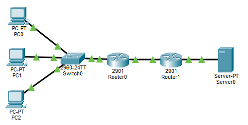
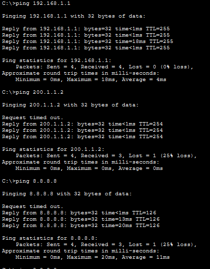
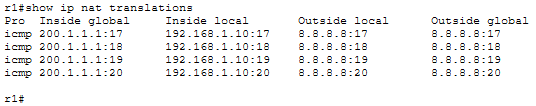
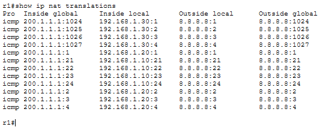
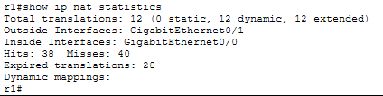
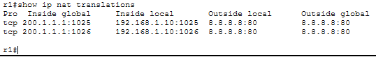

# LAB 18 — NAT/PAT (Network Address Translation / Port Address Translation)

## Objective
- Configure Static NAT (one-to-one mapping)
- Configure Dynamic NAT (pool-based translation)
- Configure PAT/NAT Overload (many-to-one using ports)
- Understand inside/outside interfaces and address translation
- Verify NAT translations and statistics

---

## Topology

```
PC1 (192.168.1.10) ---\
                       \
PC2 (192.168.1.20) --- R1 (NAT Router) --- Internet (ISP Router) --- Web Server (8.8.8.8)
                       /
PC3 (192.168.1.30) ---/
   (Private Network)      (Public IP: 200.1.1.1)        (Internet)
```



**Scenario:**
- Private network: 192.168.1.0/24
- Public IP assigned by ISP: 200.1.1.1
- All internal devices access Internet using NAT/PAT

---

## IP Addressing Plan

| Device      | Interface | IP Address      | Subnet Mask     | Default Gateway  | Network Type |
|-------------|-----------|-----------------|-----------------|------------------|--------------|
| PC1         | NIC       | 192.168.1.10    | 255.255.255.0   | 192.168.1.1      | Private      |
| PC2         | NIC       | 192.168.1.20    | 255.255.255.0   | 192.168.1.1      | Private      |
| PC3         | NIC       | 192.168.1.30    | 255.255.255.0   | 192.168.1.1      | Private      |
| R1 (NAT)    | G0/0      | 192.168.1.1     | 255.255.255.0   | N/A              | Inside       |
| R1 (NAT)    | G0/1      | 200.1.1.1       | 255.255.255.252 | N/A              | Outside      |
| ISP Router  | G0/0      | 200.1.1.2       | 255.255.255.252 | N/A              | Public       |
| ISP Router  | G0/1      | 8.8.8.1         | 255.255.255.0   | N/A              | Internet     |
| Web Server  | NIC       | 8.8.8.8         | 255.255.255.0   | 8.8.8.1          | Public       |

---

## Physical Connections

- PC1 → Switch F0/1
- PC2 → Switch F0/2
- PC3 → Switch F0/3
- Switch F0/24 → R1 G0/0
- R1 G0/1 → ISP Router G0/0
- ISP Router G0/1 → Web Server

---

## PC Configuration

### PC1
```
IP Address: 192.168.1.10
Subnet Mask: 255.255.255.0
Default Gateway: 192.168.1.1
```

### PC2
```
IP Address: 192.168.1.20
Subnet Mask: 255.255.255.0
Default Gateway: 192.168.1.1
```

### PC3
```
IP Address: 192.168.1.30
Subnet Mask: 255.255.255.0
Default Gateway: 192.168.1.1
```

---

## Web Server Configuration

### Web Server
```
IP Address: 8.8.8.8
Subnet Mask: 255.255.255.0
Default Gateway: 8.8.8.1
```

**Enable HTTP Service:**
1. Click Web Server → Services tab
2. Click HTTP
3. Ensure service is **ON**

---

## Switch Configuration

```
Switch>enable
Switch#configure terminal
Switch(config)#hostname SW1
Switch(config)#exit
```

---

## Router R1 Configuration (NAT Router)

### Step 1: Basic Configuration
```
Router>enable
Router#configure terminal
Router(config)#hostname R1
Router(config)#no ip domain-lookup
```

### Step 2: Configure Interfaces
```
R1(config)#interface gigabitEthernet0/0
R1(config-if)#ip address 192.168.1.1 255.255.255.0
R1(config-if)#no shutdown
R1(config-if)#exit

R1(config)#interface gigabitEthernet0/1
R1(config-if)#ip address 200.1.1.1 255.255.255.252
R1(config-if)#no shutdown
R1(config-if)#exit
```

### Step 3: Configure Default Route (to ISP)
```
R1(config)#ip route 0.0.0.0 0.0.0.0 200.1.1.2
```

### Step 4: Define NAT Inside and Outside Interfaces
```
R1(config)#interface gigabitEthernet0/0
R1(config-if)#ip nat inside
R1(config-if)#exit

R1(config)#interface gigabitEthernet0/1
R1(config-if)#ip nat outside
R1(config-if)#exit
```

### Step 5: Configure PAT (NAT Overload)
```
R1(config)#access-list 1 permit 192.168.1.0 0.0.0.255
R1(config)#ip nat inside source list 1 interface gigabitEthernet0/1 overload
```

**Explanation:**
- **access-list 1 permit 192.168.1.0 0.0.0.255** - Define which internal addresses can use NAT
- **ip nat inside source list 1 interface g0/1 overload** - Translate addresses in ACL 1 to the outside interface IP (200.1.1.1) using PAT (port overload)

---

## ISP Router Configuration

### Step 1: Basic Configuration
```
Router>enable
Router#configure terminal
Router(config)#hostname ISP
Router(config)#no ip domain-lookup
```

### Step 2: Configure Interfaces
```
ISP(config)#interface gigabitEthernet0/0
ISP(config-if)#ip address 200.1.1.2 255.255.255.252
ISP(config-if)#no shutdown
ISP(config-if)#exit

ISP(config)#interface gigabitEthernet0/1
ISP(config-if)#ip address 8.8.8.1 255.255.255.0
ISP(config-if)#no shutdown
ISP(config-if)#exit
```

### Step 3: Configure Static Route (back to R1's public IP)
```
ISP(config)#ip route 200.1.1.0 255.255.255.252 200.1.1.1
```

---

## Verification Commands

### Test 1: Verify Basic Connectivity

**From PC1:** 
To local gateway:
```
ping 192.168.1.1
```

To ISP router:
```
ping 200.1.1.2
```

To Web Server:
```
ping 8.8.8.8
```



---

### Test 2: View NAT Translations

**Before any traffic, check NAT table on R1:**
```
R1#show ip nat translations
```

Should be empty or show no active translations.

**From PC1, ping Web Server:**
```
ping 8.8.8.8
```

**Immediately check NAT table on R1:**
```
R1#show ip nat translations
```


**Explanation:**
- **Inside local** = 192.168.1.10 (PC1's real private IP)
- **Inside global** = 200.1.1.1 (translated public IP)
- **Outside local** = 8.8.8.8 (Web Server's IP as seen from inside)
- **Outside global** = 8.8.8.8 (Web Server's real IP)

---

### Test 3: Multiple Devices Using PAT

**From PC1, PC2, PC3 - all ping Web Server simultaneously:**
```
ping 8.8.8.8
```

**Check NAT translations on R1:**
```
R1#show ip nat translations
```


**Expected - multiple entries, all using 200.1.1.1 but different port numbers:**

**This is PAT (Port Address Translation) - multiple internal IPs share one public IP using different port numbers**

---

### Test 4: NAT Statistics

**View NAT statistics:**
```
R1#show ip nat statistics
```


**Key fields:**
- **Total active translations** - Current number of active NAT entries
- **Hits** - Packets successfully translated
- **Misses** - Packets that didn't match NAT rules

---

### Test 5: Clear NAT Translations

**Clear all dynamic NAT translations:**
```
R1#clear ip nat translation *
```

**Verify cleared:**
```
R1#show ip nat translations
```

Should show empty or minimal entries.

---

### Test 6: Web Server Access

**From PC1 - Desktop → Web Browser:**
```
http://8.8.8.8
```

**Check NAT translations:**
```
R1#show ip nat translations
```


---

## Key Concepts

**What is NAT?**
- **Network Address Translation** - Translates private IP addresses to public IP addresses
- Allows multiple devices to share a single public IP
- Provides basic security by hiding internal network structure
- Required because of IPv4 address exhaustion

**NAT Types:**

### 1. Static NAT (One-to-One)
- One private IP permanently mapped to one public IP
- Used for servers that need consistent public IP
- **Example:** Internal server 192.168.1.100 always translates to public IP 200.1.1.10

### 2. Dynamic NAT (Pool-Based)
- Multiple private IPs translate to a pool of public IPs
- First-come, first-served from the pool
- When pool exhausted, no more translations possible
- **Example:** 10 internal IPs share a pool of 5 public IPs

### 3. PAT / NAT Overload (Many-to-One)
- **What we configured in this lab**
- Multiple private IPs share ONE public IP using different port numbers
- Most common type of NAT in home/office networks
- Can support ~65,000 simultaneous connections per public IP
- **Example:** All devices translate to 200.1.1.1 but use ports 1024, 1025, 1026, etc.

---

## NAT Terminology

**Inside vs Outside:**
- **Inside Local** - Private IP address (192.168.1.10)
- **Inside Global** - Public IP address after translation (200.1.1.1)
- **Outside Local** - Destination IP as seen from inside (usually same as outside global)
- **Outside Global** - Real destination IP (8.8.8.8)

**NAT Interfaces:**
- **ip nat inside** - Interface connected to private network
- **ip nat outside** - Interface connected to public network/Internet

---

## Additional NAT Configurations

### Static NAT Configuration 

**If you wanted a server to have a permanent public IP:**
```
R1(config)#ip nat inside source static 192.168.1.100 200.1.1.10
```

This would permanently map internal server 192.168.1.100 to public IP 200.1.1.10.

---

### Dynamic NAT Configuration

**If you had a pool of public IPs:**
```
R1(config)#ip nat pool PUBLIC_POOL 200.1.1.10 200.1.1.20 netmask 255.255.255.0
R1(config)#access-list 1 permit 192.168.1.0 0.0.0.255
R1(config)#ip nat inside source list 1 pool PUBLIC_POOL
```

This creates a pool from 200.1.1.10 to 200.1.1.20, and internal devices will dynamically grab IPs from this pool.

---

### Port Forwarding (Static PAT) - For Reference

**If you wanted external users to access an internal web server:**
```
R1(config)#ip nat inside source static tcp 192.168.1.100 80 200.1.1.1 80
```

This forwards external requests to 200.1.1.1:80 to internal server 192.168.1.100:80.

---

## Common NAT Commands

**View active translations:**
```
R1#show ip nat translations
```

**View NAT statistics:**
```
R1#show ip nat statistics
```

**Clear all dynamic translations:**
```
R1#clear ip nat translation *
```

**Clear specific translation:**
```
R1#clear ip nat translation inside 192.168.1.10
```

**Debug NAT (troubleshooting):**
```
R1#debug ip nat
```

**Stop debugging:**
```
R1#undebug all
```

---

## NAT Advantages and Disadvantages

**Advantages:**
- Conserves public IPv4 addresses
- Provides basic security (hides internal topology)
- Allows network redesign without changing public IPs
- Multiple private networks can use same private IP ranges

**Disadvantages:**
- Breaks end-to-end IP connectivity
- Complicates some protocols (VoIP, IPsec, FTP)
- Adds processing overhead on router
- Difficult to troubleshoot connection issues
- Not needed with IPv6 (enough addresses for everyone)

---

## Troubleshooting NAT

**Problem: Devices can't reach Internet**

**Check 1: NAT interfaces defined?**
```
R1#show ip nat statistics
```
Verify inside and outside interfaces are listed.

**Check 2: Default route configured?**
```
R1#show ip route
```
Should have default route pointing to ISP.

**Check 3: ACL permits traffic?**
```
R1#show access-lists
```
ACL should permit internal network.

**Check 4: Translations happening?**
```
R1#show ip nat translations
```
Should see entries when traffic flows.

---

## Outcome

- Configured PAT (NAT Overload) to allow multiple devices to share one public IP
- Defined NAT inside and outside interfaces
- Verified NAT translations and statistics
- Understood the difference between Static NAT, Dynamic NAT, and PAT
- Learned NAT terminology (inside local, inside global, etc.)
- Tested multiple devices simultaneously using port-based translation

---

## Files Included
- `lab18.pkt`
- `README.md`
- `screenshots/`

---

Lab18 **completed successfully**

---
