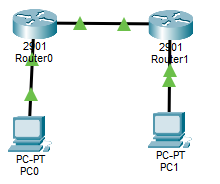
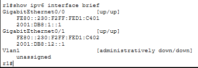
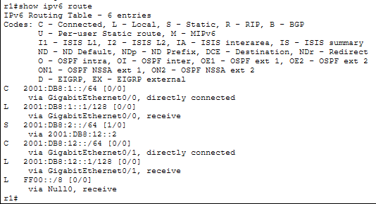
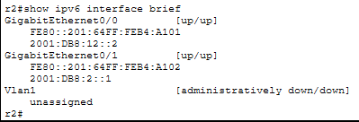
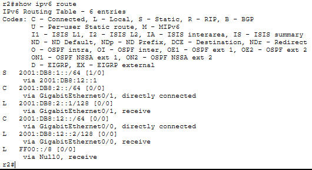
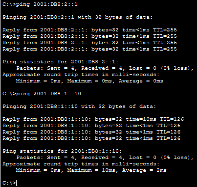
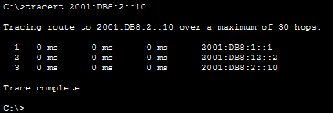

# LAB 19 — IPv6 Basic Addressing & Routing

## Objective
- Configure IPv6 addresses on routers and end devices
- Understand IPv6 address types (Global Unicast, Link-Local, EUI-64)
- Configure static IPv6 routing
- Verify IPv6 connectivity and routing tables
- Compare IPv6 with IPv4

---

## Topology

```
PC1 --- R1 --- R2 --- PC2
   (Network A)    (Network B)
```



**Two IPv6 networks connected via two routers**

---

## IP Addressing Plan

| Device | Interface | IPv6 Address                  | Prefix Length | Network            |
|--------|-----------|-------------------------------|---------------|--------------------|
| PC1    | NIC       | 2001:DB8:1::10                | /64           | 2001:DB8:1::/64    |
| R1     | G0/0      | 2001:DB8:1::1                 | /64           | 2001:DB8:1::/64    |
| R1     | G0/1      | 2001:DB8:12::1                | /64           | 2001:DB8:12::/64   |
| R2     | G0/0      | 2001:DB8:12::2                | /64           | 2001:DB8:12::/64   |
| R2     | G0/1      | 2001:DB8:2::1                 | /64           | 2001:DB8:2::/64    |
| PC2    | NIC       | 2001:DB8:2::10                | /64           | 2001:DB8:2::/64    |

**Note:** 2001:DB8::/32 is reserved for documentation/examples (like 192.0.2.0 in IPv4)

---

## PC Configuration

### PC1
```
IPv6 Address: 2001:DB8:1::10
Prefix Length: 64
Default Gateway: 2001:DB8:1::1
```

### PC2
```
IPv6 Address: 2001:DB8:2::10
Prefix Length: 64
Default Gateway: 2001:DB8:2::1
```

---

## Router R1 Configuration

### Step 1: Basic Configuration
```
Router>enable
Router#configure terminal
Router(config)#hostname R1
Router(config)#no ip domain-lookup
```

### Step 2: Enable IPv6 Routing
```
R1(config)#ipv6 unicast-routing
```

**Note:** This command is REQUIRED for IPv6 routing to work. Without it, the router won't route IPv6 packets.

### Step 3: Configure Interfaces with IPv6
```
R1(config)#interface gigabitEthernet0/0
R1(config-if)#ipv6 address 2001:DB8:1::1/64
R1(config-if)#no shutdown
R1(config-if)#exit

R1(config)#interface gigabitEthernet0/1
R1(config-if)#ipv6 address 2001:DB8:12::1/64
R1(config-if)#no shutdown
R1(config-if)#exit
```

### Step 4: Configure Static IPv6 Route
```
R1(config)#ipv6 route 2001:DB8:2::/64 2001:DB8:12::2
```

**Explanation:** Route to network 2001:DB8:2::/64 via next-hop 2001:DB8:12::2 (R2)

---

## Router R2 Configuration

### Step 1: Basic Configuration
```
Router>enable
Router#configure terminal
Router(config)#hostname R2
Router(config)#no ip domain-lookup
```

### Step 2: Enable IPv6 Routing
```
R2(config)#ipv6 unicast-routing
```

### Step 3: Configure Interfaces with IPv6
```
R2(config)#interface gigabitEthernet0/0
R2(config-if)#ipv6 address 2001:DB8:12::2/64
R2(config-if)#no shutdown
R2(config-if)#exit

R2(config)#interface gigabitEthernet0/1
R2(config-if)#ipv6 address 2001:DB8:2::1/64
R2(config-if)#no shutdown
R2(config-if)#exit
```

### Step 4: Configure Static IPv6 Route
```
R2(config)#ipv6 route 2001:DB8:1::/64 2001:DB8:12::1
```

**Explanation:** Route to network 2001:DB8:1::/64 via next-hop 2001:DB8:12::1 (R1)

---

## Verification Commands

### On R1

**Check IPv6 interface status:**
```
R1#show ipv6 interface brief
```


**Note:** FE80:: addresses are Link-Local addresses (auto-generated)

**Check IPv6 routing table:**
```
R1#show ipv6 route
```


**Route codes:**
- **C** = Connected
- **L** = Local (router's own IP)
- **S** = Static

**Check specific interface details:**
```
R1#show ipv6 interface gigabitEthernet 0/0
```

---

### On R2

**Check IPv6 interface status:**
```
R2#show ipv6 interface brief
```


**Check IPv6 routing table:**
```
R2#show ipv6 route
```


---

### Connectivity Tests

**From PC1:**
```
ping 2001:DB8:1::1
```
(Ping R1 gateway)

```
ping 2001:DB8:12::2
```
(Ping R2)

```
ping 2001:DB8:2::10
```
(Ping PC2)


**From PC2:**
```
ping 2001:DB8:2::1
```
(Ping R2 gateway)

```
ping 2001:DB8:1::10
```
(Ping PC1)



---

### Traceroute Test

**From PC1:**
```
tracert 2001:DB8:2::10
```



---

## Key Concepts

**What is IPv6?**
- **Internet Protocol version 6** - Successor to IPv4
- 128-bit addresses (vs 32-bit in IPv4)
- Solves IPv4 address exhaustion
- Simplified header format
- Built-in security (IPsec)
- No need for NAT

**IPv6 Address Format:**
- Written in hexadecimal (0-9, A-F)
- 8 groups of 4 hex digits
- Separated by colons
- Example: 2001:0DB8:0000:0001:0000:0000:0000:0010

**IPv6 Address Shortening Rules:**

**Rule 1: Remove leading zeros**
```
2001:0DB8:0000:0001 → 2001:DB8:0:1
```

**Rule 2: Replace consecutive zeros with ::**
```
2001:DB8:0:0:0:0:0:10 → 2001:DB8::10
```

**Note:** :: can only be used ONCE in an address

**Examples:**
- 2001:DB8:1:0:0:0:0:1 → 2001:DB8:1::1
- 2001:0DB8:0000:0000:0000:0000:0000:0001 → 2001:DB8::1
- FE80:0000:0000:0000:0000:0000:0000:0001 → FE80::1

---

## IPv6 Address Types

### 1. Global Unicast Address (GUA)
- Public IPv6 addresses
- Routable on the Internet
- Similar to public IPv4 addresses
- Starts with 2000::/3 (2000:: to 3FFF::)
- **Example:** 2001:DB8:1::10

### 2. Link-Local Address
- Auto-generated on every IPv6 interface
- Only valid on the local link (not routable)
- Starts with FE80::/10
- Similar to APIPA (169.254.x.x) in IPv4
- **Example:** FE80::1, FE80::2E0:F7FF:FE12:3456

### 3. Unique Local Address (ULA)
- Private IPv6 addresses
- Not routable on Internet
- Similar to RFC 1918 addresses (10.x.x.x, 172.16.x.x, 192.168.x.x)
- Starts with FC00::/7 or FD00::/8
- **Example:** FD00::1

### 4. Loopback Address
- ::1/128
- Similar to 127.0.0.1 in IPv4
- Used for testing local stack

### 5. Unspecified Address
- ::/128
- Similar to 0.0.0.0 in IPv4
- Indicates absence of address

### 6. Multicast Address
- Starts with FF00::/8
- Used for one-to-many communication
- No broadcast in IPv6 (replaced by multicast)
- **Example:** FF02::1 (all nodes), FF02::2 (all routers)

---

## IPv6 Prefix Length

**IPv6 uses prefix length notation (like CIDR in IPv4):**
- /64 is standard for end-user networks
- /48 is typical for enterprise sites
- /32 is typical for ISP allocations
- /128 is a single host (like /32 in IPv4)

**Example:**
- 2001:DB8:1::/64 = Network
- 2001:DB8:1::10/64 = Host in that network

---

## IPv4 vs IPv6 Comparison

| Feature              | IPv4                  | IPv6                          |
|----------------------|-----------------------|-------------------------------|
| Address length       | 32 bits               | 128 bits                      |
| Address format       | Decimal (192.168.1.1) | Hexadecimal (2001:DB8::1)     |
| Address space        | 4.3 billion           | 340 undecillion               |
| Broadcast            | Yes                   | No (uses multicast)           |
| NAT required         | Yes (common)          | No (enough addresses)         |
| Header complexity    | Complex (12+ fields)  | Simplified (8 fields)         |
| Configuration        | Manual or DHCP        | SLAAC or DHCPv6               |
| IPsec                | Optional              | Mandatory (in spec)           |
| Fragmentation        | Routers can fragment  | Only source can fragment      |
| ARP                  | Yes                   | No (uses NDP)                 |

---

## IPv6 Configuration Methods

### 1. Static Configuration (What we did)
```
R1(config-if)#ipv6 address 2001:DB8:1::1/64
```

### 2. EUI-64 (Extended Unique Identifier)
```
R1(config-if)#ipv6 address 2001:DB8:1::/64 eui-64
```
Auto-generates the host portion from MAC address.

### 3. SLAAC (Stateless Address Autoconfiguration)
```
R1(config-if)#ipv6 address autoconfig
```
Router learns prefix from Router Advertisements.

### 4. DHCPv6 (Stateful)
Similar to DHCP in IPv4 (not covered in this lab).

---

## Additional IPv6 Commands

**View IPv6 neighbors (similar to ARP):**
```
R1#show ipv6 neighbors
```

**View link-local addresses:**
```
R1#show ipv6 interface gigabitEthernet 0/0 | include link-local
```

**Clear IPv6 route:**
```
R1#clear ipv6 route *
```

**Debug IPv6 packets:**
```
R1#debug ipv6 packet
```

**Stop debugging:**
```
R1#undebug all
```

---

## Common IPv6 Mistakes

**Forgetting to enable IPv6 routing:**
Without `ipv6 unicast-routing`, router won't route IPv6 packets.

**Wrong prefix length:**
IPv6 typically uses /64 for LANs, not /24.

**Using :: multiple times:**
You can only use :: once per address to compress zeros.

**Forgetting link-local addresses:**
Every IPv6 interface automatically gets a link-local (FE80::) address.

---

## Outcome:

- Configured IPv6 addresses on routers and PCs
- Enabled IPv6 routing on routers
- Configured static IPv6 routes
- Verified IPv6 connectivity with ping and traceroute
- Understood IPv6 address types and formatting
- Compared IPv6 with IPv4

---

## Files Included
- `lab19.pkt`
- `README.md`
- `screenshots/`

---

Lab19 **completed successfully**

---
