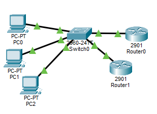
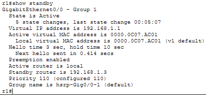
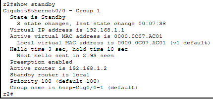
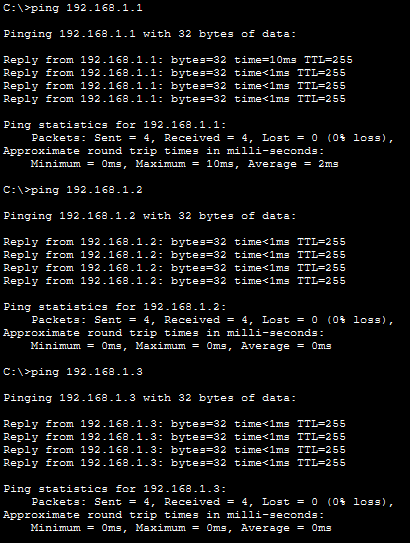
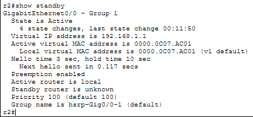
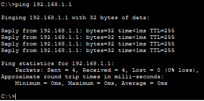
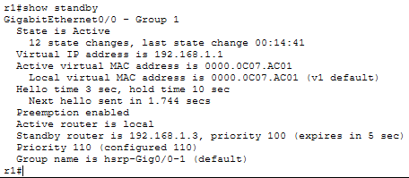

# LAB 20 — HSRP (Hot Standby Router Protocol)

## Objective
- Configure HSRP for gateway redundancy on a LAN
- Understand Active and Standby router roles
- Test automatic failover when active router fails
- Verify HSRP virtual IP and MAC address

---

## Topology

```
PC1 ---\
        \
PC2 ---- Switch ---- R1 (192.168.1.2) Active
        /            R2 (192.168.1.3) Standby
PC3 ---/

Virtual Gateway: 192.168.1.1 (HSRP)
```



---

## IP Addressing Plan

| Device  | Interface | IP Address      | Subnet Mask     | Default Gateway  |
|---------|-----------|-----------------|-----------------|------------------|
| PC1     | NIC       | 192.168.1.10    | 255.255.255.0   | 192.168.1.1      |
| PC2     | NIC       | 192.168.1.20    | 255.255.255.0   | 192.168.1.1      |
| PC3     | NIC       | 192.168.1.30    | 255.255.255.0   | 192.168.1.1      |
| R1      | G0/0      | 192.168.1.2     | 255.255.255.0   | N/A              |
| R2      | G0/0      | 192.168.1.3     | 255.255.255.0   | N/A              |

**HSRP Virtual IP:** 192.168.1.1

---

## Physical Connections

- PC1 → Switch F0/1
- PC2 → Switch F0/2
- PC3 → Switch F0/3
- R1 G0/0 → Switch F0/23
- R2 G0/0 → Switch F0/24

---

## PC Configuration

### PC1
```
IP Address: 192.168.1.10
Subnet Mask: 255.255.255.0
Default Gateway: 192.168.1.1
```

### PC2
```
IP Address: 192.168.1.20
Subnet Mask: 255.255.255.0
Default Gateway: 192.168.1.1
```

### PC3
```
IP Address: 192.168.1.30
Subnet Mask: 255.255.255.0
Default Gateway: 192.168.1.1
```

---

## Switch Configuration

```
Switch>enable
Switch#configure terminal
Switch(config)#hostname SW1
Switch(config)#exit
```

---

## Router R1 Configuration (Active Router)

### Step 1: Basic Configuration
```
Router>enable
Router#configure terminal
Router(config)#hostname R1
Router(config)#no ip domain-lookup
```

### Step 2: Configure Interface
```
R1(config)#interface gigabitEthernet0/0
R1(config-if)#ip address 192.168.1.2 255.255.255.0
R1(config-if)#no shutdown
R1(config-if)#exit
```

### Step 3: Configure HSRP
```
R1(config)#interface gigabitEthernet0/0
R1(config-if)#standby 1 ip 192.168.1.1
R1(config-if)#standby 1 priority 110
R1(config-if)#standby 1 preempt
R1(config-if)#exit
```

**Explanation:**
- **standby 1 ip 192.168.1.1** - Virtual gateway IP
- **standby 1 priority 110** - Higher priority makes R1 Active (default is 100)
- **standby 1 preempt** - Allows R1 to reclaim Active role if it recovers

---

## Router R2 Configuration (Standby Router)

### Step 1: Basic Configuration
```
Router>enable
Router#configure terminal
Router(config)#hostname R2
Router(config)#no ip domain-lookup
```

### Step 2: Configure Interface
```
R2(config)#interface gigabitEthernet0/0
R2(config-if)#ip address 192.168.1.3 255.255.255.0
R2(config-if)#no shutdown
R2(config-if)#exit
```

### Step 3: Configure HSRP
```
R2(config)#interface gigabitEthernet0/0
R2(config-if)#standby 1 ip 192.168.1.1
R2(config-if)#standby 1 priority 100
R2(config-if)#standby 1 preempt
R2(config-if)#exit
```

**Explanation:**
- **standby 1 ip 192.168.1.1** - Same virtual IP as R1
- **standby 1 priority 100** - Default priority, makes R2 Standby
- **standby 1 preempt** - Allows automatic failover

---

## Verification Commands

### Check HSRP Status on R1

```
R1#show standby
```


**Expected output:**
```
GigabitEthernet0/0 - Group 1
  State is Active
  Virtual IP address is 192.168.1.1
  Active virtual MAC address is 0000.0c07.ac01
  Priority 110 (configured 110)
  Preemption enabled
  Active router is local
  Standby router is 192.168.1.3, priority 100
```

---

### Check HSRP Status on R2

```
R2#show standby
```


**Expected output:**
```
GigabitEthernet0/0 - Group 1
  State is Standby
  Virtual IP address is 192.168.1.1
  Active virtual MAC address is 0000.0c07.ac01
  Priority 100 (default 100)
  Preemption enabled
  Active router is 192.168.1.2, priority 110
  Standby router is local
```

---

### Connectivity Test

**From PC1:**
```
ping 192.168.1.1
```
(To virtual gateway)

```
ping 192.168.1.2
```
(To R1)

```
ping 192.168.1.3
```
(To - R2)



---

### Test Failover

**On R1, shut down the interface:**
```
R1(config)#interface gigabitEthernet 0/0
R1(config-if)#shutdown
```

**Check R2 status:**
```
R2#show standby
```


**Should now show:**
```
State is Active
```

**From PC1, ping gateway:**
```
ping 192.168.1.1
```

**Should still work - traffic now going through R2**



---

### Restore R1

**Bring R1 interface back up:**
```
R1(config)#interface gigabitEthernet 0/0
R1(config-if)#no shutdown
```

**Wait 10 seconds, check R1:**
```
R1#show standby
```



**Should show:**
```
State is Active
```

**R1 reclaimed Active role due to preemption**

---

## Key Concepts

**HSRP Basics:**
- Hot Standby Router Protocol
- Cisco proprietary
- Provides gateway redundancy
- Virtual IP shared between routers

**HSRP Roles:**
- **Active** - Forwards traffic
- **Standby** - Monitors active, ready to take over
- **Listen** - Other routers in the group

**Priority:**
- Range: 0-255
- Default: 100
- Higher priority becomes Active

**Preemption:**
- Allows higher priority router to reclaim Active role
- Disabled by default
- Must configure manually

**Virtual MAC:**
- Format: 0000.0c07.acXX
- Group 1 = 0000.0c07.ac01

---

## LAB COMPLETE

You have successfully:
- Configured HSRP for gateway redundancy
- Set up Active and Standby routers
- Tested automatic failover
- Verified preemption behavior

---

## Files Included
- `lab20.pkt`
- `README.md`
- `screenshots/`

---

Lab20 **completed successfully**

---
