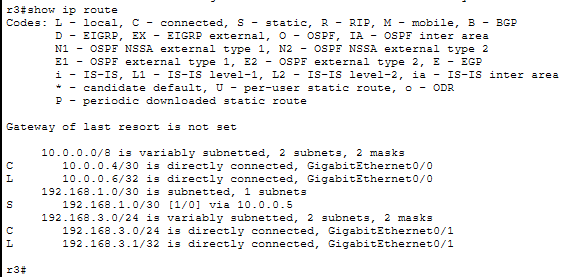
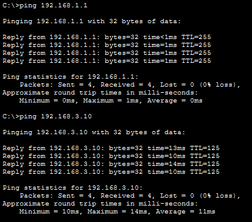
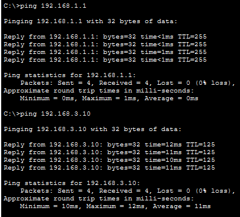

# LAB 21 — Network Troubleshooting Scenario 1 (Routing Issues)

## Objective
- Diagnose and fix common routing problems
- Practice systematic troubleshooting methodology
- Identify misconfigured static routes, subnet masks, and default routes
- Restore full network connectivity through logical problem-solving

---

## Scenario

**User Complaints:**
- PC1 cannot reach Server (192.168.3.10)
- PC2 can ping R1 but nothing beyond
- PC3 has no connectivity at all

---

## Topology

```
PC1 ---\
        \
PC2 ---- Switch --- R1 --- R2 --- R3 --- Server
        /
PC3 ---/
```


---

## Expected (Correct) IP Addressing Plan

| Device  | Interface | IP Address      | Subnet Mask     | Default Gateway  |
|---------|-----------|-----------------|-----------------|------------------|
| PC1     | NIC       | 192.168.1.10    | 255.255.255.0   | 192.168.1.1      |
| PC2     | NIC       | 192.168.1.20    | 255.255.255.0   | 192.168.1.1      |
| PC3     | NIC       | 192.168.1.30    | 255.255.255.0   | 192.168.1.1      |
| R1      | G0/0      | 192.168.1.1     | 255.255.255.0   | N/A              |
| R1      | G0/1      | 10.0.0.1        | 255.255.255.252 | N/A              |
| R2      | G0/0      | 10.0.0.2        | 255.255.255.252 | N/A              |
| R2      | G0/1      | 10.0.0.5        | 255.255.255.252 | N/A              |
| R3      | G0/0      | 10.0.0.6        | 255.255.255.252 | N/A              |
| R3      | G0/1      | 192.168.3.1     | 255.255.255.0   | N/A              |
| Server  | NIC       | 192.168.3.10    | 255.255.255.0   | 192.168.3.1      |

---

## Physical Connections

- PC1 → Switch F0/1
PC2 → Switch F0/2
PC3 → Switch F0/3
Switch F0/24 → R1 G0/0
R1 G0/1 → R2 G0/0
R2 G0/1 → R3 G0/0
R3 G0/1 → Server

---

## Pre-Configured (Broken) Network

**Set up the network with these intentional errors:**

### PC1 Configuration (ERROR: Wrong Gateway)
```
IP Address: 192.168.1.10
Subnet Mask: 255.255.255.0
Default Gateway: 192.168.1.2  (WRONG - should be 192.168.1.1)
```

### PC2 Configuration (ERROR: Wrong Subnet Mask)
```
IP Address: 192.168.1.20
Subnet Mask: 255.255.0.0  (WRONG - should be 255.255.255.0)
Default Gateway: 192.168.1.1
```

### PC3 Configuration (Correct)
```
IP Address: 192.168.1.30
Subnet Mask: 255.255.255.0
Default Gateway: 192.168.1.1
```

### Server Configuration (ERROR: No Gateway)
```
IP Address: 192.168.3.10
Subnet Mask: 255.255.255.0
Default Gateway: (blank - WRONG, should be 192.168.3.1)
```

---

### Router R1 Configuration (ERROR: Wrong Static Route)

```
Router>enable
Router#configure terminal
Router(config)#hostname R1
Router(config)#no ip domain-lookup

Router(config)#interface gigabitEthernet 0/0
Router(config-if)#ip address 192.168.1.1 255.255.255.0
Router(config-if)#no shutdown
Router(config-if)#exit

Router(config)#interface gigabitEthernet 0/1
Router(config-if)#ip address 10.0.0.1 255.255.255.252
Router(config-if)#no shutdown
Router(config-if)#exit

Router(config)#ip route 192.168.3.0 255.255.255.0 10.0.0.3
(WRONG - next-hop should be 10.0.0.2, not 10.0.0.3)
```

---

### Router R2 Configuration (ERROR: Missing Return Route)

```
Router>enable
Router#configure terminal
Router(config)#hostname R2
Router(config)#no ip domain-lookup

Router(config)#interface gigabitEthernet 0/0
Router(config-if)#ip address 10.0.0.2 255.255.255.252
Router(config-if)#no shutdown
Router(config-if)#exit

Router(config)#interface gigabitEthernet 0/1
Router(config-if)#ip address 10.0.0.5 255.255.255.252
Router(config-if)#no shutdown
Router(config-if)#exit

Router(config)#ip route 192.168.3.0 255.255.255.0 10.0.0.6

(MISSING - No route back to 192.168.1.0/24 network!)
```

---

### Router R3 Configuration (ERROR: Wrong Subnet Mask on Route)

```
Router>enable
Router#configure terminal
Router(config)#hostname R3
Router(config)#no ip domain-lookup

Router(config)#interface gigabitEthernet 0/0
Router(config-if)#ip address 10.0.0.6 255.255.255.252
Router(config-if)#no shutdown
Router(config-if)#exit

Router(config)#interface gigabitEthernet 0/1
Router(config-if)#ip address 192.168.3.1 255.255.255.0
Router(config-if)#no shutdown
Router(config-if)#exit

Router(config)#ip route 192.168.1.0 255.255.0.0 10.0.0.5
(WRONG - subnet mask should be 255.255.255.0, not 255.255.0.0)
```

---

## Troubleshoot and Fix

### Step 1: Document the Problems

**Test connectivity and document what works and what doesn't:**

**From PC1:**
```
ping 192.168.1.1
ping 10.0.0.2
ping 192.168.3.10
```

**From PC2:**
```
ping 192.168.1.1
ping 192.168.1.10
ping 192.168.3.10
```

**From PC3:**
```
ping 192.168.1.1
ping 192.168.3.10
```

**Create a table documenting results:**

---

### Step 2: Systematic Troubleshooting

**Check Layer 1 (Physical):**
```
R1#show ip interface brief
R2#show ip interface brief
R3#show ip interface brief
```

Are all interfaces up/up?

---

**Check Layer 2 (Data Link):**

Not applicable in this topology (no VLANs/trunking).

---

**Check Layer 3 (Network):**

**On R1:**
```
R1#show ip route
```


Look for:
- Are all expected networks present?
- Are static routes pointing to correct next-hops?

**On R2:**
```
R2#show ip route
```


**On R3:**
```
R3#show ip route
```


---

**Check PC Configurations:**

**On each PC, verify:**
- IP address correct?
- Subnet mask correct?
- Default gateway correct?

---

### Step 3: Identify Issues

**Issue 1: PC1 Wrong Gateway**
- PC1 configured with gateway 192.168.1.2 (doesn't exist)
- Should be 192.168.1.1

**Issue 2: PC2 Wrong Subnet Mask**
- PC2 has 255.255.0.0 (Class B mask on Class C network)
- Should be 255.255.255.0

**Issue 3: R1 Wrong Static Route**
- Route points to 10.0.0.3 (doesn't exist)
- Should point to 10.0.0.2 (R2)

**Issue 4: R2 Missing Return Route**
- No route back to 192.168.1.0/24 network
- Should have: ip route 192.168.1.0 255.255.255.0 10.0.0.1

**Issue 5: R3 Wrong Subnet Mask on Route**
- Route uses 255.255.0.0 instead of 255.255.255.0
- Wrong mask causes routing to fail

**Issue 6: Server Missing Gateway**
- Server has no default gateway configured
- Cannot send return traffic back to PCs

---

### Step 4: Fix All Issues

**Fix PC1:**
```
IP Address: 192.168.1.10
Subnet Mask: 255.255.255.0
Default Gateway: 192.168.1.1  (CORRECTED)
```

**Fix PC2:**
```
IP Address: 192.168.1.20
Subnet Mask: 255.255.255.0  (CORRECTED)
Default Gateway: 192.168.1.1
```

**Fix Server:**
```
IP Address: 192.168.3.10
Subnet Mask: 255.255.255.0
Default Gateway: 192.168.3.1  (ADDED)
```

---

**Fix R1:**
```
R1(config)#no ip route 192.168.3.0 255.255.255.0 10.0.0.3
R1(config)#ip route 192.168.3.0 255.255.255.0 10.0.0.2
```

**Fix R2 (Add missing route):**
```
R2(config)#ip route 192.168.1.0 255.255.255.0 10.0.0.1
```

**Fix R3:**
```
R3(config)#no ip route 192.168.1.0 255.255.0.0 10.0.0.5
R3(config)#ip route 192.168.1.0 255.255.255.0 10.0.0.5
```

---

### Step 5: Verify All Fixes

**Check routing tables again:**

**R1:**
```
R1#show ip route
```


Should now show correct route to 192.168.3.0/24 via 10.0.0.2

**R2:**
```
R2#show ip route
```


Should now show route to 192.168.1.0/24 via 10.0.0.1

**R3:**
```
R3#show ip route
```


Should show correct route to 192.168.1.0/24 with proper mask

---

**Test connectivity from all PCs:**

**From PC1:**
```
ping 192.168.1.1
ping 10.0.0.2
ping 192.168.3.10
```


All should work now.

**From PC2:**
```
ping 192.168.1.1
ping 192.168.3.10
```


All should work now.

**From PC3:**
```
ping 192.168.1.1
ping 192.168.3.10
```


All should work now.

---

**Traceroute to verify path:**

**From PC1:**
```
tracert 192.168.3.10
```


Should show: PC1 → R1 → R2 → R3 → Server

---

## Troubleshooting Methodology

**Always follow this systematic approach:**

### 1. Gather Information
- What is not working?
- What error messages appear?
- What changed recently?

### 2. Isolate the Problem
- Use ping to test connectivity at each hop
- Check physical connectivity first
- Verify configurations layer by layer

### 3. Check Common Issues
- Interface status (up/up?)
- IP addressing (correct IPs, masks, gateways?)
- Routing (routes present? correct next-hops?)
- ACLs blocking traffic?

### 4. Implement Solution
- Fix one issue at a time
- Document changes made

### 5. Verify Fix
- Test end-to-end connectivity
- Verify from multiple sources
- Document successful resolution

---

## Common Routing Problems Summary

**Wrong Default Gateway on PC:**
- Symptom: PC cannot reach anything beyond local network
- Fix: Correct gateway IP address

**Wrong Subnet Mask:**
- Symptom: Inconsistent connectivity, some devices work, others don't
- Fix: Use correct subnet mask matching network design

**Wrong Next-Hop in Static Route:**
- Symptom: Packets forwarded to wrong router or dropped
- Fix: Verify and correct next-hop IP address

**Missing Return Route:**
- Symptom: Ping works one way but not both ways
- Fix: Add missing static route on intermediate router

**Wrong Subnet Mask in Static Route:**
- Symptom: Route matches wrong traffic or doesn't match expected traffic
- Fix: Correct subnet mask in route statement

**Missing Default Gateway on Server:**
- Symptom: Server receives requests but cannot send replies
- Fix: Configure default gateway on server

---

## Troubleshooting Commands Reference

**Interface Status:**
```
show ip interface brief
show interfaces [interface]
```

**Routing Table:**
```
show ip route
show ip route [network]
```

**Connectivity Testing:**
```
ping [destination]
traceroute [destination]
```

**ARP Table:**
```
show arp
```

**Protocol Status:**
```
show ip protocols
```

---

## Outcome

- Identified multiple routing configuration errors
- Applied systematic troubleshooting methodology
- Fixed PC configuration issues (gateway, subnet mask)
- Corrected router static route misconfigurations
- Verified end-to-end connectivity after fixes
- Documented the entire troubleshooting process

---

## Files Included
- `lab21.pkt`
- `README.md`
- `screenshots/`

---

Lab21 **completed successfully**
