# LAB 22 — Network Troubleshooting Scenario 2 (Switching Issues)

## Objective
- Diagnose and fix common switching problems
- Troubleshoot VLAN misconfigurations and trunk issues
- Identify port security problems
- Practice systematic Layer 2 troubleshooting

---

## Scenario

A network was recently reconfigured to implement VLANs for security and traffic segmentation. However, users are reporting various connectivity problems. Identify and fix all switching-related issues.

**User Complaints:**
- Sales PC (VLAN 10) cannot reach Sales Server
- HR PC (VLAN 20) cannot communicate with HR Server
- Inter-VLAN routing not working
- Some ports are unexpectedly disabled

---

## Topology

```
Sales PC (VLAN 10) ---\                    /--- Sales Server (VLAN 10)
                       \                  /
HR PC (VLAN 20) ------- SW1 ===TRUNK=== SW2 ---- HR Server (VLAN 20)
                       /                  \
IT PC (VLAN 30) ------/                    \--- IT Server (VLAN 30)
                       |
                     Router
                  (Inter-VLAN)
```


---

## Expected (Correct) Configuration

### VLAN Design

| VLAN ID | VLAN Name | Network         | Gateway       |
|---------|-----------|-----------------|---------------|
| 10      | Sales     | 192.168.10.0/24 | 192.168.10.1  |
| 20      | HR        | 192.168.20.0/24 | 192.168.20.1  |
| 30      | IT        | 192.168.30.0/24 | 192.168.30.1  |

---

## IP Addressing Plan

| Device       | Interface/VLAN | IP Address      | Subnet Mask     | Default Gateway |
|--------------|----------------|-----------------|-----------------|-----------------|
| Sales PC     | NIC            | 192.168.10.10   | 255.255.255.0   | 192.168.10.1    |
| HR PC        | NIC            | 192.168.20.10   | 255.255.255.0   | 192.168.20.1    |
| IT PC        | NIC            | 192.168.30.10   | 255.255.255.0   | 192.168.30.1    |
| Sales Server | NIC            | 192.168.10.100  | 255.255.255.0   | 192.168.10.1    |
| HR Server    | NIC            | 192.168.20.100  | 255.255.255.0   | 192.168.20.1    |
| IT Server    | NIC            | 192.168.30.100  | 255.255.255.0   | 192.168.30.1    |
| Router       | G0/0.10        | 192.168.10.1    | 255.255.255.0   | N/A             |
| Router       | G0/0.20        | 192.168.20.1    | 255.255.255.0   | N/A             |
| Router       | G0/0.30        | 192.168.30.1    | 255.255.255.0   | N/A             |

---

## Physical Connections

**SW1 (Access Switch):**
- Sales PC → SW1 F0/1
- HR PC → SW1 F0/2
- IT PC → SW1 F0/3
- SW1 F0/24 → SW2 F0/24 (Trunk)
- SW1 F0/23 → Router G0/0 (Trunk)

**SW2 (Distribution Switch):**
- Sales Server → SW2 F0/1
- HR Server → SW2 F0/2
- IT Server → SW2 F0/3

---

## Pre-Configured (Broken) Network

**Set up the network with these intentional errors:**

---

### PC Configuration (Correct)

**Sales PC:**
```
IP Address: 192.168.10.10
Subnet Mask: 255.255.255.0
Default Gateway: 192.168.10.1
```

**HR PC:**
```
IP Address: 192.168.20.10
Subnet Mask: 255.255.255.0
Default Gateway: 192.168.20.1
```

**IT PC:**
```
IP Address: 192.168.30.10
Subnet Mask: 255.255.255.0
Default Gateway: 192.168.30.1
```

---

### Server Configuration (Correct)

**Sales Server:**
```
IP Address: 192.168.10.100
Subnet Mask: 255.255.255.0
Default Gateway: 192.168.10.1
```

**HR Server:**
```
IP Address: 192.168.20.100
Subnet Mask: 255.255.255.0
Default Gateway: 192.168.20.1
```

**IT Server:**
```
IP Address: 192.168.30.100
Subnet Mask: 255.255.255.0
Default Gateway: 192.168.30.1
```

---

### Switch SW1 Configuration (Multiple ERRORS)

```
Switch>enable
Switch#configure terminal
Switch(config)#hostname SW1

Switch(config)#vlan 10
Switch(config-vlan)#name Sales
Switch(config-vlan)#exit

Switch(config)#vlan 20
Switch(config-vlan)#name HR
Switch(config-vlan)#exit

Switch(config)#vlan 30
Switch(config-vlan)#name IT
Switch(config-vlan)#exit

Switch(config)#interface fastEthernet 0/1
Switch(config-if)#switchport mode access
Switch(config-if)#switchport access vlan 10
Switch(config-if)#exit

Switch(config)#interface fastEthernet 0/2
Switch(config-if)#switchport mode access
Switch(config-if)#switchport access vlan 10
(ERROR: Should be VLAN 20, not VLAN 10)
Switch(config-if)#exit

Switch(config)#interface fastEthernet 0/3
Switch(config-if)#switchport mode access
Switch(config-if)#switchport access vlan 30
Switch(config-if)#switchport port-security
Switch(config-if)#switchport port-security maximum 1
Switch(config-if)#switchport port-security violation shutdown
Switch(config-if)#switchport port-security mac-address 0001.1111.1111
(ERROR: Wrong MAC address - will cause port to shut down)
Switch(config-if)#exit

Switch(config)#interface fastEthernet 0/24
Switch(config-if)#switchport mode access
(ERROR: Should be trunk mode, not access)
Switch(config-if)#exit

Switch(config)#interface fastEthernet 0/23
Switch(config-if)#switchport mode trunk
Switch(config-if)#exit
```

---

### Switch SW2 Configuration (Multiple ERRORS)

```
Switch>enable
Switch#configure terminal
Switch(config)#hostname SW2

Switch(config)#vlan 10
Switch(config-vlan)#name Sales
Switch(config-vlan)#exit

Switch(config)#vlan 20
Switch(config-vlan)#name HR
Switch(config-vlan)#exit

(ERROR: VLAN 30 not created!)

Switch(config)#interface fastEthernet 0/1
Switch(config-if)#switchport mode access
Switch(config-if)#switchport access vlan 10
Switch(config-if)#exit

Switch(config)#interface fastEthernet 0/2
Switch(config-if)#switchport mode access
Switch(config-if)#switchport access vlan 20
Switch(config-if)#exit

Switch(config)#interface fastEthernet 0/3
Switch(config-if)#switchport mode access
Switch(config-if)#switchport access vlan 30
(ERROR: VLAN 30 doesn't exist, port will be inactive)
Switch(config-if)#exit

Switch(config)#interface fastEthernet 0/24
Switch(config-if)#switchport mode trunk
Switch(config-if)#switchport trunk allowed vlan 10,20
(ERROR: VLAN 30 not allowed on trunk!)
Switch(config-if)#exit
```

---

### Router Configuration (ERROR: Missing Subinterface)

```
Router>enable
Router#configure terminal
Router(config)#hostname R1
Router(config)#no ip domain-lookup

Router(config)#interface gigabitEthernet 0/0
Router(config-if)#no shutdown
Router(config-if)#exit

Router(config)#interface gigabitEthernet 0/0.10
Router(config-subif)#encapsulation dot1Q 10
Router(config-subif)#ip address 192.168.10.1 255.255.255.0
Router(config-subif)#exit

Router(config)#interface gigabitEthernet 0/0.20
Router(config-subif)#encapsulation dot1Q 20
Router(config-subif)#ip address 192.168.20.1 255.255.255.0
Router(config-subif)#exit

(ERROR: Missing subinterface for VLAN 30!)
```

---

## Troubleshoot and Fix

### Step 1: Document the Problems

**Test connectivity within VLANs:**

**From Sales PC:**
```
ping 192.168.10.100
```
(Ping Sales Server - should this work?)

**From HR PC:**
```
ping 192.168.20.100
```
(Ping HR Server - should this work?)

**From IT PC:**
```
ping 192.168.30.100
```
(Ping IT Server - should this work?)

---

**Test inter-VLAN connectivity:**

**From Sales PC:**
```
ping 192.168.20.10
```
(Ping HR PC - should this work?)

---

**Document results:**

---

### Step 2: Check Switch Configurations

**On SW1:**
```
SW1#show vlan brief
```
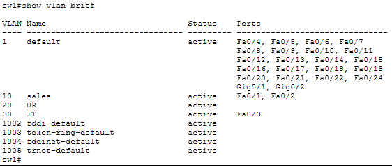

Check:
- Are all VLANs created?
- Are ports assigned to correct VLANs?

```
SW1#show interfaces trunk
```
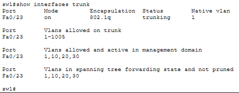

Check:
- Is F0/24 in trunk list? (It shouldn't be if configured as access)
- Are all VLANs allowed on trunk?

```
SW1#show port-security interface fastEthernet 0/3
```
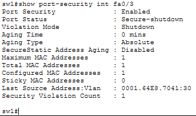

Check:
- Is port in err-disabled state?
- Does configured MAC match actual device MAC?

```
SW1#show interfaces status
```
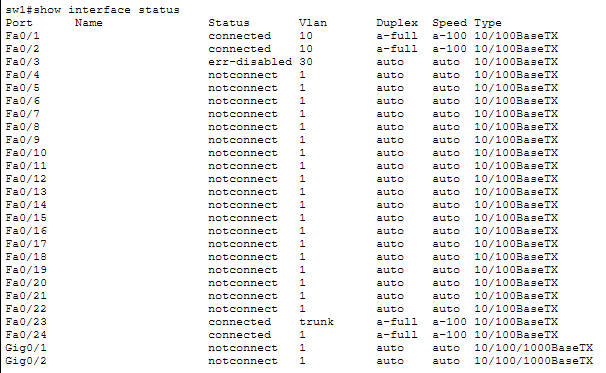

Look for err-disabled or inactive ports.

---

**On SW2:**
```
SW2#show vlan brief
```
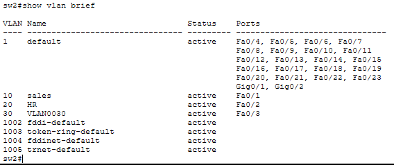

Check:
- Is VLAN 30 present?
- Are all servers in correct VLANs?

```
SW2#show interfaces trunk
```
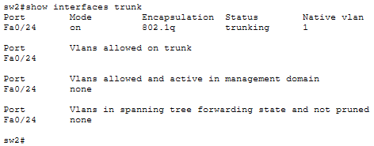

Check:
- Which VLANs are allowed on trunk?

---

**On Router:**
```
R1#show ip interface brief
```
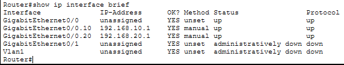

Check:
- Are all subinterfaces present and up?
- VLAN 30 subinterface missing?

---

### Step 3: Identify All Issues

**Issue 1: SW1 F0/2 in Wrong VLAN**
- HR PC port assigned to VLAN 10 instead of VLAN 20
- HR PC cannot reach its own VLAN

**Issue 2: SW1 F0/3 Port Security Violation**
- Wrong MAC address configured
- Port shut down in err-disabled state
- IT PC has no connectivity

**Issue 3: SW1 F0/24 Not in Trunk Mode**
- Configured as access port instead of trunk
- No inter-switch VLAN communication

**Issue 4: SW2 Missing VLAN 30**
- VLAN 30 not created on SW2
- IT Server port inactive

**Issue 5: SW2 Trunk Not Allowing VLAN 30**
- Trunk only allows VLANs 10 and 20
- Even if VLAN 30 created, traffic won't pass

**Issue 6: Router Missing VLAN 30 Subinterface**
- No gateway configured for VLAN 30
- No inter-VLAN routing for IT network

---

### Step 4: Fix All Issues

**Fix SW1 - Issue 1 (Wrong VLAN):**
```
SW1(config)#interface fastEthernet 0/2
SW1(config-if)#switchport access vlan 20
SW1(config-if)#exit
```

**Fix SW1 - Issue 2 (Port Security):**

First, find IT PC's actual MAC address:
- Click IT PC → Desktop → Command Prompt → ipconfig /all
- Note MAC address (example: 0001.4242.9C03)

```
SW1(config)#interface fastEthernet 0/3
SW1(config-if)#shutdown
SW1(config-if)#no switchport port-security mac-address 0001.1111.1111
SW1(config-if)#switchport port-security mac-address 0001.4242.9C03
(Use actual MAC from IT PC)
SW1(config-if)#no shutdown
SW1(config-if)#exit
```

Or remove port security entirely:
```
SW1(config)#interface fastEthernet 0/3
SW1(config-if)#shutdown
SW1(config-if)#no switchport port-security
SW1(config-if)#no shutdown
SW1(config-if)#exit
```

**Fix SW1 - Issue 3 (Trunk Mode):**
```
SW1(config)#interface fastEthernet 0/24
SW1(config-if)#switchport mode trunk
SW1(config-if)#exit
```

---

**Fix SW2 - Issue 4 (Create VLAN 30):**
```
SW2(config)#vlan 30
SW2(config-vlan)#name IT
SW2(config-vlan)#exit
```

**Fix SW2 - Issue 5 (Allow VLAN 30 on Trunk):**
```
SW2(config)#interface fastEthernet 0/24
SW2(config-if)#switchport trunk allowed vlan 10,20,30
SW2(config-if)#exit
```

Or allow all VLANs:
```
SW2(config)#interface fastEthernet 0/24
SW2(config-if)#switchport trunk allowed vlan all
SW2(config-if)#exit
```

---

**Fix Router - Issue 6 (Add VLAN 30 Subinterface):**
```
R1(config)#interface gigabitEthernet 0/0.30
R1(config-subif)#encapsulation dot1Q 30
R1(config-subif)#ip address 192.168.30.1 255.255.255.0
R1(config-subif)#exit
```

---

### Step 5: Verify All Fixes

**Check SW1 VLAN assignments:**
```
SW1#show vlan brief
```
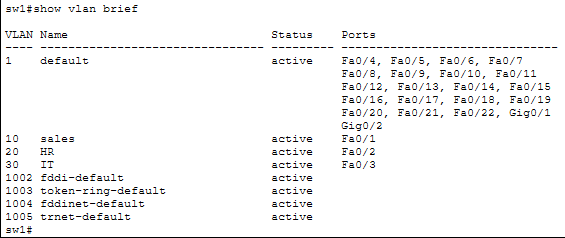

Should show:
- F0/1 in VLAN 10
- F0/2 in VLAN 20
- F0/3 in VLAN 30

**Check SW1 trunk:**
```
SW1#show interfaces trunk
```
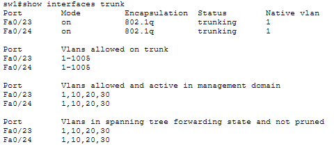

Should show F0/23 and F0/24 as trunks.

**Check SW1 port security:**
```
SW1#show port-security interface fastEthernet 0/3
```
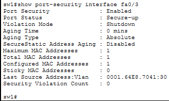

Should show:
- Port Status: Secure-up
- Violation Mode: Shutdown
- Secure MAC: (correct MAC)

---

**Check SW2 VLANs:**
```
SW2#show vlan brief
```
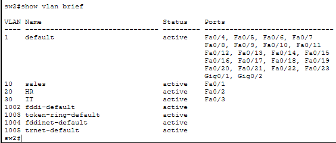

Should show VLAN 30 present with F0/3 assigned.

**Check SW2 trunk:**
```
SW2#show interfaces trunk
```
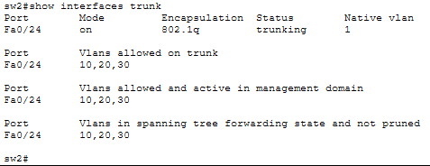

Should show VLANs 10, 20, 30 allowed.

---

**Check Router subinterfaces:**
```
R1#show ip interface brief
```
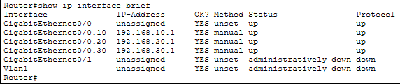

Should show all three subinterfaces up/up:
- G0/0.10
- G0/0.20
- G0/0.30

---

### Step 6: Test Full Connectivity

**Test within VLANs:**

**From Sales PC:**
```
ping 192.168.10.100
```
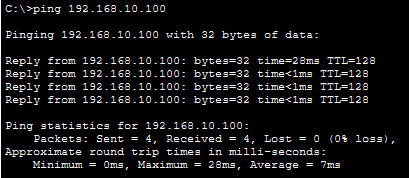

Should work.

**From HR PC:**
```
ping 192.168.20.100
```
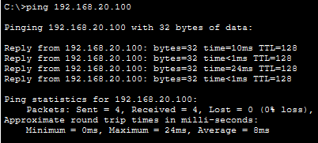

Should work.

**From IT PC:**
```
ping 192.168.30.100
```
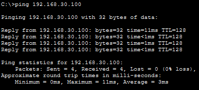

Should work.

---

**Test inter-VLAN routing:**

**From Sales PC:**
```
ping 192.168.20.10
ping 192.168.30.10
```
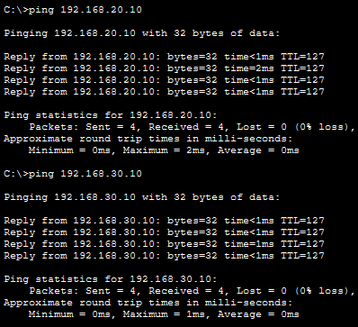

Should work.

**From HR PC:**
```
ping 192.168.10.10
ping 192.168.30.100
```
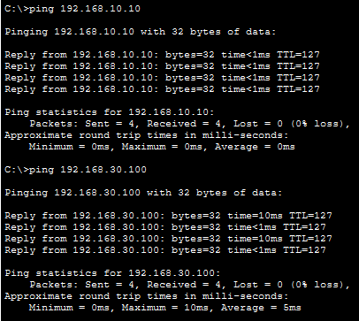

Should work.

---

## Common Switching Problems Summary

**VLAN Misconfiguration:**
- Symptom: Devices in wrong VLAN cannot communicate
- Fix: Verify VLAN assignments with show vlan brief

**Trunk Not Configured:**
- Symptom: No inter-switch VLAN communication
- Fix: Configure switchport mode trunk

**VLANs Not Allowed on Trunk:**
- Symptom: Some VLANs work, others don't
- Fix: Check switchport trunk allowed vlan

**VLAN Not Created:**
- Symptom: Ports assigned to non-existent VLAN go inactive
- Fix: Create VLAN on all switches

**Port Security Violation:**
- Symptom: Port in err-disabled state
- Fix: Correct MAC address or remove port security, then no shutdown

**Missing Router Subinterface:**
- Symptom: No inter-VLAN routing for specific VLAN
- Fix: Create subinterface with correct encapsulation and IP

---

## Troubleshooting Commands Reference

**VLAN Information:**
```
show vlan brief
show vlan id [vlan-id]
show interfaces [interface] switchport
```

**Trunk Information:**
```
show interfaces trunk
show interfaces [interface] switchport
```

**Port Security:**
```
show port-security
show port-security interface [interface]
show port-security address
```

**Interface Status:**
```
show interfaces status
show ip interface brief
```

**Clear err-disabled:**
```
shutdown
no shutdown
```

Or configure auto-recovery:
```
errdisable recovery cause psecure-violation
errdisable recovery interval 30
```

---

## Outcome

- Identified multiple Layer 2 switching issues
- Fixed VLAN misconfigurations
- Resolved trunk configuration problems
- Corrected port security violations
- Created missing VLANs
- Configured missing router subinterface
- Verified full intra-VLAN and inter-VLAN connectivity

---

## Files Included
- `lab22.pkt`
- `README.md`
- `screenshots/`

---

Lab22 **completed successfully**
