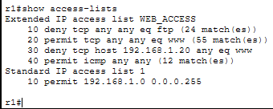
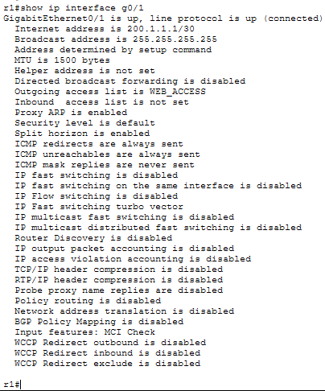
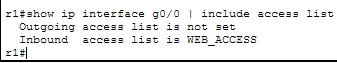
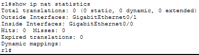
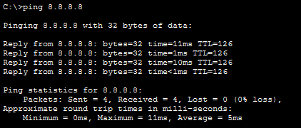
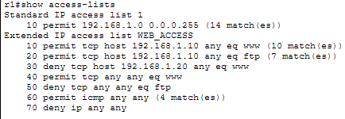
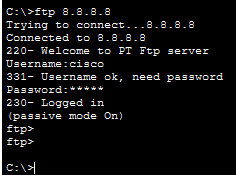
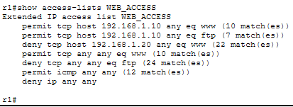
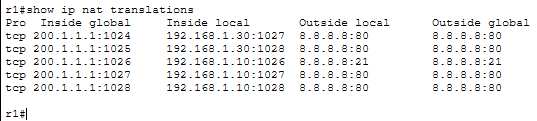

# LAB 23 — ACL & NAT Troubleshooting

## Objective
- Diagnose and fix Access Control List (ACL) misconfigurations
- Troubleshoot Network Address Translation (NAT) issues
- Identify incorrect ACL placement and ordering
- Fix NAT translation problems and verify proper operation

---

## Scenario

A small office network was recently configured with ACLs for security and NAT for Internet access. However, users are reporting that they cannot access certain services, and some traffic that should be blocked is getting through. Identify and fix all ACL and NAT issues.

**User Complaints:**
- PC1 cannot access the web server (should be allowed)
- PC2 can access the web server (should be blocked)
- PC3 cannot access anything on the Internet
- FTP access is completely blocked for everyone (should work for PC1 only)
- NAT translations not showing up

---

## Topology


---

## IP Addressing Plan

| Device     | Interface | IP Address      | Subnet Mask     | Default Gateway  | Network Type |
|------------|-----------|-----------------|-----------------|------------------|--------------|
| PC1        | NIC       | 192.168.1.10    | 255.255.255.0   | 192.168.1.1      | Private      |
| PC2        | NIC       | 192.168.1.20    | 255.255.255.0   | 192.168.1.1      | Private      |
| PC3        | NIC       | 192.168.1.30    | 255.255.255.0   | 192.168.1.1      | Private      |
| R1         | G0/0      | 192.168.1.1     | 255.255.255.0   | N/A              | Inside       |
| R1         | G0/1      | 200.1.1.1       | 255.255.255.252 | N/A              | Outside      |
| ISP        | G0/0      | 200.1.1.2       | 255.255.255.252 | N/A              | Public       |
| ISP        | G0/1      | 8.8.8.1         | 255.255.255.0   | N/A              | Internet     |
| Web Server | NIC       | 8.8.8.8         | 255.255.255.0   | 8.8.8.1          | Public       |

---

## Physical Connections

- PC1 → R1 G0/0
- PC2 → R1 G0/0
- PC3 → R1 G0/0
- R1 G0/1 → ISP G0/0
- ISP G0/1 → Web Server

---

## PC Configuration (Correct)

### PC1
```
IP Address: 192.168.1.10
Subnet Mask: 255.255.255.0
Default Gateway: 192.168.1.1
```

### PC2
```
IP Address: 192.168.1.20
Subnet Mask: 255.255.255.0
Default Gateway: 192.168.1.1
```

### PC3
```
IP Address: 192.168.1.30
Subnet Mask: 255.255.255.0
Default Gateway: 192.168.1.1
```

---

## Switch Configuration:
Switch>enable
Switch#configure terminal
Switch(config)#hostname SW1
Switch(config)#exit

No VLAN configuration needed - all ports in default VLAN 1.

---

## Server Configuration (Correct)

### Web Server
```
IP Address: 8.8.8.8
Subnet Mask: 255.255.255.0
Default Gateway: 8.8.8.1
```

**Enable Services:**
1. HTTP (Port 80)
2. FTP (Port 21)

---

## Pre-Configured (Broken) Network

### Router R1 Configuration (Multiple ERRORS)

```
Router>enable
Router#configure terminal
Router(config)#hostname R1
Router(config)#no ip domain-lookup

Router(config)#interface gigabitEthernet0/0
Router(config-if)#ip address 192.168.1.1 255.255.255.0
Router(config-if)#no shutdown
Router(config-if)#exit

Router(config)#interface gigabitEthernet0/1
Router(config-if)#ip address 200.1.1.1 255.255.255.252
Router(config-if)#no shutdown
Router(config-if)#exit

Router(config)#ip route 0.0.0.0 0.0.0.0 200.1.1.2
```

**ACL Configuration (Multiple ERRORS):**
```
Router(config)#ip access-list extended WEB_ACCESS
Router(config-ext-nacl)#deny tcp any any eq 21
(ERROR 1: FTP blocked for everyone - should only allow PC1)
Router(config-ext-nacl)#permit tcp any any eq 80
(ERROR 2: Wrong order - this permits everyone before checking specific rules)
Router(config-ext-nacl)#deny tcp host 192.168.1.20 any eq 80
(ERROR 3: This deny never executes because permit any came first)
Router(config-ext-nacl)#permit icmp any any
Router(config-ext-nacl)#exit

Router(config)#interface gigabitEthernet0/1
Router(config-if)#ip access-group WEB_ACCESS out
(ERROR 4: ACL applied outbound on wrong interface - should be inbound on G0/0)
Router(config-if)#exit
```

**NAT Configuration (Multiple ERRORS):**
```
Router(config)#access-list 1 permit 192.168.1.0 0.0.0.255

Router(config)#ip nat inside source list 1 interface gigabitEthernet0/1 overload

(ERROR 5: NAT inside/outside interfaces NOT defined!)
```

---

### ISP Router Configuration (Correct)

```
Router>enable
Router#configure terminal
Router(config)#hostname ISP
Router(config)#no ip domain-lookup

Router(config)#interface gigabitEthernet0/0
Router(config-if)#ip address 200.1.1.2 255.255.255.252
Router(config-if)#no shutdown
Router(config-if)#exit

Router(config)#interface gigabitEthernet0/1
Router(config-if)#ip address 8.8.8.1 255.255.255.0
Router(config-if)#no shutdown
Router(config-if)#exit

Router(config)#ip route 200.1.1.0 255.255.255.252 200.1.1.1
```

---

## Your Task: Troubleshoot and Fix

### Step 1: Document the Problems

**Test connectivity and document results:**

**From PC1 (should access HTTP and FTP):**
```
ping 8.8.8.8
```
(Test basic connectivity)

Try web browser:
```
http://8.8.8.8
```

Try FTP:
```
ftp 8.8.8.8
```

---

**From PC2 (should be blocked from HTTP, no FTP):**
```
ping 8.8.8.8
```

Try web browser:
```
http://8.8.8.8
```

---

**From PC3 (should access HTTP, no FTP):**
```
ping 8.8.8.8
```

Try web browser:
```
http://8.8.8.8
```

---

**Document results:**

---

### Step 2: Check ACL Configuration

**On R1:**
```
R1#show access-lists
```


**Check:**
- What is the order of ACL entries?
- Is there a permit any before specific denies?
- Is FTP completely blocked?

```
R1#show ip interface gigabitEthernet0/0 | include access list
```

**Check:**
- Is ACL applied to this interface?

```
R1#show ip interface gigabitEthernet0/1 | include access list
```


**Check:**
- Is ACL applied outbound here? (Wrong placement!)

---

### Step 3: Check NAT Configuration

**On R1:**
```
R1#show ip nat statistics
```

**Check:**
- Are inside/outside interfaces listed?
- If not, NAT won't work!

```
R1#show ip nat translations
```

**Should be empty because NAT isn't working**

```
R1#show running-config | section nat
```


**Check:**
- Is ip nat inside configured on G0/0?
- Is ip nat outside configured on G0/1?

---

### Step 4: Identify All Issues

**Issue 1: ACL Rule Order Wrong**
- Line: permit tcp any any eq 80 comes BEFORE deny for PC2
- Result: PC2 can access HTTP (should be blocked)
- ACLs process top-to-bottom, first match wins

**Issue 2: FTP Completely Blocked**
- Line: deny tcp any any eq 21 at top of ACL
- Result: Everyone blocked from FTP, even PC1
- Should only allow PC1 FTP access

**Issue 3: ACL Applied to Wrong Interface**
- ACL applied outbound on G0/1 (outside interface)
- Should be applied inbound on G0/0 (inside interface)
- Extended ACLs should be placed close to source

**Issue 4: Missing Specific FTP Allow Rule**
- No rule permitting PC1 FTP access
- Need: permit tcp host 192.168.1.10 any eq 21

**Issue 5: NAT Inside/Outside Not Defined**
- ip nat inside not configured on G0/0
- ip nat outside not configured on G0/1
- NAT won't work without these

---

### Step 5: Fix All Issues

**Fix ACL - Remove and Recreate with Correct Order:**

```
R1(config)#no ip access-list extended WEB_ACCESS
R1(config)#ip access-list extended WEB_ACCESS
R1(config-ext-nacl)#remark Allow PC1 full access (HTTP and FTP)
R1(config-ext-nacl)#permit tcp host 192.168.1.10 any eq 80
R1(config-ext-nacl)#permit tcp host 192.168.1.10 any eq 21
R1(config-ext-nacl)#remark Block PC2 from HTTP
R1(config-ext-nacl)#deny tcp host 192.168.1.20 any eq 80
R1(config-ext-nacl)#remark Allow everyone else HTTP only
R1(config-ext-nacl)#permit tcp any any eq 80
R1(config-ext-nacl)#remark Block all FTP except PC1
R1(config-ext-nacl)#deny tcp any any eq 21
R1(config-ext-nacl)#remark Allow ICMP
R1(config-ext-nacl)#permit icmp any any
R1(config-ext-nacl)#remark Block everything else
R1(config-ext-nacl)#deny ip any any
R1(config-ext-nacl)#exit
```

**Explanation of correct order:**
1. PC1 specific permits (most specific first)
2. PC2 specific deny
3. General permits
4. General denies
5. Explicit deny all

---

**Fix ACL Placement - Move to Correct Interface:**

```
R1(config)#interface gigabitEthernet0/1
R1(config-if)#no ip access-group WEB_ACCESS out
R1(config-if)#exit

R1(config)#interface gigabitEthernet0/0
R1(config-if)#ip access-group WEB_ACCESS in
R1(config-if)#exit
```

**Why inbound on G0/0?**
- Extended ACLs should be placed close to source
- Filter traffic as it enters from PCs
- More efficient - drops bad traffic early

---

**Fix NAT - Define Inside/Outside Interfaces:**

```
R1(config)#interface gigabitEthernet0/0
R1(config-if)#ip nat inside
R1(config-if)#exit

R1(config)#interface gigabitEthernet0/1
R1(config-if)#ip nat outside
R1(config-if)#exit
```

---

### Step 6: Verify All Fixes

**Check ACL configuration:**
```
R1#show access-lists WEB_ACCESS
```


**Should show correct order:**
1. PC1 HTTP permit
2. PC1 FTP permit
3. PC2 HTTP deny
4. Everyone else HTTP permit
5. Everyone else FTP deny
6. ICMP permit
7. Deny all

---

**Check ACL placement:**
```
R1#show ip interface gigabitEthernet0/0 | include access list
```


**Should show:**
```
Inbound access list is WEB_ACCESS
```

```
R1#show ip interface gigabitEthernet0/1 | include access list
```

**Should show:**
```
Outgoing access list is not set
Inbound access list is not set
```

---

**Check NAT configuration:**
```
R1#show ip nat statistics
```


**Should show:**
```
Inside interfaces:
  GigabitEthernet0/0
Outside interfaces:
  GigabitEthernet0/1
```

---

### Step 7: Test All Scenarios

**Clear ACL counters to track new traffic:**
```
R1#clear access-list counters WEB_ACCESS
```

**Clear NAT translations:**
```
R1#clear ip nat translation *
```

---

**Test PC1 (Should have full access):**

**From PC1:**
```
ping 8.8.8.8
```


Should work.

**Web Browser:**
```
http://8.8.8.8
```


Should work and display web page.
If web page is not loading, check the access-list.
The matches increase as it works.

**FTP:**
```
ftp 8.8.8.8
```


Should connect successfully.

---

**Test PC2 (HTTP blocked, no FTP):**

**From PC2:**
```
ping 8.8.8.8
```

Should work (ICMP allowed).

**Web Browser:**
```
http://8.8.8.8
```

Should timeout or fail (blocked by ACL).

**FTP:**
```
ftp 8.8.8.8
```

Should timeout (FTP blocked for everyone except PC1).

---

**Test PC3 (HTTP allowed, no FTP):**

**From PC3:**
```
ping 8.8.8.8
```

Should work.

**Web Browser:**
```
http://8.8.8.8
```

Should work.

**FTP:**
```
ftp 8.8.8.8
```

Should timeout (FTP blocked).

---

**Check ACL hit counters:**
```
R1#show access-lists WEB_ACCESS
```


**Should show matches on:**
- PC1 HTTP permit line
- PC1 FTP permit line
- PC2 HTTP deny line
- PC3 HTTP permit line
- FTP deny line (for PC2 and PC3 attempts)

---

**Check NAT translations:**
```
R1#show ip nat translations
```


**Should show active translations:**
```
Pro Inside global      Inside local       Outside local      Outside global
tcp 200.1.1.1:1024    192.168.1.10:1024  8.8.8.8:80         8.8.8.8:80
tcp 200.1.1.1:1025    192.168.1.30:1025  8.8.8.8:80         8.8.8.8:80
```

This proves NAT is working - internal IPs translated to public IP.

---

## Common ACL Problems Summary

**Wrong ACL Order:**
- Symptom: Rules not executing as expected
- Cause: General permit before specific deny
- Fix: Most specific rules first, general rules last

**ACL Applied to Wrong Interface:**
- Symptom: ACL not filtering traffic properly
- Cause: Wrong interface or wrong direction
- Fix: Extended ACL close to source (inbound on inside interface)

**Missing Return Traffic Rule:**
- Symptom: Outbound works but inbound blocked
- Cause: No rule for return packets
- Fix: Add established keyword or specific return rule

**ACL Too Restrictive:**
- Symptom: Legitimate traffic blocked
- Cause: Deny rule too broad or missing permit
- Fix: Add specific permit rules before general deny

---

## Common NAT Problems Summary

**NAT Inside/Outside Not Configured:**
- Symptom: No translations occurring
- Cause: Interfaces not defined as inside/outside
- Fix: Configure ip nat inside and ip nat outside

**Wrong ACL in NAT Statement:**
- Symptom: Some devices not translated
- Cause: ACL doesn't match source addresses
- Fix: Verify ACL permits correct source network

**No Route to NAT Pool:**
- Symptom: NAT configured but not working
- Cause: Missing default route or return route
- Fix: Add appropriate routing

**Overlapping NAT and ACL:**
- Symptom: Unpredictable behavior
- Cause: ACL blocking before NAT translates
- Fix: Ensure ACL allows NAT traffic

---

## Troubleshooting Commands Reference

**ACL Commands:**
```
show access-lists
show access-lists [name]
show ip interface [interface] | include access
clear access-list counters
```

**NAT Commands:**
```
show ip nat translations
show ip nat statistics
clear ip nat translation *
debug ip nat
```

**Testing Commands:**
```
ping [destination]
traceroute [destination]
telnet [destination] [port]
```

---

## ACL Best Practices

1. **Place Extended ACLs close to source**
2. **Place Standard ACLs close to destination**
3. **Most specific rules first**
4. **Use named ACLs for easier editing**
5. **Document with remark statements**
6. **Test incrementally as you build**
7. **Always include explicit deny at end**
8. **Use show access-lists to verify order**

---

## NAT Best Practices

1. **Always define inside/outside interfaces**
2. **Verify ACL matches correct source addresses**
3. **Use show ip nat statistics to verify config**
4. **Clear translations when testing changes**
5. **Use show ip nat translations to verify operation**
6. **Ensure routing is correct (default route configured)**

---

## Outcome

- Identified ACL rule ordering problems
- Fixed ACL placement issues (wrong interface/direction)
- Corrected specific permit/deny rules
- Configured missing NAT inside/outside interfaces
- Verified ACL and NAT operation with proper testing
- Used ACL counters and NAT translations to confirm fixes

---

## Files Included
- `lab23.pkt`
- `README.md`
- `screenshots/`

---

Lab23 **completed successfully**
