# LAB 24 — OSPF Troubleshooting

## Objective
- Diagnose and fix common OSPF configuration problems
- Troubleshoot OSPF neighbor adjacency issues
- Identify mismatched OSPF parameters
- Fix network statement and area misconfigurations
- Restore full OSPF routing operation

---

## Scenario

An enterprise network was recently configured with OSPF, but routing is not working properly. Several routers are not forming neighbor relationships, and some networks are not being advertised. Identify and fix all OSPF issues to restore full routing functionality.

**Problems Reported:**
- R1 and R2 are not forming OSPF neighbors
- R2 and R3 have partial adjacency
- Some networks not appearing in routing tables
- Users cannot reach all destinations

---

## Topology


```
All routers should be in OSPF Area 0
```

---

## IP Addressing Plan

| Device | Interface | IP Address      | Subnet Mask     | Default Gateway | OSPF Area |
|--------|-----------|-----------------|-----------------|-----------------|-----------|
| PC1    | NIC       | 192.168.1.10    | 255.255.255.0   | 192.168.1.1     | N/A       |
| R1     | G0/0      | 192.168.1.1     | 255.255.255.0   | N/A             | Area 0    |
| R1     | G0/1      | 10.0.0.1        | 255.255.255.252 | N/A             | Area 0    |
| R2     | G0/0      | 10.0.0.2        | 255.255.255.252 | N/A             | Area 0    |
| R2     | G0/1      | 10.0.0.5        | 255.255.255.252 | N/A             | Area 0    |
| R2     | Lo0       | 2.2.2.2         | 255.255.255.255 | N/A             | Area 0    |
| R3     | G0/0      | 10.0.0.6        | 255.255.255.252 | N/A             | Area 0    |
| R3     | G0/1      | 192.168.3.1     | 255.255.255.0   | N/A             | Area 0    |
| PC2    | NIC       | 192.168.3.10    | 255.255.255.0   | 192.168.3.1     | N/A       |

---

## Physical Connections

- PC1 → R1 G0/0
- R1 G0/1 → R2 G0/0
- R2 G0/1 → R3 G0/0
- R3 G0/1 → PC2

---

## PC Configuration (Correct)

### PC1
```
IP Address: 192.168.1.10
Subnet Mask: 255.255.255.0
Default Gateway: 192.168.1.1
```

### PC2
```
IP Address: 192.168.3.10
Subnet Mask: 255.255.255.0
Default Gateway: 192.168.3.1
```

---

## Pre-Configured (Broken) Network

### Router R1 Configuration (Multiple ERRORS)

```
Router>enable
Router#configure terminal
Router(config)#hostname R1
Router(config)#no ip domain-lookup

Router(config)#interface gigabitEthernet0/0
Router(config-if)#ip address 192.168.1.1 255.255.255.0
Router(config-if)#no shutdown
Router(config-if)#exit

Router(config)#interface gigabitEthernet0/1
Router(config-if)#ip address 10.0.0.1 255.255.255.252
Router(config-if)#no shutdown
Router(config-if)#exit

Router(config)#router ospf 1
Router(config-router)#network 192.168.1.0 0.0.0.255 area 0
Router(config-router)#network 10.0.0.0 0.0.0.3 area 1
(ERROR 1: Area mismatch - should be area 0, not area 1)
Router(config-router)#exit
```

---

### Router R2 Configuration (Multiple ERRORS)

```
Router>enable
Router#configure terminal
Router(config)#hostname R2
Router(config)#no ip domain-lookup

Router(config)#interface gigabitEthernet0/0
Router(config-if)#ip address 10.0.0.2 255.255.255.252
Router(config-if)#ip ospf hello-interval 5
(ERROR 2: Hello interval changed - default is 10, will cause mismatch with R1)
Router(config-if)#no shutdown
Router(config-if)#exit

Router(config)#interface gigabitEthernet0/1
Router(config-if)#ip address 10.0.0.5 255.255.255.252
Router(config-if)#no shutdown
Router(config-if)#exit

Router(config)#interface loopback 0
Router(config-if)#ip address 2.2.2.2 255.255.255.255
Router(config-if)#exit

Router(config)#router ospf 1
Router(config-router)#network 10.0.0.0 0.0.0.3 area 0
(ERROR 3: Missing network statement for 10.0.0.4/30 link to R3)
Router(config-router)#network 2.2.2.2 0.0.0.0 area 0
Router(config-router)#exit
```

---

### Router R3 Configuration (Multiple ERRORS)

```
Router>enable
Router#configure terminal
Router(config)#hostname R3
Router(config)#no ip domain-lookup

Router(config)#interface gigabitEthernet0/0
Router(config-if)#ip address 10.0.0.6 255.255.255.252
Router(config-if)#no shutdown
Router(config-if)#exit

Router(config)#interface gigabitEthernet0/1
Router(config-if)#ip address 192.168.3.1 255.255.255.0
Router(config-if)#no shutdown
Router(config-if)#exit

Router(config)#router ospf 2
(ERROR 4: Wrong OSPF process ID - should match for troubleshooting clarity, though technically can be different)
Router(config-router)#network 10.0.0.4 0.0.0.3 area 0
Router(config-router)#network 192.168.3.0 0.0.0.255 area 0
Router(config-router)#passive-interface gigabitEthernet0/0
(ERROR 5: G0/0 set as passive - won't form neighbor with R2!)
Router(config-router)#exit
```

---

## Troubleshoot and Fix:

### Step 1: Document the Problems

**Test basic connectivity:**

**From PC1:**
```
ping 192.168.1.1
ping 10.0.0.2
ping 192.168.3.10
```

**Document which pings work and which fail**

---

### Step 2: Check OSPF Neighbor Relationships

**On R1:**
```
R1#show ip ospf neighbor
```
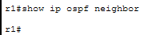

**Expected problem:** No neighbors or only partial adjacency

---

**On R2:**
```
R2#show ip ospf neighbor
```
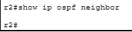

**Check:**
- Can R2 see R1?
- Can R2 see R3?
- What states are neighbors in?

---

**On R3:**
```
R3#show ip ospf neighbor
```
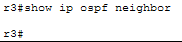

**Expected problem:** No neighbor with R2

---

### Step 3: Check OSPF Configuration

**On R1:**
```
R1#show ip protocols
```
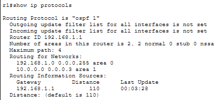

**Check:**
- Which networks are advertised?
- Which areas are configured?
- Look for area mismatches

```
R1#show ip ospf interface brief
```
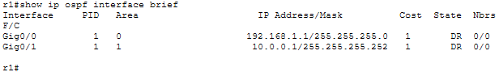

**Check:**
- Which interfaces are running OSPF?
- What are the hello/dead intervals?

---

**On R2:**
```
R2#show ip protocols
```
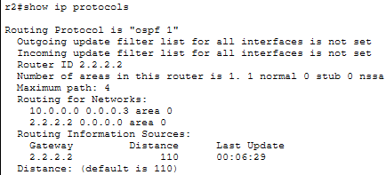

**Check:**
- Are all networks included?
- Missing network statement for R2-R3 link?

```
R2#show ip ospf interface gigabitEthernet 0/0
```
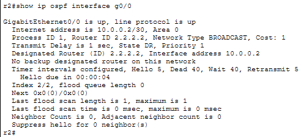

**Check:**
- Hello interval (should be 10, not 5)
- Dead interval (should be 40, not 20)

---

**On R3:**
```
R3#show ip protocols
```
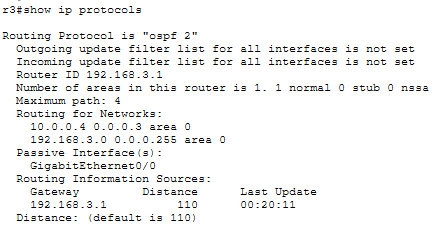

**Check:**
- Which interfaces are passive?
- G0/0 passive will prevent neighbor with R2

```
R3#show ip ospf interface brief
```
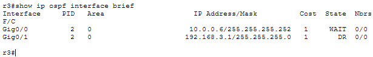

---

### Step 4: Check Routing Tables

**On R1:**
```
R1#show ip route ospf
```
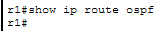

**Check:**
- Is 192.168.3.0/24 present?
- Is 10.0.0.4/30 present?

---

**On R2:**
```
R2#show ip route ospf
```
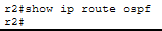

---

**On R3:**
```
R3#show ip route ospf
```
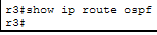

---

### Step 5: Identify All Issues

**Issue 1: R1 Area Mismatch**
- Network 10.0.0.0/30 in Area 1 instead of Area 0
- R1-R2 link not forming neighbors due to area mismatch
- OSPF requires matching area on both sides of link

**Issue 2: R2 Hello Interval Mismatch**
- R2 G0/0 has hello interval 5 (changed from default 10)
- R1 using default 10
- Neighbors won't form if hello/dead timers don't match

**Issue 3: R2 Missing Network Statement**
- Network 10.0.0.4/30 (R2-R3 link) not advertised in OSPF
- R2 won't form neighbor with R3 on this link

**Issue 4: R3 Passive Interface**
- G0/0 set as passive interface
- Passive interfaces don't send OSPF hellos
- Won't form neighbor relationship with R2

**Issue 5: R3 Different Process ID**
- Using OSPF process 2 instead of 1
- Not technically wrong (process ID is locally significant)
- But inconsistent and makes troubleshooting harder

---

### Step 6: Fix All Issues

**Fix R1 - Correct Area Assignment:**

```
R1(config)#router ospf 1
R1(config-router)#no network 10.0.0.0 0.0.0.3 area 1
R1(config-router)#network 10.0.0.0 0.0.0.3 area 0
R1(config-router)#exit
```

---

**Fix R2 - Restore Default Hello Interval:**

```
R2(config)#interface gigabitEthernet0/0
R2(config-if)#no ip ospf hello-interval 5
R2(config-if)#exit
```

This restores default hello interval of 10 seconds.

---

**Fix R2 - Add Missing Network Statement:**

```
R2(config)#router ospf 1
R2(config-router)#network 10.0.0.4 0.0.0.3 area 0
R2(config-router)#exit
```

---

**Fix R3 - Remove Passive Interface:**

```
R3(config)#router ospf 2
R3(config-router)#no passive-interface gigabitEthernet0/0
R3(config-router)#exit
```

---

**Optional - Fix R3 Process ID for Consistency:**

```
R3(config)#no router ospf 2
R3(config)#router ospf 1
R3(config-router)#network 10.0.0.4 0.0.0.3 area 0
R3(config-router)#network 192.168.3.0 0.0.0.255 area 0
R3(config-router)#exit
```

---

### Step 7: Verify All Fixes

**Wait 40 seconds for OSPF to converge**

**Check R1 neighbors:**
```
R1#show ip ospf neighbor
```
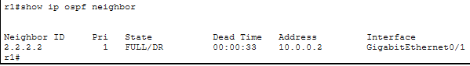

**Should show:**
```
Neighbor ID     Pri   State       Dead Time   Address         Interface
2.2.2.2         1     FULL/  -    00:00:35    10.0.0.2        GigabitEthernet0/1
```

State should be FULL.

---

**Check R2 neighbors:**
```
R2#show ip ospf neighbor
```
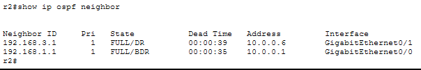

**Should show both R1 and R3:**
```
Neighbor ID     Pri   State       Dead Time   Address         Interface
192.168.1.1     1     FULL/  -    00:00:38    10.0.0.1        GigabitEthernet0/0
192.168.3.1     1     FULL/  -    00:00:36    10.0.0.6        GigabitEthernet0/1
```

---

**Check R3 neighbors:**
```
R3#show ip ospf neighbor
```
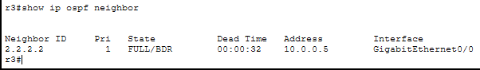

**Should show:**
```
Neighbor ID     Pri   State       Dead Time   Address         Interface
2.2.2.2         1     FULL/  -    00:00:34    10.0.0.5        GigabitEthernet0/0
```

---

**Check routing tables:**

**On R1:**
```
R1#show ip route ospf
```
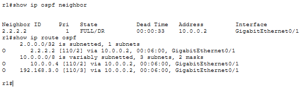

**Should show:**
```
O    2.2.2.2/32 [110/2] via 10.0.0.2, GigabitEthernet0/1
O    10.0.0.4/30 [110/2] via 10.0.0.2, GigabitEthernet0/1
O    192.168.3.0/24 [110/3] via 10.0.0.2, GigabitEthernet0/1
```

All networks from R2 and R3 should be present.

---

**On R2:**
```
R2#show ip route ospf
```
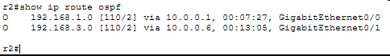

**Should show:**
```
O    192.168.1.0/24 [110/2] via 10.0.0.1, GigabitEthernet0/0
O    192.168.3.0/24 [110/2] via 10.0.0.6, GigabitEthernet0/1
```

---

**On R3:**
```
R3#show ip route ospf
```
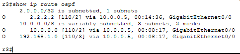

**Should show:**
```
O    2.2.2.2/32 [110/2] via 10.0.0.5, GigabitEthernet0/0
O    10.0.0.0/30 [110/2] via 10.0.0.5, GigabitEthernet0/0
O    192.168.1.0/24 [110/3] via 10.0.0.5, GigabitEthernet0/0
```

---

### Step 8: Test End-to-End Connectivity

**From PC1:**
```
ping 192.168.3.10
```
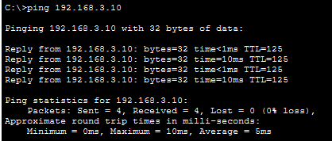

Should work now.

**Traceroute:**
```
tracert 192.168.3.10
```
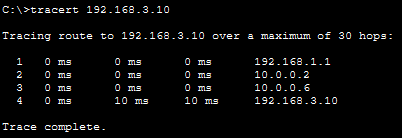

Should show: PC1 → R1 → R2 → R3 → PC2

---

**From PC2:**
```
ping 192.168.1.10
```

Should work.

---

## Common OSPF Problems Summary

**Area Mismatch:**
- Symptom: Neighbors not forming, stuck in EXSTART or 2WAY
- Cause: Different area numbers on same link
- Fix: Ensure both sides of link in same area

**Hello/Dead Timer Mismatch:**
- Symptom: Neighbors not forming
- Cause: Timers changed on one side only
- Fix: Match timers or restore defaults

**Missing Network Statement:**
- Symptom: Interface not running OSPF, no neighbor on that link
- Cause: Network not included in OSPF configuration
- Fix: Add network statement covering the interface

**Passive Interface Incorrectly Set:**
- Symptom: No OSPF hellos sent, neighbors not forming
- Cause: Interface configured as passive
- Fix: Remove passive-interface command for links needing neighbors

**Wrong Wildcard Mask:**
- Symptom: Interface not matched by network statement
- Cause: Incorrect wildcard mask in network command
- Fix: Calculate correct wildcard mask

**Interface Down:**
- Symptom: Neighbors dropping, routes disappearing
- Cause: Physical or administrative issue
- Fix: Check interface status, no shutdown if needed

---

## OSPF Neighbor States

Understanding neighbor states helps troubleshooting:

1. **Down** - No hellos received
2. **Init** - Hello received, but not bidirectional yet
3. **2-Way** - Bidirectional communication established
4. **Exstart** - Negotiating master/slave for database exchange
5. **Exchange** - Exchanging database descriptions
6. **Loading** - Requesting and receiving full LSAs
7. **Full** - Fully adjacent, databases synchronized

**Stuck in EXSTART or EXCHANGE?**
- MTU mismatch
- Duplicate router IDs

**Stuck in 2WAY?**
- Normal on multi-access networks (not DR/BDR)
- Problem on point-to-point links

---

## OSPF Troubleshooting Commands Reference

**Neighbor Status:**
```
show ip ospf neighbor
show ip ospf neighbor detail
```

**Interface Status:**
```
show ip ospf interface
show ip ospf interface brief
show ip ospf interface [interface]
```

**OSPF Configuration:**
```
show ip protocols
show ip ospf
show ip ospf database
```

**Routing Table:**
```
show ip route
show ip route ospf
```

**Debug (use carefully):**
```
debug ip ospf adj
debug ip ospf hello
debug ip ospf events
```

**Stop debugging:**
```
undebug all
```

---

## OSPF Verification Checklist

When troubleshooting OSPF, check these systematically:

**Layer 1/2:**
- [ ] Interfaces up/up
- [ ] Correct IP addresses
- [ ] Subnet masks match

**OSPF Basic:**
- [ ] OSPF enabled (show ip protocols)
- [ ] Correct network statements
- [ ] Interfaces included in OSPF
- [ ] Router ID assigned

**OSPF Adjacency:**
- [ ] Area numbers match on link
- [ ] Hello/Dead timers match
- [ ] Not configured as passive interface
- [ ] MTU matches (if stuck in EXSTART)
- [ ] No duplicate router IDs

**OSPF Routes:**
- [ ] Neighbors in FULL state
- [ ] Routes appearing in routing table
- [ ] Correct metrics
- [ ] No filtering/distribution issues

---

## Outcome

- Identified OSPF area mismatches
- Fixed hello/dead timer misconfigurations
- Added missing network statements
- Removed incorrectly configured passive interfaces
- Verified full OSPF neighbor adjacencies
- Confirmed all routes present in routing tables
- Tested end-to-end connectivity

---

## Files Included
- `lab24.pkt`
- `README.md`
- `screenshots/`

---

Lab24 **completed successfully**
