# LAB 25 — Enterprise Network Integration Lab 

## Objective
- Design and build a complete multi-site enterprise network from scratch
- Integrate all technologies learned: VLANs, trunking, routing protocols, ACLs, NAT, HSRP
- Configure inter-site connectivity with dynamic routing
- Implement security policies with ACLs
- Provide Internet access with NAT
- Ensure gateway redundancy with HSRP
- Document and verify complete network functionality

---

## Scenario

TechCorp, a company with two office locations (HQ and Branch). Design and implement a complete network solution that provides:

- Segmented networks using VLANs
- Inter-VLAN routing
- Dynamic routing between sites using OSPF
- Gateway redundancy at HQ using HSRP
- Controlled Internet access using ACLs
- NAT for private to public IP translation
- Full documentation and testing

---

## Network Requirements

**HQ Site:**
- 3 VLANs: Management (VLAN 10), Sales (VLAN 20), Engineering (VLAN 30)
- Redundant gateway routers (R1 and R2) with HSRP
- Connection to ISP for Internet access
- ACL: Block Sales VLAN from accessing Engineering resources

**Branch Site:**
- 2 VLANs: Management (VLAN 10), Operations (VLAN 40)
- Single router (R3)
- Connection to HQ via WAN link

**WAN/Internet:**
- OSPF routing between HQ and Branch
- NAT on HQ routers for Internet access
- Web Server accessible from all sites

---

## Topology

```
HQ Site:
                        Internet
                           |
                    ISP Router (200.1.1.2)
                           |
                        SW-ISP
                      /        \
                   F0/1        F0/2
                    /            \
       R1 (HSRP Active)         R2 (HSRP Standby)
      200.1.1.3                 200.1.1.4
            |                        |
            +-------- SW1 -----------+
                   /    |    \
                  /     |     \
    VLAN 10 (Mgmt) VLAN 20 (Sales) VLAN 30 (Eng)
         PC1          PC2              PC3

Branch Site:
    R3 --- SW2 --- VLAN 10 (PC4)
                \
                 VLAN 40 (PC5)

WAN Link: R1 ↔ R3 (OSPF Area 0)
          R2 ↔ R3 (OSPF Area 0)
```


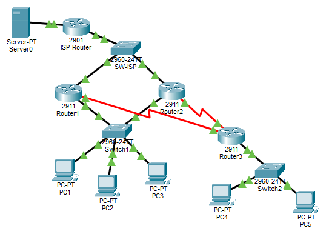

---

## IP Addressing Plan

### HQ Site

**VLANs:**

| VLAN | Name        | Network         | Gateway (HSRP) |
|------|-------------|-----------------|----------------|
| 10   | Management  | 10.10.10.0/24   | 10.10.10.1     |
| 20   | Sales       | 10.10.20.0/24   | 10.10.20.1     |
| 30   | Engineering | 10.10.30.0/24   | 10.10.30.1     |

**End Devices:**

| Device | VLAN | IP Address   | Subnet Mask     | Gateway    |
|--------|------|--------------|-----------------|------------|
| PC1    | 10   | 10.10.10.10  | 255.255.255.0   | 10.10.10.1 |
| PC2    | 20   | 10.10.20.10  | 255.255.255.0   | 10.10.20.1 |
| PC3    | 30   | 10.10.30.10  | 255.255.255.0   | 10.10.30.1 |

**Routers:**

| Router | Interface   | IP Address      | Subnet Mask     | Purpose          |
|--------|-------------|-----------------|-----------------|------------------|
| R1     | G0/0        | Physical int    | N/A             | Trunk to SW1     |
| R1     | G0/0.10     | 10.10.10.2      | 255.255.255.0   | VLAN 10 gateway  |
| R1     | G0/0.20     | 10.10.20.2      | 255.255.255.0   | VLAN 20 gateway  |
| R1     | G0/0.30     | 10.10.30.2      | 255.255.255.0   | VLAN 30 gateway  |
| R1     | G0/1        | 200.1.1.3       | 255.255.255.248 | ISP connection   |
| R1     | S0/0/0      | 172.16.0.1      | 255.255.255.252 | WAN to Branch    |
| R2     | G0/0        | Physical int    | N/A             | Trunk to SW1     |
| R2     | G0/0.10     | 10.10.10.3      | 255.255.255.0   | VLAN 10 gateway  |
| R2     | G0/0.20     | 10.10.20.3      | 255.255.255.0   | VLAN 20 gateway  |
| R2     | G0/0.30     | 10.10.30.3      | 255.255.255.0   | VLAN 30 gateway  |
| R2     | G0/1        | 200.1.1.4       | 255.255.255.248 | ISP connection   |
| R2     | S0/0/0      | 172.16.0.5      | 255.255.255.252 | WAN to Branch    |

**HSRP Virtual IPs:**
- VLAN 10: 10.10.10.1
- VLAN 20: 10.10.20.1
- VLAN 30: 10.10.30.1

---

### Branch Site

**VLANs:**

| VLAN | Name       | Network        | Gateway     |
|------|------------|----------------|-------------|
| 10   | Management | 10.20.10.0/24  | 10.20.10.1  |
| 40   | Operations | 10.20.40.0/24  | 10.20.40.1  |

**End Devices:**

| Device | VLAN | IP Address   | Subnet Mask     | Gateway    |
|--------|------|--------------|-----------------|------------|
| PC4    | 10   | 10.20.10.10  | 255.255.255.0   | 10.20.10.1 |
| PC5    | 40   | 10.20.40.10  | 255.255.255.0   | 10.20.40.1 |

**Router:**

| Router | Interface   | IP Address      | Subnet Mask     | Purpose          |
|--------|-------------|-----------------|-----------------|------------------|
| R3     | G0/0        | Physical int    | N/A             | Trunk to SW2     |
| R3     | G0/0.10     | 10.20.10.1      | 255.255.255.0   | VLAN 10 gateway  |
| R3     | G0/0.40     | 10.20.40.1      | 255.255.255.0   | VLAN 40 gateway  |
| R3     | S0/0/0      | 172.16.0.2      | 255.255.255.252 | WAN to HQ R1     |
| R3     | S0/0/1      | 172.16.0.6      | 255.255.255.252 | WAN to HQ R2     |

---

### ISP/Internet

| Device     | Interface | IP Address   | Subnet Mask     | Purpose         |
|------------|-----------|--------------|-----------------|-----------------|
| ISP        | G0/0      | 200.1.1.2    | 255.255.255.248 | HQ connection   |
| ISP        | G0/1      | 8.8.8.1      | 255.255.255.0   | Internet        |
| Web Server | NIC       | 8.8.8.8      | 255.255.255.0   | Public server   |

---

## Physical Connections

**HQ Site:**
- PC1 → SW1 F0/1 (VLAN 10)
- PC2 → SW1 F0/2 (VLAN 20)
- PC3 → SW1 F0/3 (VLAN 30)
- SW1 F0/23 → R1 G0/0 (Trunk)
- SW1 F0/24 → R2 G0/0 (Trunk)
- R1 G0/1 → SW-ISP F0/1
- R2 G0/1 → SW-ISP F0/2
- SW-ISP F0/24 → ISP G0/0
- R1 S0/0/0 → R3 S0/0/0 (Serial DCE on R1)
- R2 S0/0/0 → R3 S0/0/1 (Serial DCE on R2)

**Branch Site:**
- PC4 → SW2 F0/1 (VLAN 10)
- PC5 → SW2 F0/2 (VLAN 40)
- SW2 F0/24 → R3 G0/0 (Trunk)

**ISP:**
- ISP G0/1 → Web Server

---

## PC Configuration

### PC1
```
IP Address: 10.10.10.10
Subnet Mask: 255.255.255.0
Default Gateway: 10.10.10.1
```

### PC2
```
IP Address: 10.10.20.10
Subnet Mask: 255.255.255.0
Default Gateway: 10.10.20.1
```

### PC3
```
IP Address: 10.10.30.10
Subnet Mask: 255.255.255.0
Default Gateway: 10.10.30.1
```

### PC4
```
IP Address: 10.20.10.10
Subnet Mask: 255.255.255.0
Default Gateway: 10.20.10.1
```

### PC5
```
IP Address: 10.20.40.10
Subnet Mask: 255.255.255.0
Default Gateway: 10.20.40.1
```

---

## Server Configuration

### Web Server
```
IP Address: 8.8.8.8
Subnet Mask: 255.255.255.0
Default Gateway: 8.8.8.1
```

**Enable HTTP Service:**
1. Click Web Server → Services tab
2. Click HTTP
3. Ensure service is ON

---

## Switch SW1 Configuration

```
Switch>enable
Switch#configure terminal
Switch(config)#hostname SW1

Switch(config)#vlan 10
Switch(config-vlan)#name Management
Switch(config-vlan)#exit

Switch(config)#vlan 20
Switch(config-vlan)#name Sales
Switch(config-vlan)#exit

Switch(config)#vlan 30
Switch(config-vlan)#name Engineering
Switch(config-vlan)#exit

Switch(config)#interface fastEthernet0/1
Switch(config-if)#switchport mode access
Switch(config-if)#switchport access vlan 10
Switch(config-if)#exit

Switch(config)#interface fastEthernet0/2
Switch(config-if)#switchport mode access
Switch(config-if)#switchport access vlan 20
Switch(config-if)#exit

Switch(config)#interface fastEthernet0/3
Switch(config-if)#switchport mode access
Switch(config-if)#switchport access vlan 30
Switch(config-if)#exit

Switch(config)#interface range fastEthernet0/23-24
Switch(config-if-range)#switchport mode trunk
Switch(config-if-range)#exit

Switch(config)#end
Switch#write memory
```

---

## Switch SW2 Configuration

```
Switch>enable
Switch#configure terminal
Switch(config)#hostname SW2

Switch(config)#vlan 10
Switch(config-vlan)#name Management
Switch(config-vlan)#exit

Switch(config)#vlan 40
Switch(config-vlan)#name Operations
Switch(config-vlan)#exit

Switch(config)#interface fastEthernet 0/1
Switch(config-if)#switchport mode access
Switch(config-if)#switchport access vlan 10
Switch(config-if)#exit

Switch(config)#interface fastEthernet 0/2
Switch(config-if)#switchport mode access
Switch(config-if)#switchport access vlan 40
Switch(config-if)#exit

Switch(config)#interface fastEthernet 0/24
Switch(config-if)#switchport mode trunk
Switch(config-if)#exit

Switch(config)#end
Switch#write memory
```

---

## Switch SW-ISP Configuration

```
Switch>enable
Switch#configure terminal
Switch(config)#hostname SW-ISP
Switch(config)#end
Switch#write memory
```

---

## Router R1 Configuration

```
Router>enable
Router#configure terminal
Router(config)#hostname R1
Router(config)#no ip domain-lookup

Router(config)#interface gigabitEthernet0/0
Router(config-if)#no shutdown
Router(config-if)#exit

Router(config)#interface gigabitEthernet0/0.10
Router(config-subif)#encapsulation dot1Q 10
Router(config-subif)#ip address 10.10.10.2 255.255.255.0
Router(config-subif)#standby 10 ip 10.10.10.1
Router(config-subif)#standby 10 priority 110
Router(config-subif)#standby 10 preempt
Router(config-subif)#exit

Router(config)#interface gigabitEthernet0/0.20
Router(config-subif)#encapsulation dot1Q 20
Router(config-subif)#ip address 10.10.20.2 255.255.255.0
Router(config-subif)#standby 20 ip 10.10.20.1
Router(config-subif)#standby 20 priority 110
Router(config-subif)#standby 20 preempt
Router(config-subif)#exit

Router(config)#interface gigabitEthernet0/0.30
Router(config-subif)#encapsulation dot1Q 30
Router(config-subif)#ip address 10.10.30.2 255.255.255.0
Router(config-subif)#standby 30 ip 10.10.30.1
Router(config-subif)#standby 30 priority 110
Router(config-subif)#standby 30 preempt
Router(config-subif)#exit

Router(config)#interface gigabitEthernet0/1
Router(config-if)#ip address 200.1.1.3 255.255.255.248
Router(config-if)#no shutdown
Router(config-if)#exit

Router(config)#interface serial0/0/0
Router(config-if)#ip address 172.16.0.1 255.255.255.252
Router(config-if)#clock rate 64000
Router(config-if)#no shutdown
Router(config-if)#exit

Router(config)#router ospf 1
Router(config-router)#network 10.10.10.0 0.0.0.255 area 0
Router(config-router)#network 10.10.20.0 0.0.0.255 area 0
Router(config-router)#network 10.10.30.0 0.0.0.255 area 0
Router(config-router)#network 172.16.0.0 0.0.0.3 area 0
Router(config-router)#exit

Router(config)#ip route 0.0.0.0 0.0.0.0 200.1.1.2

Router(config)#access-list 1 permit 10.0.0.0 0.255.255.255

Router(config)#ip nat inside source list 1 interface gigabitEthernet 0/1 overload

Router(config)#interface gigabitEthernet0/0
Router(config-if)#ip nat inside
Router(config-if)#exit

Router(config)#interface serial0/0/0
Router(config-if)#ip nat inside
Router(config-if)#exit

Router(config)#interface gigabitEthernet0/1
Router(config-if)#ip nat outside
Router(config-if)#exit

Router(config)#ip access-list extended SALES_POLICY
Router(config-ext-nacl)#deny ip 10.10.20.0 0.0.0.255 10.10.30.0 0.0.0.255
Router(config-ext-nacl)#permit ip any any
Router(config-ext-nacl)#exit

Router(config)#interface gigabitEthernet0/0.20
Router(config-subif)#ip access-group SALES_POLICY in
Router(config-subif)#exit

R1(config)#router ospf 1
R1(config-router)#default-information originate
R1(config-router)#exit
R1(config)#end
R1#write memory
```

---

## Router R2 Configuration

```
Router>enable
Router#configure terminal
Router(config)#hostname R2
Router(config)#no ip domain-lookup

Router(config)#interface gigabitEthernet0/0
Router(config-if)#no shutdown
Router(config-if)#exit

Router(config)#interface gigabitEthernet0/0.10
Router(config-subif)#encapsulation dot1Q 10
Router(config-subif)#ip address 10.10.10.3 255.255.255.0
Router(config-subif)#standby 10 ip 10.10.10.1
Router(config-subif)#standby 10 priority 100
Router(config-subif)#standby 10 preempt
Router(config-subif)#exit

Router(config)#interface gigabitEthernet0/0.20
Router(config-subif)#encapsulation dot1Q 20
Router(config-subif)#ip address 10.10.20.3 255.255.255.0
Router(config-subif)#standby 20 ip 10.10.20.1
Router(config-subif)#standby 20 priority 100
Router(config-subif)#standby 20 preempt
Router(config-subif)#exit

Router(config)#interface gigabitEthernet0/0.30
Router(config-subif)#encapsulation dot1Q 30
Router(config-subif)#ip address 10.10.30.3 255.255.255.0
Router(config-subif)#standby 30 ip 10.10.30.1
Router(config-subif)#standby 30 priority 100
Router(config-subif)#standby 30 preempt
Router(config-subif)#exit

Router(config)#interface gigabitEthernet0/1
Router(config-if)#ip address 200.1.1.4 255.255.255.248
Router(config-if)#no shutdown
Router(config-if)#exit

Router(config)#interface serial0/0/0
Router(config-if)#ip address 172.16.0.5 255.255.255.252
Router(config-if)#clock rate 64000
Router(config-if)#no shutdown
Router(config-if)#exit

Router(config)#router ospf 1
Router(config-router)#network 10.10.10.0 0.0.0.255 area 0
Router(config-router)#network 10.10.20.0 0.0.0.255 area 0
Router(config-router)#network 10.10.30.0 0.0.0.255 area 0
Router(config-router)#network 172.16.0.4 0.0.0.3 area 0
Router(config-router)#exit

Router(config)#ip route 0.0.0.0 0.0.0.0 200.1.1.2

Router(config)#access-list 1 permit 10.0.0.0 0.255.255.255

Router(config)#ip nat inside source list 1 interface gigabitEthernet 0/1 overload

Router(config)#interface gigabitEthernet0/0
Router(config-if)#ip nat inside
Router(config-if)#exit

Router(config)#interface serial0/0/0
Router(config-if)#ip nat inside
Router(config-if)#exit

Router(config)#interface gigabitEthernet0/1
Router(config-if)#ip nat outside
Router(config-if)#exit

Router(config)#ip access-list extended SALES_POLICY
Router(config-ext-nacl)#deny ip 10.10.20.0 0.0.0.255 10.10.30.0 0.0.0.255
Router(config-ext-nacl)#permit ip any any
Router(config-ext-nacl)#exit

Router(config)#interface gigabitEthernet0/0.20
Router(config-subif)#ip access-group SALES_POLICY in
Router(config-subif)#exit

R2(config)#router ospf 1
R2(config-router)#default-information originate
R2(config-router)#exit
R2(config)#end
R2#write memory
```

---

## Router R3 Configuration

```
Router>enable
Router#configure terminal
Router(config)#hostname R3
Router(config)#no ip domain-lookup

Router(config)#interface gigabitEthernet0/0
Router(config-if)#no shutdown
Router(config-if)#exit

Router(config)#interface gigabitEthernet 0/0.10
Router(config-subif)#encapsulation dot1Q 10
Router(config-subif)#ip address 10.20.10.1 255.255.255.0
Router(config-subif)#exit

Router(config)#interface gigabitEthernet0/0.40
Router(config-subif)#encapsulation dot1Q 40
Router(config-subif)#ip address 10.20.40.1 255.255.255.0
Router(config-subif)#exit

Router(config)#interface serial0/0/0
Router(config-if)#ip address 172.16.0.2 255.255.255.252
Router(config-if)#no shutdown
Router(config-if)#exit

Router(config)#interface serial0/0/1
Router(config-if)#ip address 172.16.0.6 255.255.255.252
Router(config-if)#no shutdown
Router(config-if)#exit

Router(config)#router ospf 1
Router(config-router)#network 10.20.10.0 0.0.0.255 area 0
Router(config-router)#network 10.20.40.0 0.0.0.255 area 0
Router(config-router)#network 172.16.0.0 0.0.0.3 area 0
Router(config-router)#network 172.16.0.4 0.0.0.3 area 0
Router(config-router)#exit

Router(config)#end
Router#write memory
```

Verify on R3:
Wait 30 seconds, then check:
R3#show ip route
You should now see:
O*E2 0.0.0.0/0 [110/1] via 172.16.0.1
                [110/1] via 172.16.0.5
This is the default route learned via OSPF.


---

## ISP Router Configuration

```
Router>enable
Router#configure terminal
Router(config)#hostname ISP
Router(config)#no ip domain-lookup

Router(config)#interface gigabitEthernet0/0
Router(config-if)#ip address 200.1.1.2 255.255.255.248
Router(config-if)#no shutdown
Router(config-if)#exit

Router(config)#interface gigabitEthernet0/1
Router(config-if)#ip address 8.8.8.1 255.255.255.0
Router(config-if)#no shutdown
Router(config-if)#exit

Router(config)#ip route 10.0.0.0 255.0.0.0 200.1.1.3
Router(config)#ip route 10.0.0.0 255.0.0.0 200.1.1.4
Router(config)#ip route 172.16.0.0 255.255.0.0 200.1.1.3
Router(config)#ip route 172.16.0.0 255.255.0.0 200.1.1.4

Router(config)#end
Router#write memory
```

---

## Verification and Testing

### Test 1: Verify VLANs

**On SW1:**
```
SW1#show vlan brief
```
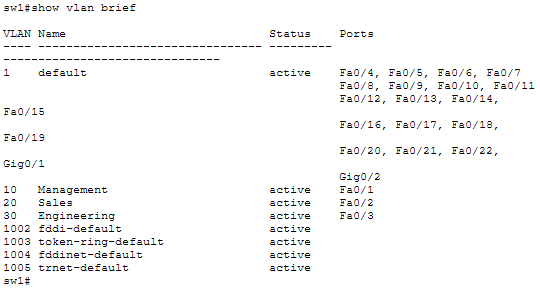

Verify:
- VLAN 10, 20, 30 created
- F0/1 in VLAN 10
- F0/2 in VLAN 20
- F0/3 in VLAN 30
- F0/23-24 not listed (trunk ports)

**On SW2:**
```
SW2#show vlan brief
```
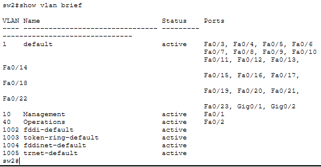

Verify:
- VLAN 10, 40 created
- F0/1 in VLAN 10
- F0/2 in VLAN 40

---

### Test 2: Verify Trunks

**On SW1:**
```
SW1#show interfaces trunk
```
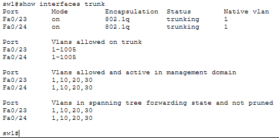

Verify F0/23 and F0/24 in trunk mode.

---

### Test 3: Verify HSRP

**On R1:**
```
R1#show standby brief
```
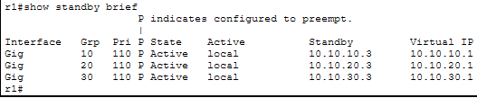

Verify:
- All VLANs showing Active state
- Priority 110

**On R2:**
```
R2#show standby brief
```
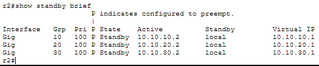

Verify:
- All VLANs showing Standby state
- Priority 100

---

### Test 4: Verify OSPF Neighbors

**On R1:**
```
R1#show ip ospf neighbor
```
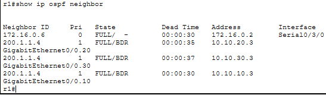

Verify R3 as neighbor in FULL state.

**On R2:**
```
R2#show ip ospf neighbor
```
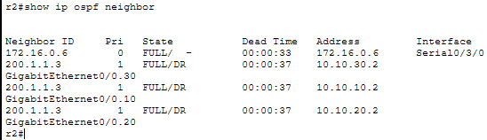

Verify R3 as neighbor in FULL state.

**On R3:**
```
R3#show ip ospf neighbor
```
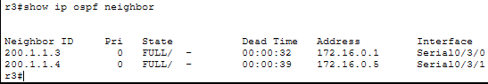

Verify both R1 and R2 as neighbors in FULL state.

---

### Test 5: Verify Routing Tables

**On R1:**
```
R1#show ip route ospf
```
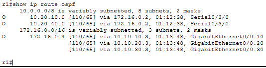

Verify Branch networks present:
- 10.20.10.0/24
- 10.20.40.0/24

**On R3:**
```
R3#show ip route ospf
```
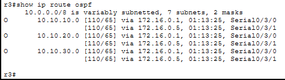

Verify HQ networks present:
- 10.10.10.0/24
- 10.10.20.0/24
- 10.10.30.0/24

---

### Test 6: Test Intra-VLAN Connectivity (HQ)

**From PC1:**
```
ping 10.10.10.1
```
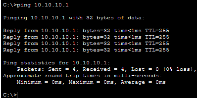

Should work (HSRP virtual gateway).

---

### Test 7: Test Inter-VLAN Connectivity (HQ)

**From PC1 (Management):**
```
ping 10.10.20.10
ping 10.10.30.10
```
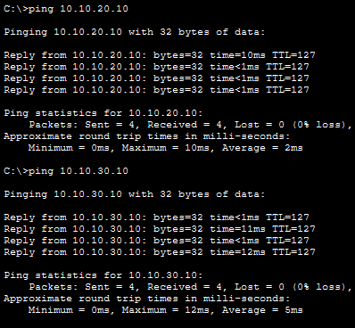

Both should work.

**From PC2 (Sales):**
```
ping 10.10.30.10
```
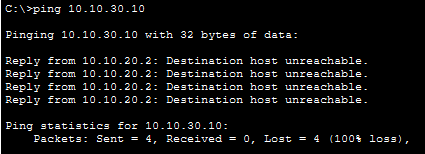

Should FAIL (blocked by ACL).

**From PC2:**
```
ping 10.10.10.10
```
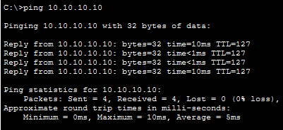

Should work (Sales can reach Management).

---

### Test 8: Test HQ to Branch Connectivity

**From PC1 (HQ):**
```
ping 10.20.10.10
ping 10.20.40.10
```
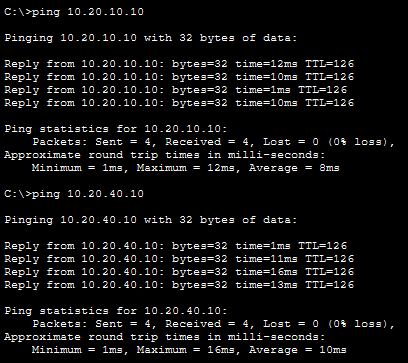

Both should work via OSPF routing.

**From PC4 (Branch):**
```
ping 10.10.10.10
ping 10.10.20.10
ping 10.10.30.10
```
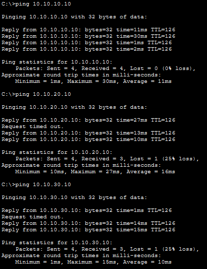

All should work.

---

### Test 9: Test Internet Connectivity

**From PC1:**
```
ping 8.8.8.8
```
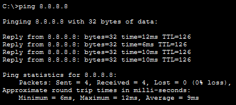

Should work (NAT configured).

**Web Browser:**
```
http://8.8.8.8
```

Should display web page. If not visible then,
R1: check access-lists for increase in matches to confirm that it's working.

**From PC4 (Branch):**
```
ping 8.8.8.8
```
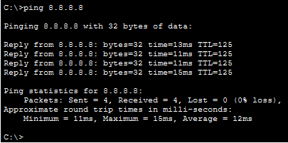

Should work (traffic routes through HQ, then NAT).

---

### Test 10: Verify NAT Configuration

**On R1:**
```
R1#show ip nat statistics
```
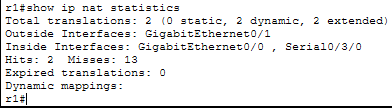

Verify:
- Inside interfaces: GigabitEthernet0/0, Serial0/0/0
- Outside interfaces: GigabitEthernet0/1
- Hits incrementing when traffic flows

```
R1#show running-config | section nat
```
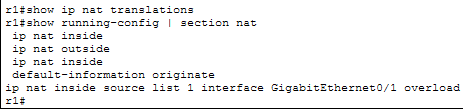

Verify NAT commands present.

---

### Test 11: Verify ACL Policy

**On R1:**
```
R1#show access-lists SALES_POLICY
```
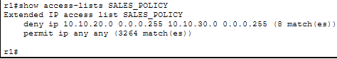

Verify deny line shows matches when PC2 tries to reach Engineering.

From PC2 (Sales):
```
ping 10.10.30.10
```
Should fail (ACL blocking).

From PC2:
ping 10.10.10.10
ping 10.20.10.10
ping 8.8.8.8

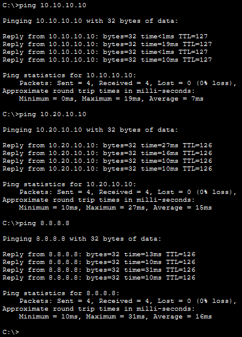

All should work (Sales can reach Management, Branch, and Internet).

Test 12: Test HSRP Failover
On R1, shut down G0/0:
```
R1(config)#interface gigabitEthernet 0/0
R1(config-if)#shutdown
```

**On R2, check HSRP status:**
```
R2#show standby brief
```
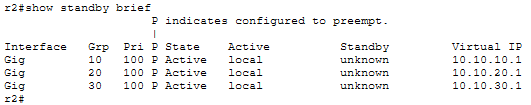

R2 should now show Active state for all VLANs.

**From PC1, continuously ping gateway:**
```
ping -t 10.10.10.1 
```

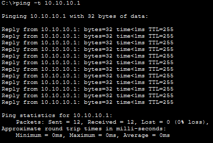

Should see brief interruption (1-2 packets lost), then resume successfully.

**Restore R1:**
```
R1(config)#interface gigabitEthernet 0/0
R1(config-if)#no shutdown
R1(config-if)#exit
```

**Wait 10 seconds, then check R1:**
```
R1#show standby brief
```
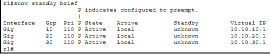

R1 should reclaim Active role (preemption enabled).

**Check R2:**
```
R2#show standby brief
```

R2 should return to Standby state.

---

### Test 13: Traceroute Path Verification

**From PC1 to PC4 (Branch):**
```
tracert 10.20.10.10
```
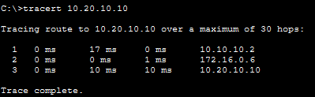

**From PC1 to Web Server:**
```
tracert 8.8.8.8
```


---

## Configuration Summary Tables

### VLAN Summary

| Site   | VLAN | Name        | Network        | Gateway    | Devices |
|--------|------|-------------|----------------|------------|---------|
| HQ     | 10   | Management  | 10.10.10.0/24  | 10.10.10.1 | PC1     |
| HQ     | 20   | Sales       | 10.10.20.0/24  | 10.10.20.1 | PC2     |
| HQ     | 30   | Engineering | 10.10.30.0/24  | 10.10.30.1 | PC3     |
| Branch | 10   | Management  | 10.20.10.0/24  | 10.20.10.1 | PC4     |
| Branch | 40   | Operations  | 10.20.40.0/24  | 10.20.40.1 | PC5     |

---

### HSRP Summary

| VLAN | Virtual IP  | Active Router | Priority | Standby Router | Priority |
|------|-------------|---------------|----------|----------------|----------|
| 10   | 10.10.10.1  | R1            | 110      | R2             | 100      |
| 20   | 10.10.20.1  | R1            | 110      | R2             | 100      |
| 30   | 10.10.30.1  | R1            | 110      | R2             | 100      |

---

### OSPF Summary

| Router | Process ID | Area | Networks Advertised                                    |
|--------|------------|------|--------------------------------------------------------|
| R1     | 1          | 0    | 10.10.10.0/24, 10.10.20.0/24, 10.10.30.0/24, 172.16.0.0/30 |
| R2     | 1          | 0    | 10.10.10.0/24, 10.10.20.0/24, 10.10.30.0/24, 172.16.0.4/30 |
| R3     | 1          | 0    | 10.20.10.0/24, 10.20.40.0/24, 172.16.0.0/30, 172.16.0.4/30 |

---

### NAT Summary

| Router | Inside Interfaces | Outside Interface | NAT Type | Public IP  | ACL |
|--------|-------------------|-------------------|----------|------------|-----|
| R1     | G0/0, S0/0/0      | G0/1              | PAT      | 200.1.1.3  | 1   |
| R2     | G0/0, S0/0/0      | G0/1              | PAT      | 200.1.1.4  | 1   |

---

### ACL Summary

| Router | ACL Name      | Purpose                          | Applied To | Direction |
|--------|---------------|----------------------------------|------------|-----------|
| R1     | SALES_POLICY  | Block Sales from Engineering     | G0/0.20    | In        |
| R2     | SALES_POLICY  | Block Sales from Engineering     | G0/0.20    | In        |

---

### Routing Summary

| Router | Static Routes           | Dynamic Protocol | Default Route To |
|--------|-------------------------|------------------|------------------|
| R1     | 0.0.0.0/0 via 200.1.1.2 | OSPF             | ISP              |
| R2     | 0.0.0.0/0 via 200.1.1.2 | OSPF             | ISP              |
| R3     | None                    | OSPF             | Via OSPF to HQ   |
| ISP    | 10.0.0.0/8 via R1 & R2  | None             | N/A              |
|        | 172.16.0.0/16 via R1 & R2 | None           | N/A              |

---

## Note on NAT Verification in Packet Tracer

**Known Limitation:** Packet Tracer may not display NAT translations in `show ip nat translations` even when NAT is functioning correctly.

**NAT functionality is verified by:**
- Successful ping from internal PCs (10.x.x.x) to Internet (8.8.8.8)
- Web browser access from PCs to external web server
- NAT statistics showing packet processing (`show ip nat statistics`)
- Traffic successfully routing through NAT router to Internet

If `show ip nat translations` shows empty or only displays misses, but connectivity works, NAT is configured correctly - this is a simulator display limitation, not a configuration error.

In production Cisco devices, translations display properly.

---

## Skills Demonstrated

By completing this lab, you have demonstrated:

**Configuration Skills:**
- VLANs and trunk configuration
- Router-on-a-stick inter-VLAN routing
- OSPF dynamic routing protocol
- HSRP gateway redundancy
- Extended ACLs for security policies
- NAT/PAT for Internet connectivity
- Multi-site WAN connectivity with serial links

**Troubleshooting Skills:**
- Layer 2 verification (VLANs, trunks)
- Layer 3 verification (routing tables, OSPF neighbors)
- HSRP state verification and failover testing
- NAT configuration verification
- ACL policy enforcement verification

**Design Skills:**
- IP addressing scheme planning
- VLAN segmentation strategy
- Redundancy implementation (HSRP, dual WAN links)
- Security policy design and implementation

**Documentation Skills:**
- Network topology diagrams
- IP addressing tables
- Configuration summaries
- Comprehensive verification procedures

---

## LAB COMPLETE

- Designed and built a complete multi-site enterprise network from scratch
- Implemented network segmentation using VLANs (5 VLANs across 2 sites)
- Configured inter-VLAN routing using router-on-a-stick
- Deployed OSPF for automatic route discovery between sites
- Implemented HSRP for gateway redundancy at HQ
- Configured NAT/PAT for Internet access
- Applied security policies using extended ACLs
- Verified all functionality with comprehensive testing
- Documented the complete network design

---

## Files Included
- `lab25.pkt`
- `README.md`
- `screenshots/`

---

Lab25 **completed successfully**
